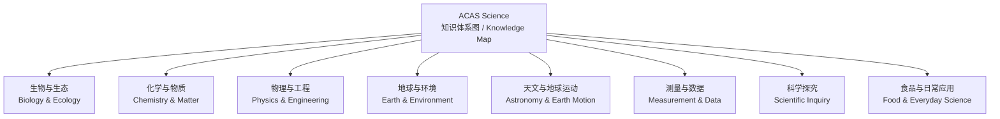

# ACAS Science 知识体系图 / Knowledge Map

按科学领域整理 40 道题的核心知识点。点击题号可直接查看对应题目的分析。

This map groups the core concepts from all 40 questions by science domain. Select a question to open its analysis.

[查看教材全部 Topic 与考题对应表 / View the full textbook-topic crosswalk](textbook-topic-map.md)

## 生物与生态 / Biology & Ecology

- 生物分类与亲缘关系 / Classification and evolutionary relationships：[第 1 题 / Q1](questions/q01.md)
- 种子萌发与光敏色素 / Seed germination and phytochrome：[第 12 题 / Q12](questions/q12.md)
- 蚜虫生活史、寄主与繁殖 / Aphid life cycle, hosts and reproduction：[第 25 题 / Q25](questions/q25.md)
-- 种群密度与样方法 / Population density and quadrat sampling：[第 36 题 / Q36](questions/q36.md)

## 化学与物质 / Chemistry & Matter

- 燃烧、颗粒大小与反应 / Combustion, particle size and reaction rate：[第 3 题 / Q3](questions/q03.md)
- 铁的锈蚀与反应条件 / Rusting and reaction conditions：[第 6 题 / Q6](questions/q06.md)
- 分子式与原子模型 / Molecular formulae and atom models：[第 11 题 / Q11](questions/q11.md)
- 混合物分离方法 / Separation of mixtures：[第 19 题 / Q19](questions/q19.md)
- 化学发光与催化 / Chemiluminescence and catalysis：[第 21 题 / Q21](questions/q21.md)
- 分子结构与手性 / Molecular structure and chirality：[第 29 题 / Q29](questions/q29.md)
-- 水中氨平衡与总氨氮 / Aqueous ammonia equilibrium and total ammonia nitrogen：[第 39 题 / Q39](questions/q39.md)

## 物理与工程 / Physics & Engineering

- 红外辐射与材料透射 / Infrared radiation and material transmission：[第 8 题 / Q8](questions/q08.md)
- 平面镜成像 / Plane-mirror reflection：[第 9 题 / Q9](questions/q09.md)
- 杠杆与力矩平衡 / Levers and moments：[第 13 题 / Q13](questions/q13.md)
- 水平仪与倾斜方向 / Spirit levels and tilt direction：[第 16 题 / Q16](questions/q16.md)
- 重力势能、动能与碰撞 / Gravitational potential energy, kinetic energy and impact：[第 23 题 / Q23](questions/q23.md)
- 冷却与温差 / Cooling and temperature difference：[第 28 题 / Q28](questions/q28.md)
- 电路与灯泡 / Circuits and lamps：[第 30 题 / Q30](questions/q30.md)
- 电功率与调光 / Electrical power and dimming：[第 31 题 / Q31](questions/q31.md)
- 重心与物体稳定性 / Centre of mass and stability：[第 34 题 / Q34](questions/q34.md)
-- 车轮滚动与瞬时速度 / Rolling motion and instantaneous velocity：[第 37 题 / Q37](questions/q37.md)

## 地球与环境 / Earth & Environment

- 风蚀与沙漠砾幕 / Wind erosion and desert pavement：[第 4 题 / Q4](questions/q04.md)
- 海水盐度与盐跃层 / Ocean salinity and the halocline：[第 5 题 / Q5](questions/q05.md)
- 河流侵蚀、搬运与沉积 / River erosion, transport and deposition：[第 24 题 / Q24](questions/q24.md)
- 全球温度异常与影响因素 / Global temperature anomalies and contributing factors：[第 26 题 / Q26](questions/q26.md)
- 地层叠覆与化石对比 / Stratigraphic superposition and fossil correlation：[第 32 题 / Q32](questions/q32.md)
-- 地质图走向与倾向 / Geological strike and dip：[第 38 题 / Q38](questions/q38.md)

## 天文与地球运动 / Astronomy & Earth Motion

- 傅科摆与地球自转 / Foucault pendulum and Earth's rotation：[第 35 题 / Q35](questions/q35.md)
-- 日地月位置与地球相位 / Sun-Earth-Moon geometry and phases：[第 40 题 / Q40](questions/q40.md)

## 测量与数据 / Measurement & Data

- 显微镜放大倍数与比例尺 / Magnification and scale bars：[第 15 题 / Q15](questions/q15.md)
- Rankine 与 Kelvin 温标换算 / Rankine-Kelvin scale conversion：[第 18 题 / Q18](questions/q18.md)
- 分钟秒格式与时间求和 / Elapsed-time notation and addition：[第 22 题 / Q22](questions/q22.md)
-- 雷声传播与距离估算 / Thunder propagation and distance estimation：[第 33 题 / Q33](questions/q33.md)

## 科学探究 / Scientific Inquiry

- 科学推理：提出并解释可检验假设、解释数据 / Scientific reasoning: formulate and explain testable hypotheses, and interpret data：[第 9 章 Interaction 活动技能表，第 64 页 / Ch. 9 Interaction activity skills table, p. 64](assets/textbooks/pages/textbook-page-064.jpg)；[教材阅读器 / Textbook reader](textbook-reader.md?page=64)
- 实验设计：设计检验假设的方法，说明变量控制与数据收集 / Experimental design: design a method to test a hypothesis, including variables and data collection：[第 9 章 Interaction 活动技能表，第 64 页 / Ch. 9 Interaction activity skills table, p. 64](assets/textbooks/pages/textbook-page-064.jpg)；[教材阅读器 / Textbook reader](textbook-reader.md?page=64)
- 批判性思考：分析机械运动中变量之间的关系 / Critical thinking: analyse relationships between variables in mechanical motion：[第 12 章速度与加速度，第 102 页 / Ch. 12 Velocity and acceleration, p. 102](assets/textbooks/pages/textbook-page-102.jpg)；[教材阅读器 / Textbook reader](textbook-reader.md?page=102)
- 自变量、因变量与公平实验 / Variables and fair tests：[第 10 题 / Q10](questions/q10.md)
- 实验数据的有效比较 / Valid comparison of experimental data：[第 17 题 / Q17](questions/q17.md)
- 表格与日期码读取 / Reading tables and product date codes：[第 2 题 / Q2](questions/q02.md)
-- 图表变量与实验结果 / Variables and results in graphs：[第 27 题 / Q27](questions/q27.md)

## 食品与日常应用 / Food & Everyday Science

- 黄油与 shortening 的配方换算 / Ingredient substitution and proportions：[第 20 题 / Q20](questions/q20.md)
- 容器溢水与排水体积 / Overflow and displaced volume：[第 14 题 / Q14](questions/q14.md)
-- 雾网集水 / Fog harvesting and water collection：[第 7 题 / Q7](questions/q07.md)