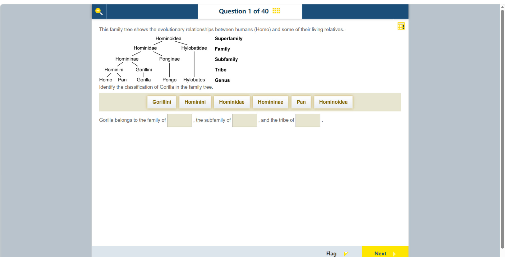

# 第 1 题

## 原题

**教材阅读器 / Textbook reader:** [Chapter 14, Topic 1: Classification（纸本第 113 页 / PDF p. 122）](../textbook-reader.md?page=122)

## 分析

[查看知识体系图](../knowledge-map.md)

### 教材 Topic 技能 / Textbook Topic Skills

**Chapter 14, Topic 1: Classification / 第 14 章 Topic 1：分类**（[教材 PDF 第 120 页 / Textbook PDF p. 120](../textbook-reader.md?page=120)）

| ATL skills / ATL 技能 | Science skills / 科学技能 |
| --- | --- |
| 作出推断并得出结论；有逻辑地组织和呈现信息；建立共识。 Make inferences and draw conclusions; organize and depict information logically; build consensus. | 解读科学探究数据并用科学推理解释结果；使用科学推理形成假设；组织并呈现数据以得出结论；绘制准确且有标签的科学图。 Interpret investigation data and explain results using scientific reasoning; formulate a hypothesis using scientific reasoning; organize and present data so that conclusions can be drawn; create accurate, labelled scientific drawings. |

### 中文分析

#### 知识背景

生物分类把有共同祖先和特征的生物逐层归入越来越小的群体。本图由大到小显示总科、科、亚科、族和属五个层级，没有画出种这一层；树状图的分支表示亲缘关系，越往末端分类越具体。

#### 图示细读

1. **先读右侧的等级标签。** 从上到下是 Superfamily（总科）、Family（科）、Subfamily（亚科）、Tribe（族）、Genus（属）。它们是分类级别，左侧的拉丁名称才是各级别中具体的分类群。例如 Family 不是答案名称，而是在提示这一行应找哪个科。
2. **从最下方的 Gorilla 沿连线向上追踪。** 直接相连的是 Gorillini，再上面是 Homininae，然后是 Hominidae，最上面是 Hominoidea。完整包含关系为：Hominoidea 总科包含 Hominidae 科，其中 Homininae 亚科包含 Gorillini 族，而 Gorilla 属属于该族。不能看到附近的文字就选，必须确认连线通向哪里。

| 图中等级 | Gorilla 所在分类群 | 如何在图上确认 |
| --- | --- | --- |
| 总科 Superfamily | Hominoidea | 全图上方共同连接的分类群 |
| 科 Family | Hominidae | Gorilla 所在左侧大分支的科，不是右侧的 Hylobatidae |
| 亚科 Subfamily | Homininae | 连向 Gorillini 的上一级，不是连向 Pongo 的 Ponginae |
| 族 Tribe | Gorillini | 紧接 Gorilla 上方的名称，不是左侧的 Hominini |
| 属 Genus | Gorilla | 题目指定的底端分类群 |

3. **比较分叉，理解亲缘关系。** Homo（人属）与 Pan（黑猩猩属）先在 Hominini 这一支汇合，再与 Gorilla 所在的 Gorillini 支在 Homininae 层级汇合。图示因此把 Homo 与 Pan 放在比它们与 Gorilla 更紧密的一组；这并不表示现生黑猩猩变成了人，也不表示所有末端生物按从左到右的次序进化。
4. **识别省略的层级。** Pongo 与 Hylobates 上方有较长的直线，是本图未标出中间层级，不是它们没有这些分类等级。图也没有时间刻度，不能把线的长短当作演化时间或变化量。
5. **把读图结果对应到三个空格。** 题目只问 family、subfamily、tribe，按这个顺序取表中的三行。Hominoidea 是总科，层级过高；Pan 是另一属；Hominini 虽然也是族，却不在 Gorilla 的支线上。

#### 推理与答案

沿着 Gorilla 的分支从末端向上读：属为 Gorilla，族为 Gorillini，亚科为 Homininae，科为 Hominidae。因此空格依次填 **Hominidae、Homininae、Gorillini**。不要把同一横排的标签当作同一级：图右侧已经标出每一层对应的分类等级。

### English Analysis

#### Background

Biological classification groups organisms by shared ancestry and characteristics. The hierarchy shown here runs from broader to narrower groups: superfamily, family, subfamily, tribe and genus; species are not shown. Branches represent relationships, with more specific groups nearer the tips.

#### Reading the diagram

1. **Separate ranks from names.** The labels on the right identify the five ranks. The Latin names on the left identify the groups at those ranks. Family is a rank, whereas Hominidae is the name of a family.
2. **Follow connections, not proximity.** Starting at Gorilla, trace upward through Gorillini, Homininae, Hominidae and Hominoidea. Each successive group contains the group below it. Hylobatidae and Ponginae are on other branches, even though they occur at relevant ranks.
3. **Interpret the branching pattern.** Homo and Pan join within Hominini before their branch joins Gorillini within Homininae. The diagram groups humans and chimpanzees more closely with each other than with gorillas. It does not show living chimpanzees turning into humans or a left-to-right evolutionary sequence.
4. **Notice what is not specified.** Long lines above Pongo and Hylobates skip labels for intermediate ranks; they do not mean those organisms lack such ranks. There is no time scale, so line lengths cannot establish elapsed evolutionary time or the amount of change.
5. **Match the requested ranks.** For family, subfamily and tribe, read Hominidae, Homininae and Gorillini respectively. Hominoidea is too broad, Pan is another genus, and Hominini is a different tribe.

#### Reasoning and answer

Trace the Gorilla branch upward from its genus. Its genus is Gorilla, its tribe is Gorillini, its subfamily is Homininae, and its family is Hominidae. The blanks are **Hominidae, Homininae, and Gorillini**, in that order. Use the labels beside the tree to distinguish taxonomic rank; names on the same branch are not interchangeable ranks.
