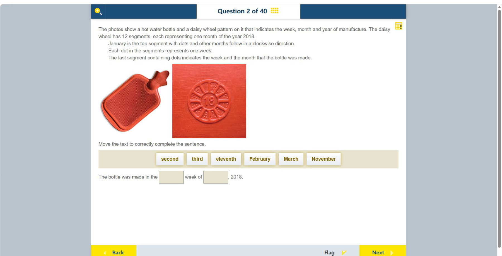

# 第 2 题

## 原题

## 分析

[查看知识体系图](../knowledge-map.md)

### 中文分析

#### 知识背景

这是读取产品日期码的题目。圆盘把 12 个月排成顺时针扇区，每个小点代表一个生产周；扇区位置表示月份，点数表示该月的周序。中心的 “18” 表示 2018 年。

#### 图示细读

1. 左边是热水袋整体照片，右边是袋面日期圆盘的放大照片；真正携带日期信息的是右图的浮雕，不是袋子的颜色或外形。
2. 圆盘中央可见 “18”，外围分成 12 个扇区。这里没有坐标轴或长度刻度：中心编码年份，扇区位置编码月份，小圆点编码周次，三种信息要分开读。
3. 按题干指定，从顶部**有点的**扇区作为 January 开始，顺时针依次对应 February、March，直到 December。照片没有逐月印出名称，因此月份对应必须结合题干，不能随意把最上方的分隔线当成起点。
4. 顺时针找到最后一个仍有点的扇区，它是第 11 个，即 November；再后面的 December 扇区没有点。空扇区帮助确认读到的确实是最后一个已标记月份。
5. 只数 November 扇区内的点，可见 3 个，所以周次是第三周。不要加总全圈点数，也不要把第 11 个扇区说成第十一周；图中并未编码具体日号。

#### 推理与答案

从顶部的 January 开始顺时针数，最后一个有点的扇区是第 11 个扇区，即 November；该扇区有 3 个点，代表第三周。因此答案是 **2018 年 November 的第三周**。不要把第 11 个扇区误读成第 11 周：月份由扇区位置编码，周次由点数编码。

### English Analysis

#### Background

This is a product-date code. The 12 clockwise sectors represent months, while the number of dots in a sector represents the week of manufacture. The central “18” identifies the year 2018.

#### Reading the diagram

1. The left photograph shows the whole hot water bottle; the right photograph enlarges its moulded date wheel. The date comes from the wheel, not the bottle's colour or outline.
2. The centre reads “18” and the rim has 12 sectors. There are no axes or length scales: the centre encodes the year, sector position encodes the month, and dots encode the week. Read these separately.
3. Following the written instructions, take the top sector **with dots** as January and proceed clockwise through February, March, and so on to December. Month names are not printed around the wheel, so the instructions, not an arbitrary top divider, establish the starting point.
4. The last sector containing dots in that sequence is the 11th, November; the following December sector is empty. That empty sector helps identify the end of the marked sequence.
5. Count only the dots within November: there are three, giving the third week. Do not total the dots around the wheel or interpret the 11th sector as week eleven; the diagram does not encode a specific day of the month.

#### Reasoning and answer

Start at the top sector, January, and count clockwise. The last marked sector is the 11th month, November, and it contains three dots. The bottle was therefore made in the **third week of November 2018**. Do not confuse the 11th month-sector with the 11th week: sector position encodes month; dot count encodes week.
