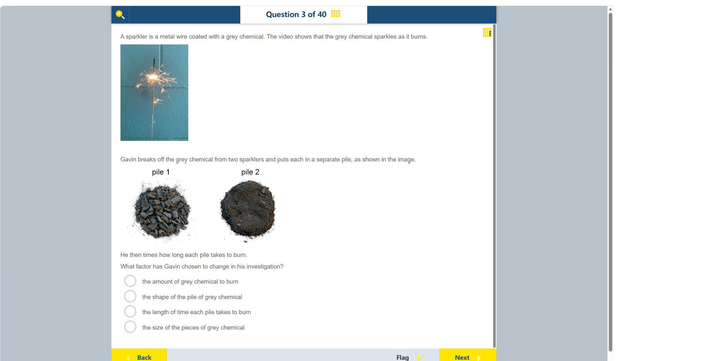

# 第 3 题

## 原题

## 分析

[查看知识体系图](../knowledge-map.md)

### 中文分析

#### 知识背景

实验设计中，研究者主动改变的因素叫自变量，测量的结果叫因变量，其余应尽量保持不变。固体颗粒越小，总表面积通常越大，燃烧反应可接触的表面也越多，可能改变燃烧速度。

#### 图示细读

1. 上方照片是正在燃烧的烟花棒：细长金属丝旁有明亮火花，说明题干所说的灰色涂层会燃烧。扫描只保留一个画面，不能据此量出整个燃烧过程的时间。
2. 下方两张照片分别标为 pile 1、pile 2。pile 1 能辨出许多边界清楚、大小不一的碎块；pile 2 主要呈细密粉末状，虽仍有少量较大的颗粒，但整体明显更细。
3. 比较的是堆内**单个颗粒的大小**，不是两堆的外轮廓。照片没有尺子或质量读数，不能从占据的面积推断哪堆质量更大，也不能给出颗粒的毫米尺寸。
4. 把照片与下方 “times how long each pile takes to burn” 联系起来：先改变粗细，再计时。颗粒大小是处理条件，燃烧时间是之后测得的结果；图中没有显示哪堆实际烧得更快，不应把预期结果当作已观察的数据。

#### 推理与答案

图中 pile 1 是较大的碎块，pile 2 是更细的粉末；Gavin 随后测量每堆燃烧所需的时间。因此他改变的是 **灰色化学物质颗粒的大小**，燃烧时间是因变量。堆的外形或燃烧时间不是他预先控制改变的因素。

### English Analysis

#### Background

In an investigation, the factor deliberately changed is the independent variable, the measured outcome is the dependent variable, and other conditions should be controlled. Smaller solid particles usually expose more total surface area to reactants, which can affect burning rate.

#### Reading the diagram

1. The upper photograph shows a burning sparkler: bright sparks appear beside a thin metal wire, illustrating the burning grey coating described in the text. The scan preserves one frame, not a measurable record of the complete burning time.
2. The lower photographs are labelled pile 1 and pile 2. Pile 1 has many distinct, irregular chunks; pile 2 is mainly fine powder. Some larger particles remain in pile 2, but its overall texture is clearly finer.
3. Compare the size of **individual particles**, not the piles' outer outlines. There is no ruler or mass reading, so the apparent footprint cannot establish which pile has more mass or supply particle sizes in millimetres.
4. Connect the photographs to “times how long each pile takes to burn”: particle size is changed first, then time is measured. Size is the treatment and burning time is the outcome. No actual faster-burning result is shown, so an expected outcome must not be presented as observed data.

#### Reasoning and answer

Pile 1 contains larger pieces, while pile 2 is much finer. Gavin measures how long each pile takes to burn, so the changed factor is **the size of the pieces of grey chemical**. Burning time is the measured dependent variable, not the factor he chose to change.
