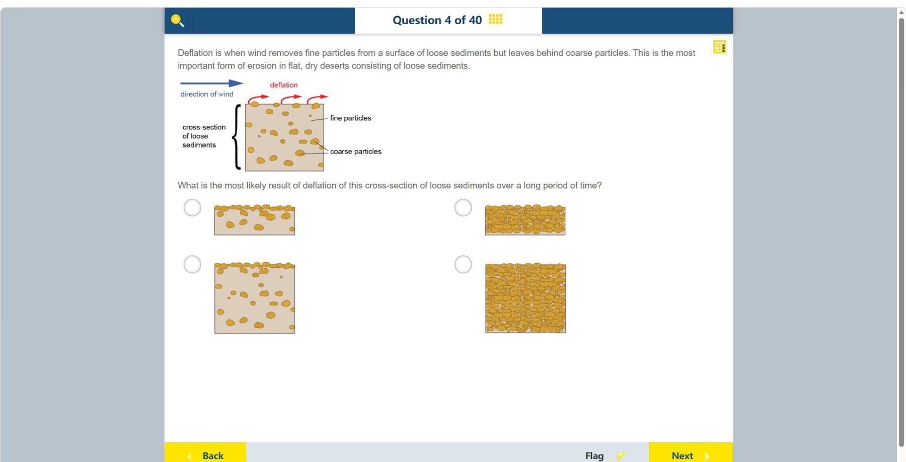

# 第 4 题

## 原题

## 分析

[查看知识体系图](../knowledge-map.md)

### 中文分析

#### 知识背景

Deflation（吹蚀）是风把松散沉积物表层的细颗粒带走、较粗颗粒留在原地的风蚀过程。长期作用会形成粗颗粒覆盖的“沙漠砾幕”，同时使可被搬走的细料减少，沉积物表层降低。

#### 图示细读

1. 上方矩形是松散沉积物的**剖面**，不是俯视图；左侧括号标出沉积层，右侧 fine particles 指向小点，coarse particles 指向较大的黄色颗粒。大小符号区分细料与粗料，不是实际粒径刻度。
2. 蓝色 direction of wind 箭头向右；表面红色弯箭头也向右，表示风从表面带走物质。箭头没有穿过整层，因此不能理解成地下所有细料同时被清空。
3. 先想象表面细料被吹走：原来混在其中的粗粒留下，形成较密的表面覆盖。留下不等于粗粒自行生长，也不等于全部沉积物变成粗粒。
4. 再检查剖面厚度：物质离开后，沉积层应比原先薄。图没有米制标尺，只能作厚薄的定性比较，不能计算侵蚀深度或所需年数。
5. 用两个条件同时筛选四幅候选图：表面粗粒集中，以及沉积层变薄。下面的表把不同错误机制分开，避免只看到“石头变多”就作答。

| 候选位置 | 可见剖面特征 | 与吹蚀过程的关系 |
| --- | --- | --- |
| 左上 | 较薄，顶面粗粒密集，内部仍有混合沉积物 | 同时表现表面残留和物质损失 |
| 左下 | 顶面粗粒集中，但仍是厚剖面 | 没有体现明显的厚度减少 |
| 右上 | 较薄，但整个剖面都密布粗粒 | 把表面选择性搬运误画成全层只剩粗粒 |
| 右下 | 厚剖面且全层密布粗粒 | 既未体现变薄，也误改了内部组成 |

#### 推理与答案

判断图示结果时要同时看颗粒大小和沉积层高度：风带走的是细颗粒，留下的粗颗粒会在新表面集中，而不是把整个剖面变成均匀粗颗粒。对应选项是 **左上图：沉积层变薄，粗颗粒集中在表面**。

### English Analysis

#### Background

Deflation is wind erosion in which fine particles are removed from loose sediment while coarser particles remain. Over time, this creates a coarse surface lag, often called desert pavement, and lowers the sediment surface as material is removed.

#### Reading the diagram

1. The upper rectangle is a **cross-section** of loose sediment, not a plan view. The left bracket identifies the layer; fine particles points to small dots and coarse particles to larger yellow grains. Symbol size distinguishes grain classes, not measured diameters.
2. The blue direction of wind arrow points right, as do the curved red arrows at the surface. These show removal from the surface, not wind passing through the entire layer and clearing all buried fines at once.
3. Imagine the surface fines leaving first: coarse grains formerly mixed with them remain and make a denser surface cover. This does not mean grains grow or all sediment becomes coarse.
4. Next compare layer thickness: loss of material should leave a thinner deposit. No metre scale is supplied, so the comparison is qualitative; neither erosion depth nor elapsed years can be calculated.
5. Apply both tests to the four candidates: concentrated surface coarse grains and reduced thickness. The table separates the alternatives so that “more stones” alone does not determine the choice.

| Candidate position | Visible cross-section | Relation to deflation |
| --- | --- | --- |
| Upper left | Thin, with dense surface coarse grains and mixed sediment below | Shows both a surface lag and material loss |
| Lower left | Surface coarse grains, but a thick section remains | Does not show the marked reduction in thickness |
| Upper right | Thin, but coarse grains fill the entire section | Mistakes selective surface removal for removal of all buried fines |
| Lower right | Thick and filled throughout with coarse grains | Shows neither thinning nor a realistic remaining interior |

#### Reasoning and answer

Track both grain size and sediment thickness. Fine grains are carried away; coarse grains become concentrated at the new surface. The cross-section is not turned into uniformly coarse sediment. The best match is **the upper-left diagram**, showing a thinner deposit with coarse particles concentrated at the surface.
