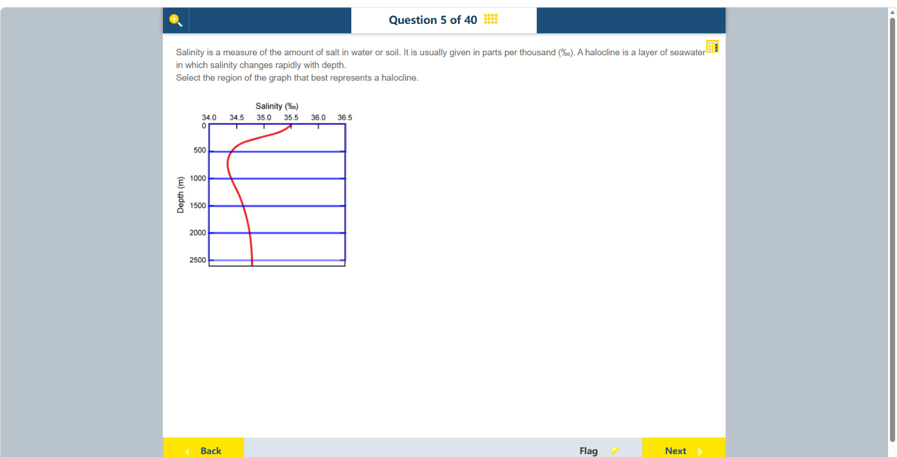

# 第 5 题

## 原题

## 分析

[查看知识体系图](../knowledge-map.md)

### 中文分析

#### 知识背景

盐跃层（halocline）是水体中盐度随深度快速改变的一层，概念上类似温度快速改变的温跃层。读图时要注意纵轴深度向下增加，横轴才是盐度；曲线越接近水平，表示同一深度范围内盐度变化越快。

#### 图示细读

1. 横轴画在图顶端，标为 Salinity (‰)，从左至右 34.0、34.5、35.0、35.5、36.0、36.5，相邻刻度相差 0.5‰。向右是盐度更高，不是水更深。
2. 左侧纵轴 Depth (m) 从上方 0 到下方 2500，每个蓝色水平分界相隔 500 m。向下才是深度增加；蓝线划分可选深度带，不是额外的盐度曲线。
3. 红线表示各深度的盐度。读一个点时，先从深度刻度水平移到红线，再竖直向上对照盐度轴；不要沿着红线把纵坐标当盐度。
4. 海面红线约在 35.5‰，500 m 处约为 34.4‰：同一个 500 m 深度带内向左移动约 1.1‰，说明盐度随深度明显降低。这些是图上估读，不是精确测量。
5. 500–1000 m 段先略向左、再向右，最低盐度位置在这个带内；该转弯不是又一个同样强的盐跃层。比较每个相同厚度的深度带内横向变化，顶部带的变化最大。
6. 1000 m 以下红线逐渐向右，深处接近竖直，表示盐度缓慢增大、每 500 m 的变化较小。这里“近水平”才意味着每单位深度盐度变化大；把通常纵轴为因变量的斜率直觉直接套用，会把深处近竖直的线误判为急变。

#### 推理与答案

图中红色曲线在海面至约 500 m 之间从约 35.5‰ 快速移向约 34.4‰，之后随深度变化缓慢。因此应选 **0–500 m 的上层急变区**，而不是深处较平缓的部分。这里的单位是千分比（‰），不是百分比（%）。

### English Analysis

#### Background

A halocline is a layer in which salinity changes rapidly with depth, analogous to a thermocline for temperature. In this graph, depth increases downward and salinity is on the horizontal axis. A nearly horizontal curve segment indicates a large salinity change over a small depth interval.

#### Reading the diagram

1. The horizontal axis is at the top, labelled Salinity (‰), with values 34.0, 34.5, 35.0, 35.5, 36.0 and 36.5 from left to right. Adjacent ticks differ by 0.5‰; rightward means saltier, not deeper.
2. The left axis, Depth (m), runs from 0 at the top to 2500 at the bottom. The blue horizontal boundaries are 500 m apart. Depth increases downward; the blue lines divide selectable depth bands, not additional salinity profiles.
3. The red curve gives salinity at each depth. To read a point, move horizontally from a depth tick to the red curve, then vertically upward to the salinity axis. Do not read the vertical coordinate as salinity.
4. At the surface the curve is about 35.5‰; at 500 m it is about 34.4‰. A leftward shift of roughly 1.1‰ within that 500 m band shows a substantial decrease with depth. These are graph estimates, not exact measurements.
5. Within 500–1000 m the curve first moves slightly left, then right; the salinity minimum lies in this band. The turn does not identify an equally strong halocline. Compare horizontal changes within equal depth bands: the upper band has the largest change.
6. Below 1000 m the curve moves gradually right and becomes nearly vertical at greater depth, showing slowly increasing salinity and smaller changes per 500 m. Here a nearly horizontal segment means a large salinity change per unit depth; applying the usual intuition for a vertical dependent-variable axis would wrongly identify the near-vertical deep segment as rapid change.

#### Reasoning and answer

From the surface to about 500 m, the red curve shifts rapidly from roughly 35.5‰ toward 34.4‰. Below that, it changes more gradually. Select **the upper 0–500 m interval**. The salinity unit is parts per thousand (‰), not percent.
