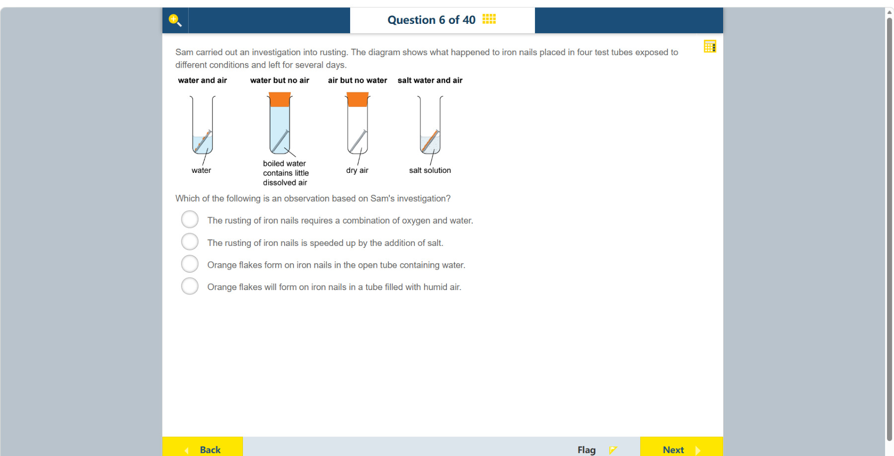

# 第 6 题

## 原题

## 分析

[查看知识体系图](../knowledge-map.md)

### 教材 Topic 技能 / Textbook Topic Skills

**Chapter 6, Topic 2: The role of evidence in chemistry / 第 6 章 Topic 2：证据在化学中的作用**（[教材 PDF 第 38 页 / Textbook PDF p. 38](../textbook-reader.md?page=38)）

| ATL skills / ATL 技能 | Science skills / 科学技能 |
| --- | --- |
| 处理数据并报告结果；从多个角度考虑观点。 Process data and report results; consider ideas from multiple perspectives. | 处理数据并绘制带最佳拟合线的散点图，以识别变量关系；解读数据并用科学推理解释结果；联系科学研究与相关伦理因素。 Process data and plot scatter graphs with a line of best fit to identify relationships between variables; interpret data and explain results using scientific reasoning; make connections between scientific research and related ethical factors. |

### 中文分析

#### 知识背景

铁生锈是铁与氧、水参与的氧化过程；盐通常会加快腐蚀，但不是形成锈的必需反应物。科学题中，“观察”是实验中直接看到或测到的结果；“结论”则是对结果的解释或推广。

#### 图示细读

1. 从左到右读每支管上方的条件标签，再读下方引线指出的内容物。引线是名称与物体的对应关系，不是空气或水流动的箭头；橙色塞子也不是锈，锈的标记在铁钉上。
2. 图显示的是放置数天后的状态。把条件与铁钉外观对应起来，不能只按“是否画了蓝色液体”判断，因为第二管虽然有水，却用煮沸、塞住来限制空气。

| 从左至右 | 图示条件与装置 | 铁钉上的可见结果 |
| --- | --- | --- |
| 第一管 | water and air；开放管，底部有水 | 钉上有橙色斑片 |
| 第二管 | water but no air；塞住，标签说明煮沸水含很少溶解空气 | 钉呈灰色，未画橙色斑片 |
| 第三管 | air but no water；塞住，标为 dry air | 钉呈灰色，未画橙色斑片 |
| 第四管 | salt water and air；开放管，底部为 salt solution | 钉上画有较明显的橙色区域 |

3. 第二管标题把它理想化为“无空气”，但下方文字实际写的是“很少溶解空气”，不是证明每一个氧分子都被除去。第三管的关键是干燥，不是没有空气。
4. 第一、第二、第三管的对照支持讨论水和空气共同参与生锈；第一与第四管的差异支持讨论盐的影响。但这些是对结果的解释，和“第一管铁钉上出现橙色斑片”这一直接观察不是同一层次。
5. 图没有锈的质量、时间序列或速度刻度，不能量出盐使生锈加快几倍；也没有一支标为 humid air 的试管，因此对潮湿空气的说法属于预测，不能冒充图上观察。

#### 推理与答案

四支试管分别改变水、空气和盐水条件。**装有水和空气的开放试管中铁钉出现橙色锈片**是可直接观察的现象，因此符合题目要求。 “生锈需要氧和水”或“盐会加速生锈”是由对照结果归纳出的结论；“潮湿空气一定会生锈”则不是图中直接记录的观察。

### English Analysis

#### Background

Rusting is the oxidation of iron in the presence of oxygen and water. Salt commonly speeds corrosion but is not itself required for rust to form. An observation is a result directly seen or measured; a conclusion explains or generalizes from observations.

#### Reading the diagram

1. Read each tube's condition above it, then follow the leader line to the named contents below. Leader lines link labels to objects; they are not flow arrows. The orange stoppers are not rust: rust markings are on the nails.
2. These are the states after several days. Match conditions to nail appearance rather than judging only whether blue liquid is drawn: the second tube has water, but boiling and stoppering restrict air.

| Left-to-right position | Conditions and apparatus shown | Visible nail result |
| --- | --- | --- |
| First | water and air; open tube with water at the bottom | Orange patches on the nail |
| Second | water but no air; stoppered, with boiled water described as containing little dissolved air | Grey nail, with no orange patches drawn |
| Third | air but no water; stoppered, labelled dry air | Grey nail, with no orange patches drawn |
| Fourth | salt water and air; open tube with salt solution at the bottom | A more prominent orange region on the nail |

3. The second heading idealizes the condition as “no air”, but the lower label actually says “little dissolved air”; it does not prove that every oxygen molecule has been removed. The third tube's important feature is dryness, not absence of air.
4. Comparing the first three tubes supports discussion of both water and air in rusting; comparing the first and fourth supports discussion of salt's effect. These interpretations differ from the direct observation that orange patches appear on the first nail.
5. There are no rust masses, time series or rate scales, so no numerical acceleration factor can be calculated. Nor is there a tube labelled humid air: a claim about that condition is a prediction, not an observation shown here.

#### Reasoning and answer

The four tubes vary the availability of water, air and salt water. **Orange flakes form on the nail in the open tube containing water** is directly visible in the investigation, so it is the observation. Statements about what rusting requires or how salt affects its rate are conclusions drawn from comparing tubes, not direct observations.
