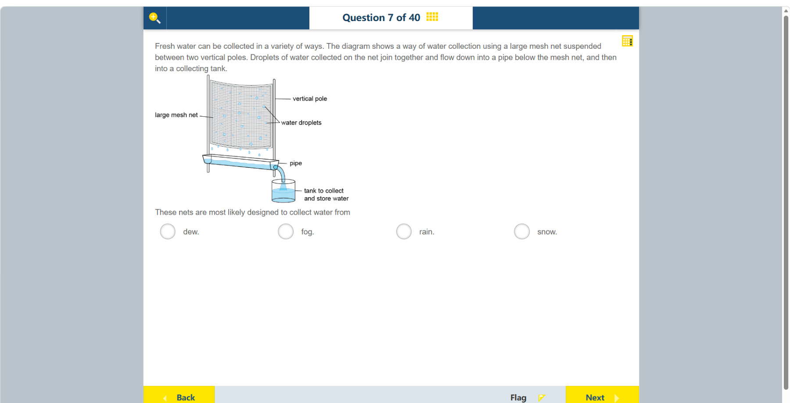

# 第 7 题

## 原题

## 分析

[查看知识体系图](../knowledge-map.md)

### 中文分析

#### 知识背景

雾是悬浮在空气中的微小液态水滴。雾网（fog net）利用网面拦截这些液滴；液滴汇聚成较大的水滴后，在重力作用下流入集水槽和水箱。露水则是在较冷表面上由水汽凝结形成。

#### 图示细读

1. 两根 vertical pole 竖杆之间张着 large mesh net 大网。网面近乎竖直，能拦截随空气接触网面的微小液滴；它不是朝上敞开的接雨盆。
2. water droplets 的引线指向网面上的蓝色小滴；网下缘也画有下落的水滴。蓝色表示液态水，不是水蒸气分子，也没有雪晶符号。
3. 按题干给出的过程先读“附着在网面”，再读“液滴合并、向下流”。液滴变大后能在重力作用下排走，不需把图中的标签引线误当成流向箭头。
4. 网下方横向 pipe 承接落水，其右端与向下弯的管道相连；弯管出口在水箱上方，水流进入标为 tank to collect and store water 的容器。顺着连接可读出“网面 → 下方管道 → 水箱”的路径，而不是水箱向网上供水。
5. 收集路径本身说明水最终到哪里；判断来源还要结合竖直网面拦截空气中液滴这一特征，最符合雾。露是水汽在冷表面凝结，图中没有降温装置或凝结过程的说明；雨雪也不是这幅网面收集图强调的来源。
6. 图未标风向、网孔尺寸、滴水速度或水箱体积，不能从蓝色水位推算效率或日产水量，也不能猜测空气由左还是由右进入。

#### 推理与答案

题图明确显示水滴先附着在网面，再汇成水流进入管道，因此来源是 **雾（fog）**，不是雨、雪或表面形成的露。这个装置收集的是已经存在于空气中的液滴，而不是直接凝结水蒸气。

### English Analysis

#### Background

Fog consists of tiny liquid-water droplets suspended in air. A fog net intercepts them; droplets merge into larger drops and drain under gravity into a gutter and storage tank. Dew, by contrast, forms when water vapour condenses on a cool surface.

#### Reading the diagram

1. A large mesh net stretches between two vertical poles. Its nearly vertical surface can intercept tiny droplets carried into contact with it by air; it is not an upward-facing rain basin.
2. The water droplets leader lines point to small blue drops on the mesh, and falling drops are also drawn below its lower edge. Blue represents liquid water, not water-vapour molecules; no snow crystals are shown.
3. Follow the process stated in the question: droplets first collect on the mesh, then merge and flow downward. Larger drops drain under gravity. Label leader lines should not be mistaken for flow arrows.
4. The horizontal pipe below the mesh catches draining water and connects at its right end to a downward-curving pipe. The outlet sits above the tank to collect and store water. Following these connections gives “mesh → lower pipe → tank”, not water pumped from the tank to the mesh.
5. This path shows the destination of the collected water; identifying its source also requires the vertical mesh's interception of airborne droplets, which best fits fog. Dew forms by condensation on a cool surface, but no cooling apparatus or condensation process is specified. Rain and snow are not the sources emphasized by this mesh-collection design.
6. No wind direction, mesh size, flow rate or tank capacity is labelled. The drawn water level cannot establish efficiency or daily yield, and the direction from which air approaches cannot be inferred.

#### Reasoning and answer

The diagram shows droplets collecting on the mesh before flowing into a pipe, so the source is **fog**, not rain, snow or dew. The net captures liquid droplets already present in the air rather than condensing water vapour directly.
