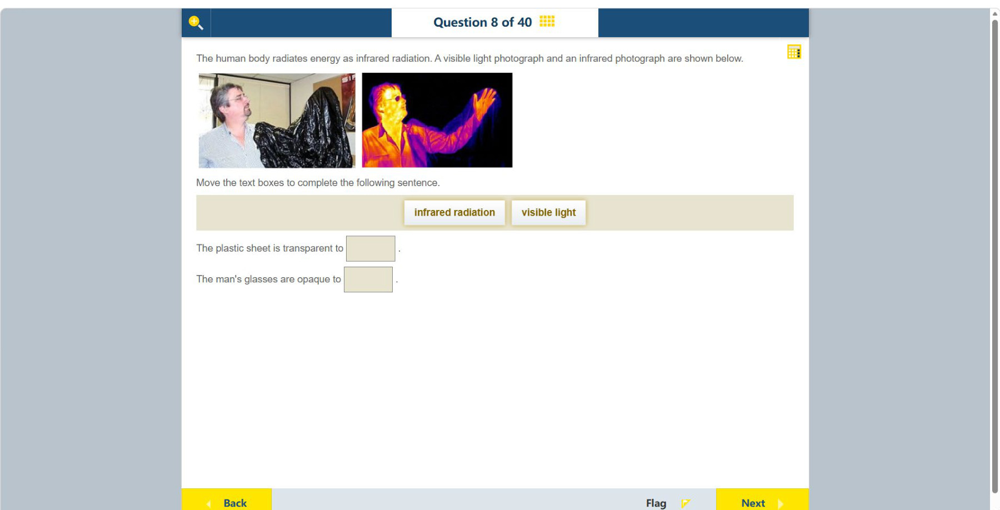

# 第 8 题

## 原题

## 分析

[查看知识体系图](../knowledge-map.md)

### 教材 Topic 技能 / Textbook Topic Skills

**Chapter 11, Topic 3: Forms of energy / 第 11 章 Topic 3：能量形式**（[教材 PDF 第 85 页 / Textbook PDF p. 85](../textbook-reader.md?page=85)）

| ATL skills / ATL 技能 | Science skills / 科学技能 |
| --- | --- |
| 鼓励他人参与；得出合理结论并进行概括；运用头脑风暴和视觉图示产生新想法与探究。 Encourage others to contribute; draw reasonable conclusions and generalizations; use brainstorming and visual diagrams to generate new ideas and inquiries. | 设计检验假设的方法并说明如何收集数据；整理并用表格呈现数据；改进方法以减少误差并拓展探究；形成并解释可检验假设、得出结论并用科学推理解释。 Design a method to test a hypothesis and explain how data will be collected; organize and present data in tables; improve a method to reduce errors and extend inquiry; formulate and explain testable hypotheses, draw conclusions and explain them using scientific reasoning. |

### 中文分析

#### 知识背景

透明与不透明是相对于特定波段而言的材料性质。普通可见光照片与红外热像使用不同波长；某种材料可以挡住可见光，却让红外辐射通过。人体会发出红外辐射，热像仪记录的是到达探测器的红外能量。

#### 图示细读

1. 左图是可见光照片，右图是红外照片。先对应同一个人的脸、眼镜、抬起的手臂与塑料片位置，不能把两图当作两个不同材料的实验。
2. 左图中塑料片是黑色、起皱的遮挡物，看不到被盖住的手臂细节；黑色外观在这里说明可见光下的遮挡，不能直接推断红外性质。
3. 右图在对应的塑料片范围仍能辨出手臂及手部的红外图像。联系题干“人体辐射红外能量”，证据是片后人体信号能到达相机，因此塑料片对该图使用的红外波段透明，不是手臂突然移到片前。
4. 再单独看眼镜：可见光图中镜片可透见眼部，红外图中镜片位置却呈暗色，和明亮的脸部形成反差。相机不能透过镜片取得同样的眼部红外信号，因此镜片对这个红外波段不透明。
5. 红外图的黄、橙、紫等是显示辐射信号的伪彩色，不是人体或衣服真实颜色。图没有温度色标，不能给脸、手或镜片标出摄氏度；暗镜片也不证明眼睛没有热量或不发射红外。
6. 两种材料表现相反，正是“透明必须说明针对哪种辐射”的证据。结论限于图中材料及相机所用波段，不应扩大为所有塑料都透过所有红外、所有眼镜都阻挡所有电磁波。

#### 推理与答案

可见光图中塑料片呈黑色遮挡，而红外图仍能看到片后人体发出的热辐射，说明塑料片对 **红外辐射透明**。眼镜在红外图中遮住眼部热信号，说明眼镜对 **红外辐射不透明**。两处都应填 infrared radiation；不要把可见光下的黑色外观直接等同于红外不透明。

### English Analysis

#### Background

Transparency depends on wavelength. A material may block visible light but transmit infrared radiation. The human body emits infrared energy, and a thermal camera records the infrared reaching its detector.

#### Reading the diagram

1. The left image is a visible-light photograph and the right is an infrared photograph. First match the same person's face, glasses, raised arm and sheet position; these are not experiments with two different sheets.
2. In the left image the black, wrinkled plastic obscures the covered arm's details. Its dark appearance establishes visible-light obstruction here, but does not establish its infrared behaviour.
3. In the corresponding sheet region on the right, the arm and hand remain identifiable in infrared. Combined with the statement that the body emits infrared energy, this shows that radiation from behind the sheet reaches the camera. The sheet transmits the infrared band used here; the arm has not suddenly moved in front of it.
4. Examine the glasses separately: the eyes can be seen through the lenses in visible light, but the lens regions are dark against the bright face in infrared. The camera cannot obtain the same eye-region infrared signal through the lenses, indicating opacity in this infrared band.
5. Yellow, orange and purple in the infrared image are false colours representing radiation signals, not the body's or clothing's actual colours. With no temperature colour scale, temperatures in degrees Celsius cannot be assigned. Dark lenses do not prove that the eyes contain no heat or emit no infrared.
6. The contrasting materials demonstrate why transparency must specify the radiation concerned. The conclusion concerns these materials and the camera's band, not every plastic transmitting all infrared or every pair of glasses blocking all electromagnetic waves.

#### Reasoning and answer

The plastic sheet looks dark in the visible photograph, yet the thermal image shows radiation from the person behind it. The sheet is therefore **transparent to infrared radiation**. The glasses block the eye-region signal in the thermal image, so they are **opaque to infrared radiation**. Do not assume that a material's visible-light appearance predicts its infrared behaviour.
