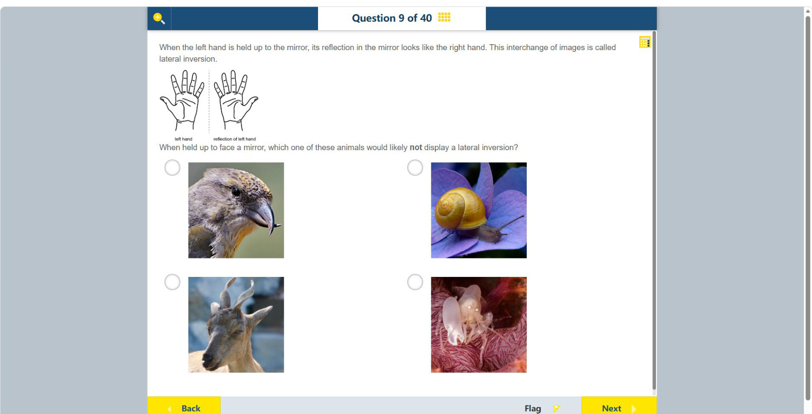

# 第 9 题

## 原题

## 分析

[查看知识体系图](../knowledge-map.md)

### 中文分析

#### 知识背景

镜面反射会把物体的前后方向翻转成观察者所感知的左右互换。若物体左右两侧高度对称，反射后可能看不出变化；若有明显不对称特征（如侧面轮廓或螺旋壳），镜像会更容易辨认。

#### 图示细读

1. 上方手掌示意图用中间竖虚线隔开 left hand 与 reflection of left hand。左边拇指在画面左侧，右边镜像拇指在画面右侧；手指仍向上，说明题目比较的是左右特征交换，而不是上下倒置。
2. 先找每只动物最明显的不对称线索，再想象把它正面朝向镜子。原图并没有画动物面前的镜子，也不是四只动物都以严格正面姿态拍摄，因此应区分照片的姿态与题目设定。

| 图片位置 | 可见特征 | 镜像比较时的意义 |
| --- | --- | --- |
| 左上鸟 | 鸟喙明显向画面右侧伸出，头部呈侧向 | 翻转照片时鸟喙朝向很容易辨认 |
| 右上蜗牛 | 黄色壳上有偏在一侧的螺旋，身体向右伸出 | 螺旋与身体位置提供不对称线索 |
| 左下山羊 | 有成对的角、耳和眼，吻部位于头部中线附近 | 若正面比较，两侧基本对应，左右交换不明显 |
| 右下蟹 | 一侧有远大于另一侧的螯 | 大螯会出现在镜像的另一侧，是强烈的不对称线索 |

3. 山羊照片略带侧向，角的投影也不完全一致，但其成对结构支持题目要求的正面近似对称比较；不能声称照片已经显示一个完全对称的山羊镜像。
4. 右下判断不需要确定蟹的具体物种或性别：一大一小的螯已足够排除。不要把它当作两侧相同的小型节肢动物，忽略最醒目的视觉差异。
5. “不显出左右互换”是指变化不易察觉，不是山羊不遵循镜面反射规律。近似对称使交换后的轮廓相似，细微毛色或姿态差异仍可能看得出来。

#### 推理与答案

若将山羊正面朝向镜子，头部左右大致对称，因此反射像与原像很相似，最不容易显出左右互换。答案是 **山羊**。鸟的侧向轮廓、蜗牛的螺旋壳，以及右下蟹的一大一小两只螯，都提供明显的不对称线索。

### English Analysis

#### Background

A plane mirror reverses the front-to-back direction in a way perceived as a left-right interchange. If an object is nearly symmetrical from the front, its reflected image may look unchanged. Asymmetric features, such as a profile or a coiled shell, make the reversal easier to notice.

#### Reading the diagram

1. The upper hand diagram separates left hand from reflection of left hand with a vertical dashed line. The thumb is on the image's left in the first drawing and on its right in the reflection. Fingers still point upward: the comparison concerns exchanged lateral features, not an upside-down image.
2. Find each animal's clearest asymmetric feature, then imagine it facing a mirror. No mirror is drawn in front of the animals, and not all four photographs are strictly frontal. Distinguish the photographed pose from the question's proposed arrangement.

| Image position | Visible feature | Significance for comparing a reflection |
| --- | --- | --- |
| Upper-left bird | Beak projects clearly to the image's right in a side-facing head | Reversal of the photographed beak direction is easy to notice |
| Upper-right snail | Yellow shell has an off-centre spiral; body extends rightward | Spiral and body position supply asymmetric cues |
| Lower-left goat | Paired horns, ears and eyes, with the muzzle near the head's midline | In a frontal comparison, the two sides broadly correspond |
| Lower-right crab | One claw is much larger than the other | The large claw changes sides in the reflection, a strong asymmetric cue |

3. The goat's photographed head is somewhat turned and its horn projections are not identical, but its paired structures support the approximately symmetric frontal comparison intended here. The photograph does not show an already perfectly symmetric goat reflection.
4. The crab's exact species or sex need not be identified: its unequal claws suffice to exclude it. Do not overlook the prominent size difference by treating it as a small arthropod with matching sides.
5. “Not display lateral inversion” means that a change is difficult to notice, not that a goat escapes the laws of reflection. Approximate symmetry makes exchanged outlines similar, although small markings or pose differences can remain visible.

#### Reasoning and answer

When facing a mirror, the **goat** is approximately symmetrical about the middle of its face, so its reflection is least likely to show a noticeable lateral inversion. The bird's profile, the snail's coiled shell and the lower-right crab's unequal claws provide conspicuous asymmetric cues.
