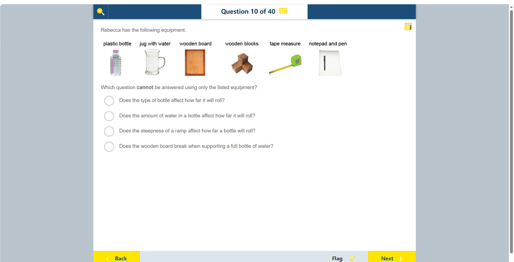

# 第 10 题

## 原题

## 分析

[查看知识体系图](../knowledge-map.md)

### 中文分析

#### 知识背景

公平实验一次只改变一个自变量，并尽可能控制其他条件。要研究“瓶子类型是否影响滚动距离”，必须有两种或更多不同类型的瓶子，并在相同斜坡和相同水量等条件下比较结果。

#### 图示细读

1. 从左到右，器材照片标为 plastic bottle、jug with water、wooden board、wooden blocks、tape measure、notepad and pen。它们是一份器材清单，不是已经组装好的装置；图中没有画滚动轨迹或实际测量结果。
2. 塑料瓶只显示一个，水壶能为同一个瓶子加水或减水。因此能改变“瓶内水量”，但没有第二种瓶子供“瓶型”比较；把同一个瓶子反复滚动不能变出另一个瓶型。
3. 木板与木块可以组合成斜坡，改变支撑高度以改变陡度。这是根据器材用途设计的操作，不是照片已给出斜坡角度；不能从木块照片估出一个实验角度。
4. 卷尺用于测滚动距离，纸笔用于记录不同条件下的结果。它们不负责改变水量、瓶型或坡度；卷尺照片中的小刻度无法可靠辨读，也不是本次实验的距离数据。
5. 最后逐项配对“能否改变条件”和“能否观察结果”：水量与坡度都有可操作的器材，木板是否承受满水瓶也能直接观察；只有瓶型缺少可比较的第二种材料。水壶上没有可可靠读出的容量刻度，因此图本身不能给出某次加水的精确毫升数。

#### 推理与答案

清单中只有 **一个塑料瓶**，所以没有不同瓶型可供比较。故不能回答“瓶子的类型是否影响它滚多远”。水量可以用量杯改变，木板斜度可用木块调整，滚动距离可用卷尺测量；木板能否支撑装满水的瓶子也可直接测试。

### English Analysis

#### Background

A fair test changes one independent variable while controlling other conditions. To test whether bottle type affects rolling distance, the investigator needs at least two bottle types and should keep factors such as ramp angle and water amount consistent.

#### Reading the diagram

1. From left to right the photographs are labelled plastic bottle, jug with water, wooden board, wooden blocks, tape measure, and notepad and pen. This is an equipment inventory, not an assembled experiment; there is no rolling path or measured result.
2. Only one plastic bottle is shown. The jug can add or remove water in that same bottle, allowing water amount to vary, but no second bottle type is supplied. Repeating rolls with one bottle does not create a different bottle type.
3. The board and blocks can be combined into a ramp, with support height varied to change steepness. This is a proposed use of the equipment, not a photographed ramp with a known angle; no experimental angle can be estimated from the block photograph.
4. The tape measure measures rolling distance, while the notepad and pen record results under different conditions. They do not change water amount, bottle type or slope. The tiny tape markings cannot be read reliably and are not distance data from this experiment.
5. Finally pair each proposed change with a way to observe its result: water amount and ramp steepness can be manipulated, and whether the board supports a full bottle can be observed directly. Only bottle type lacks a second material for comparison. No capacity graduation on the jug is reliably readable, so the image cannot supply an exact added volume in millilitres.

#### Reasoning and answer

The equipment list contains only **one plastic bottle**, so bottle type cannot be varied or compared. The unanswerable question is whether bottle type affects rolling distance. Water amount can be changed with the jug, ramp steepness with the blocks, and distance with the tape measure; the board's ability to support a full bottle can be tested directly.
