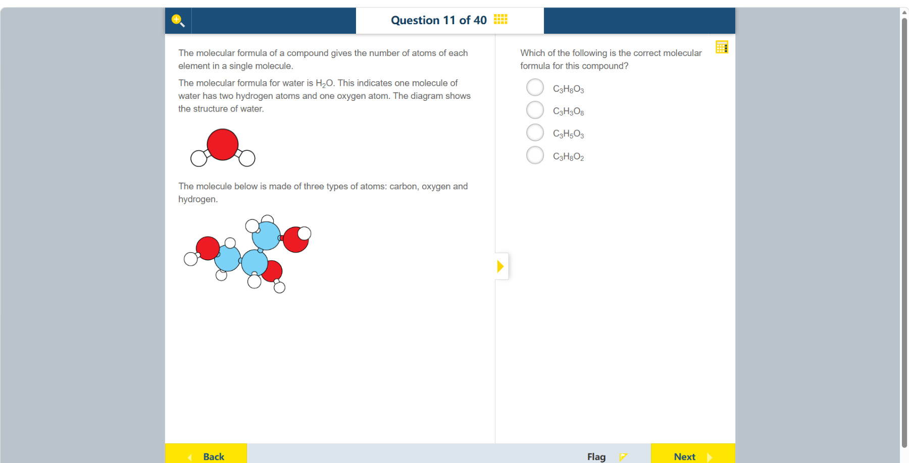

# 第 11 题

## 原题

## 分析

[查看知识体系图](../knowledge-map.md)

### 教材 Topic 技能 / Textbook Topic Skills

**Chapter 8, Topic 2: Models of atomic structure / 第 8 章 Topic 2：原子结构模型**（[教材 PDF 第 54 页 / Textbook PDF p. 54](../textbook-reader.md?page=54)）

| ATL skills / ATL 技能 | Science skills / 科学技能 |
| --- | --- |
| 联系不同信息来源；使用并解释学科专用术语和符号。 Make connections between various sources of information; use and interpret discipline-specific terms and symbols. | 评估模型对原子结构的表示是否有效；将数据整理并制成表格；绘制实验观察草图。 Evaluate the validity of a model of atomic structure; organize and present data in tables; draw sketches of experimental observations. |

**Chapter 11, Topic 2: Structure of organic molecules / 第 11 章 Topic 2：有机分子的结构**（[教材 PDF 第 84 页 / Textbook PDF p. 84](../textbook-reader.md?page=84)）

| ATL skills / ATL 技能 | Science skills / 科学技能 |
| --- | --- |
| 使用并解释学科专用术语和符号；获取信息以增进认知并传达给他人。 Use and interpret a range of discipline-specific terms and symbols; access information to be informed and inform others. | 使用适当的科学规范表示分子并命名有机化合物；绘制散点图以识别变量关系。 Use appropriate scientific conventions to visually represent molecules and name organic compounds; plot scatter graphs to identify relationships between variables. |

### 中文分析

#### 知识背景

分子式用元素符号和右下角数字表示一个分子中各类原子的个数；没有写数字的元素，其个数为 1。模型图中不同颜色的球代表不同元素，计数时应逐类数球，而不是数键或团簇。

#### 图示细读

1. 先读上方水分子示例：文字给出 H₂O，图中一个红色大球连着两个白色小球。因此本页红球代表氧，白球代表氢；下方新出现的蓝色大球对应题干剩下的元素碳。颜色含义由本题示例确定，不能套用其他模型的配色。
2. 下方才是要计数的分子；上方水分子的三个球只是图例式示范，不要一并加进答案。小球间的短连接表示键，不是另一种原子。
3. 先数蓝球：左下、中央偏下、右上各一个，共 3 个碳。三者相连成骨架；没有箭头，连线表达连接关系而不是粒子移动方向。
4. 再数红球：蓝色骨架左端附近、中央下方偏右、右上端附近各一个，共 3 个氧。每个红球旁都有一个白球，这三个白球也必须计入氢的总数。
5. 把白球分组能避免重叠处漏数：左侧碳旁 2 个、中央碳旁 1 个、上方碳旁 2 个，再加三个氧各连的 1 个，共 $2+1+2+3=8$ 个氢。上方蓝球顶部的白球只露出部分轮廓，也仍是一个原子。
6. 最后把计数写成 C₃H₈O₃，并对照选项逐元素核验。不要只数碳上的氢而漏掉氧上的氢，也不要按大球大小估计原子质量；图没有真实原子尺寸或键长刻度。

#### 推理与答案

图中有 3 个碳原子、3 个氧原子和 8 个氢原子，因此分子式为 **C₃H₈O₃**。它与甘油（丙三醇）的分子式相同。选择式子时要分别核对 C、H、O 的下标；原子排列或球的连接方式不会改变原子总数。

### English Analysis

#### Background

A molecular formula uses element symbols and subscripts to state how many atoms of each element occur in one molecule. An element without a subscript has an implied count of one. In the model, count each colour-coded atom, not the bonds or groups.

#### Reading the diagram

1. Start with the water example above: the text gives H₂O and its drawing has one large red sphere linked to two small white spheres. Thus red means oxygen and white means hydrogen on this page; the additional large blue spheres below represent the remaining named element, carbon. Use this example, not another model's colour scheme.
2. Only the lower molecule is to be counted. The three spheres in the upper water example are explanatory and must not be added to the answer. Short connectors are bonds, not extra atoms.
3. Count the blue spheres first: one lower left, one lower centre and one upper right, giving three carbons. Their connections form the backbone; with no arrows, these lines express bonding rather than particle motion.
4. Count the red spheres next: one near the backbone's left end, one below and to the right of its centre, and one at its upper-right end, giving three oxygens. Each has a white sphere attached, and those whites also count toward the hydrogen total.
5. Group the white spheres to avoid missing partially overlapping ones: two on the left carbon, one on the middle carbon and two on the upper carbon, plus one on each of the three oxygens. This gives $2+1+2+3=8$ hydrogens. The partly visible white sphere above the upper blue sphere still represents one atom.
6. Write C₃H₈O₃ and check each element against the options. Do not count only carbon-bound hydrogen and omit oxygen-bound hydrogen, or estimate atomic masses from sphere sizes. No real atomic-size or bond-length scale is provided.

#### Reasoning and answer

The model contains 3 carbon atoms, 8 hydrogen atoms and 3 oxygen atoms, giving **C₃H₈O₃**, the formula of glycerol (propane-1,2,3-triol). Check the count for each element separately; the way atoms are arranged does not change the total count.
