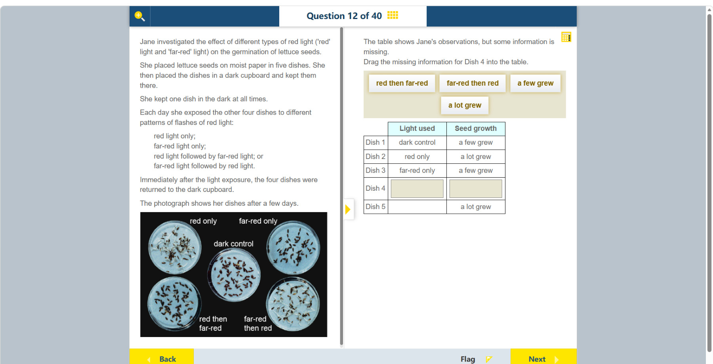

# 第 12 题

## 原题

## 分析

[查看知识体系图](../knowledge-map.md)

### 教材 Topic 技能 / Textbook Topic Skills

**Chapter 15, Topic 1: Plant responses / 第 15 章 Topic 1：植物的响应**（[教材 PDF 第 130 页 / Textbook PDF p. 130](../textbook-reader.md?page=130)）

| ATL skills / ATL 技能 | Science skills / 科学技能 |
| --- | --- |
| 提出“如果……会怎样”的问题并形成可检验假设；解读数据；得出合理结论并进行概括。 Ask “what if” questions and generate testable hypotheses; interpret data; draw reasonable conclusions and generalizations. | 形成可检验假设并用科学推理解释；设计检验假设的方法、选择器材并说明变量控制和数据收集；解读数据并讨论数据对结论的支持程度；用合适图表呈现数据。 Formulate testable hypotheses using scientific reasoning; design a method, select equipment, and explain variable control and data collection; interpret data and discuss how well it supports a conclusion; present data in an appropriate graph. |

### 中文分析

#### 知识背景

莴苣种子萌发受光敏色素调节。红光把光敏色素转成较活跃的 Pfr 状态，通常促进萌发；远红光可把它转回 Pr，抵消红光效应。连续处理时，最后一次照射的光常决定最终反应，因此这是检验“最后光脉冲效应”的实验。

#### 图示细读

1. 左下照片有五个培养皿，必须按旁边标签识别，不能按照片阅读顺序直接编号为 Dish 1–5。中央为 dark control，左上 red only，右上 far-red only，左下 red then far-red，右下 far-red then red。
2. 比较种子周围的浅色细长萌发结构，而不是只比较深色种子的数目：左上与右下可见较多长出的浅色结构，中央、右上与左下则以未明显萌发的深色种子为主。照片细节不足以逐粒可靠统计萌发率，宜使用题表的定性分类。
3. 右侧表格列名 Light used 表示处理，Seed growth 表示结果；每行是一个培养皿。题面已给 Dish 1 暗对照与 Dish 3 远红光为 a few grew，Dish 2 红光为 a lot grew，这些可作为照片比较的参照。

| 表格行 | 对应照片位置／处理 | 读到的结果及信息性质 |
| --- | --- | --- |
| Dish 1 | 中央；dark control | 表中已给 a few grew |
| Dish 2 | 左上；red only | 表中已给 a lot grew |
| Dish 3 | 右上；far-red only | 表中已给 a few grew |
| Dish 4 | 左下；red then far-red | 两格待填；照片与少量萌发的参照相似 |
| Dish 5 | 右下；far-red then red | 表中已给 a lot grew；处理可结合照片标签补全理解 |

4. 然后比较两种混合处理：左下与右下都接受两种光，却有相反的萌发表现。标签中的 then 表示时间先后，不是光同时混合；最后分别是 far-red 与 red。
5. 左下结果更像 far-red only，右下结果更像 red only，构成“后一次照射可反转前一次效应”的视觉证据。因此 Dish 4 的空格应连接左下的顺序标签与少量萌发结果，而不是随意拖入两个词。
6. 照片记录几天后的萌发，不是照光时的颜色，也没有波长、照射强度或精确萌发数量。a few 不等于零，a lot 不等于全部；更不能从这张照片直接看到光敏色素分子的转化，那是解释观察的机制。

#### 推理与答案

Dish 4 接受 **red then far-red**。红光原本促进萌发，但随后远红光反转该效应，所以 Dish 4 应填 **a few grew**，接近暗对照和 far-red-only 的结果。相反，far-red then red 的最后光是红光，预计 **a lot grew**。这说明题目不只比较光的种类，也比较照射顺序。

### English Analysis

#### Background

Lettuce germination is regulated by the photoreceptor phytochrome. Red light shifts it toward the more active Pfr state and usually promotes germination; far-red light shifts it back toward Pr and reverses the red-light effect. In alternating treatments, the final flash often determines the response.

#### Reading the diagram

1. Identify the five dishes in the lower-left photograph by their labels, not by assigning Dish 1–5 in visual reading order. Dark control is central; red only is upper left, far-red only upper right, red then far-red lower left, and far-red then red lower right.
2. Compare the pale, elongated germination structures around seeds, not just the number of dark seeds. More pale growth is visible in the upper-left and lower-right dishes; the centre, upper right and lower left mainly show dark seeds without conspicuous growth. The photograph is insufficient for reliable seed-by-seed germination percentages, so use the table's qualitative categories.
3. In the right-hand table, Light used is the treatment and Seed growth is the outcome; each row refers to one dish. Dish 1, the dark control, and Dish 3, far-red only, are already classified as a few grew; Dish 2, red only, is a lot grew. These anchor comparison with the photograph.

| Table row | Photograph position / treatment | Result and status of information |
| --- | --- | --- |
| Dish 1 | Centre; dark control | a few grew is supplied in the table |
| Dish 2 | Upper left; red only | a lot grew is supplied in the table |
| Dish 3 | Upper right; far-red only | a few grew is supplied in the table |
| Dish 4 | Lower left; red then far-red | Both cells are to be filled; the photograph resembles the low-germination references |
| Dish 5 | Lower right; far-red then red | a lot grew is supplied; the treatment can be understood from the photograph's label |

4. Compare the two mixed treatments next: both receive the same two kinds of light, yet have contrasting growth. Then indicates temporal order, not simultaneous mixing; their final exposures are far-red and red respectively.
5. The lower-left result resembles far-red only, while the lower-right result resembles red only. This visually supports reversal of the first exposure's effect by the later one. Fill Dish 4 by connecting its lower-left sequence label with the low-growth result, not by choosing two unrelated text boxes.
6. The photograph records germination after several days, not colours during illumination, and supplies no wavelengths, intensities or exact germination counts. A few does not mean zero; a lot does not mean every seed. Phytochrome conversion itself is not visible here: it is the mechanism used to explain the observations.

#### Reasoning and answer

Dish 4 receives **red then far-red**. The final far-red exposure reverses the germination-promoting effect of red light, so **a few seeds grew**, similar to the dark control and far-red-only dishes. Far-red then red is expected to produce a lot of growth because red is the final exposure. The sequence, not just the light colours, matters.
