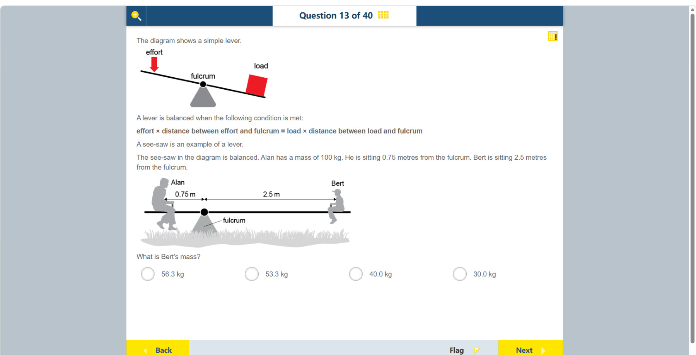

# 第 13 题

## 原题

## 分析

[查看知识体系图](../knowledge-map.md)

### 中文分析

#### 知识背景

杠杆平衡时，支点两侧的力矩相等。力矩等于力乘以力臂；在同一重力场中，人的重量与质量成正比，所以可直接用质量代入力矩平衡式。

#### 图示细读

1. 上方是通用杠杆示意：黑色杆支在灰色支架的黑点 fulcrum 上，左侧 effort 红箭头向下，右侧红块标为 load。左边向下的力倾向使杆逆时针转，右边负载的重量倾向使杆顺时针转；支点把两个相反转动作用联系起来。
2. 下方才是本题跷跷板：Alan 在支点左侧，Bert 在右侧，杆画成水平，且题干明确说 balanced。平衡表示两侧转动作用相抵，不表示两人质量相同。
3. 上方两条双向尺寸箭头分别从 Alan 到支点标 0.75 m、从支点到 Bert 标 2.5 m。它们标的是长度，不是力或运动方向；2.5 m 不是两人间的总距离，也不要减去 0.75 m 来求 Bert 的力臂。
4. 100 kg 是题干给 Alan 的质量，不是从人物剪影大小测出来的。Bert 的未知量也是 kg，而距离单位是 m；图片无可供自行量取的比例尺，应使用标注数字。
5. 两人的重量都向下，但分别在支点两边产生相反力矩。严格的力矩用重量 $mg$ 乘力臂；同一地点的 $g$ 在平衡式两边约去，所以可以比较 $100\times0.75$ 与 $m\times2.5$。质量乘距离是约去 $g$ 后的比较量，并非以 N·m 表示的实际力矩。
6. 先作方向性检查：Bert 的力臂较长，所以平衡所需质量应较小；再用 $0.75/2.5$ 的比值核验计算。不要用质量与距离同向增加的比例，也不要把图上的人数或座位长度当成质量信息。

#### 推理与答案

Alan 的力矩为 $100\,\mathrm{kg}\times0.75\,\mathrm{m}=75\,\mathrm{kg\,m}$。令 Bert 的质量为 $m$，则 $m\times2.5=75$，所以 $m=30\,\mathrm{kg}$。答案是 **30.0 kg**。Bert 距支点更远，因此要用较小质量产生相同力矩。

### English Analysis

#### Background

A balanced lever has equal moments on both sides of the fulcrum. Moment equals force multiplied by perpendicular distance from the pivot. Since both people experience the same gravitational field, their weights are proportional to their masses, so mass can be used in the balance equation.

#### Reading the diagram

1. The upper drawing is a general lever: a black bar rests on the black fulcrum point above the grey support; the left red effort arrow points down and the right red block is the load. Downward effort on the left tends to turn the bar anticlockwise, while the load's weight on the right tends to turn it clockwise. The fulcrum links these opposing turning effects.
2. The lower drawing is the actual seesaw: Alan is left of the fulcrum and Bert is right of it. The bar is horizontal and the text explicitly says balanced. Balance means opposing turning effects cancel, not that the two masses are equal.
3. The two double-headed dimension arrows run from Alan to the fulcrum, labelled 0.75 m, and from the fulcrum to Bert, labelled 2.5 m. They mark lengths, not forces or motion. The 2.5 m is not the total separation; do not subtract 0.75 m to obtain Bert's moment arm.
4. Alan's 100 kg is given in the text, not measured from his silhouette. Bert's unknown is also in kg, while distances are in m. There is no scale for independent measurement of the drawing; use the numerical labels.
5. Both weights act downward but on opposite sides, creating opposing moments. A physical moment is weight $mg$ times the moment arm; the common $g$ cancels from the balance equation, allowing comparison of $100\times0.75$ and $m\times2.5$. Mass times distance is this reduced comparison quantity, not an actual torque in N·m.
6. Check the direction of the result first: Bert has a longer arm and must therefore have a smaller mass. Then use the ratio $0.75/2.5$ to check the calculation. Do not assume mass increases with distance or infer mass from the number of people or seat lengths.

#### Reasoning and answer

Alan's moment is $100\,\mathrm{kg}\times0.75\,\mathrm{m}=75\,\mathrm{kg\,m}$. If Bert's mass is $m$, then $m\times2.5=75$, giving $m=30\,\mathrm{kg}$. The answer is **30.0 kg**. Bert sits farther from the fulcrum, so less mass is needed to produce the same moment.
