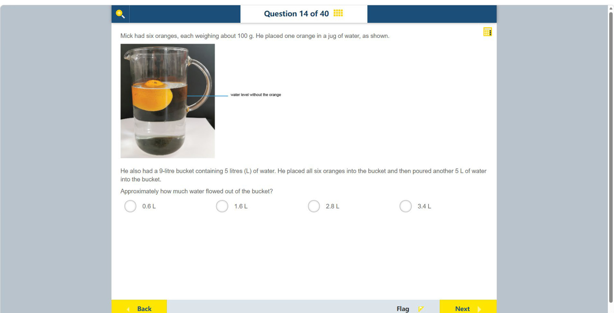

# 第 14 题

## 原题

## 分析

[查看知识体系图](../knowledge-map.md)

### 中文分析

#### 知识背景

浸入水中的物体会排开与其浸没体积相等的水。照片中的橙子漂浮且有一部分露出水面；漂浮平衡时，浮力等于橙子的重量，因此排开水的质量等于橙子的质量。100 g 的橙子约排开 100 g 的水，即约 100 mL（0.1 L），不需要假定整个橙子的密度等于水。

#### 图示细读

1. 照片显示透明水壶中的一个橙子。右侧蓝色水平指示线标为 water level without the orange，表示放入橙子**以前**的水位；它不是当前水面，也不是容量刻度。
2. 当前水面在蓝线之上，橙子大部分在水下、顶端露出水面，且没有接触壶底。这是漂浮的视觉证据，不是整个橙子完全浸没；因此排水量对应水下部分，而非整个橙子的体积。
3. 图没有可读的毫升刻度，也未给水壶横截面积，不能把水面在照片中上升多少像素直接换算成体积。可用的定量依据是题干每个橙子约 100 g，以及漂浮时排开同质量的水。
4. 于是一个橙子排水约 100 mL，六个共约 0.6 L。这里的 0.6 L 是六个漂浮橙子造成的排水体积，不是另外倒入的水，也不是从这一个橙子照片数出六个水果。
5. 照片只演示单个橙子的行为；后面的水桶过程要按文字另行追踪：容量 9 L、原有水 5 L、放入六个橙子、再倒水 5 L。可先把橙子排水计入：原来 5 L 水加约 0.6 L 排水效应，距桶口仍有约 3.4 L 的容纳余量。
6. 再加入 5 L 时，只有约 3.4 L 能留在桶中，所以约 1.6 L 溢出。这个估算沿用照片所示的自由漂浮条件，不计泼洒、吸水或桶口卡住水果等额外效应；不应把最终溢水量仅取为橙子的排水量。

#### 推理与答案

六个橙子约排开 $6\times0.1=0.6$ L。桶原有 5 L，再倒入 5 L，水量达到 10 L；9 L 桶先溢出 $10-9=1$ L，再加上橙子占据的约 0.6 L，总溢水约 **1.6 L**。不能只算桶中水本身超过容量的 1 L，而漏掉水果排开的体积。

### English Analysis

#### Background

An object placed in water displaces a volume equal to its submerged volume. The photographed orange floats with part above the surface. In floating equilibrium, buoyancy equals its weight, so the displaced water has the same mass as the orange. A 100 g orange therefore displaces about 100 g of water, or 100 mL (0.1 L), without assuming that the whole orange has the same density as water.

#### Reading the diagram

1. The photograph shows one orange in a transparent jug. The blue horizontal indicator labelled water level without the orange marks the water level **before** the orange was added; it is neither the current surface nor a volume graduation.
2. The current surface is above that line. Most of the orange is underwater, its top projects above the surface, and it does not touch the bottom. These are visible signs of floating rather than complete submersion, so displacement corresponds to the underwater part, not the whole orange's volume.
3. There are no readable millilitre graduations or jug cross-sectional dimensions. A rise measured in photograph pixels cannot be converted directly to volume. The usable numerical evidence is the stated mass of about 100 g per orange, together with equal displaced-water mass for a floating object.
4. One orange therefore displaces about 100 mL, and six about 0.6 L. This is the displacement caused by six floating oranges, not additional poured water; the photograph itself contains only one orange.
5. The photograph demonstrates one orange's behaviour; track the bucket procedure separately from the text: 9 L capacity, 5 L of water initially, six oranges added, then 5 L more water. Including displacement first gives 5 L of water plus about 0.6 L of displacement, leaving about 3.4 L of space below the rim.
6. Of the next 5 L, only about 3.4 L can remain, so about 1.6 L overflows. This estimate assumes free floating as shown, without extra splashing, absorption or fruit trapped at the rim. The final overflow is not merely the oranges' displacement.

#### Reasoning and answer

Six oranges displace about $6\times0.1=0.6$ L. The bucket receives 5 L already present plus another 5 L, totalling 10 L; a 9 L bucket overflows by 1 L even without the oranges. Including the additional 0.6 L displaced by the fruit gives about **1.6 L** of overflow. Do not omit the displaced volume.
