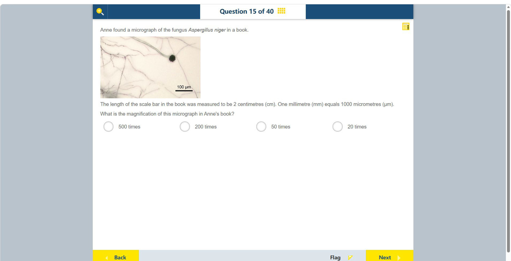

# 第 15 题

## 原题

## 分析

[查看知识体系图](../knowledge-map.md)

### 中文分析

#### 知识背景

显微照片的放大倍数定义为图像长度除以实际长度，两个长度必须先换成相同单位。比例尺表示样品中某段的真实长度，因此测量书上比例尺即可求图像放大倍数。

#### 图示细读

1. 照片中可见多条细丝状结构，以及一处较深的圆形结构；题干说明对象是黑曲霉（*Aspergillus niger*）。这些外观帮助认识样品，但图中没有逐一标注结构名称，不能把某条细丝或圆形结构直接当作测量基准。
2. 真正的定量基准是照片右下角的黑色横线，线上方标着 $100\,\mu\mathrm{m}$。这表示横线两端之间的图像距离对应样品中的 100 微米，不是整张照片、整条菌丝或圆形结构的真实长度。
3. 题干另给出这条横线在书上量得 2 cm。应将“书上横线的长度”与“横线代表的真实长度”配对，再换成相同单位相除；照片中结构的形状和颜色不参与这个比值。
4. 网页扫描图会随屏幕和缩放而改变显示大小，因此不能用屏幕上量出的长度替代题干的 2 cm。这里求的是原书中照片的放大倍数，而不是当前网页显示的放大倍数。

#### 推理与答案

图中比例尺代表 $100\,\mu\mathrm{m}$，在书上长 2 cm。换算：$2\,\mathrm{cm}=20\,\mathrm{mm}=20{,}000\,\mu\mathrm{m}$。放大倍数为 $20{,}000/100=200$，所以答案是 **200 倍**。常见错误是忘记把厘米换算成微米，或把 100 μm 当作显微照片中真菌的长度。

### English Analysis

#### Background

Magnification is image length divided by actual length. Both lengths must be expressed in the same units. A scale bar gives the real length represented by a measured distance on the printed image.

#### Reading the diagram

1. The micrograph shows several thread-like structures and one darker round structure; the stem identifies the organism as *Aspergillus niger*. These appearances help identify the specimen, but individual structures are not labelled, so none should be selected as the measurement reference merely from its shape.
2. The quantitative reference is the black horizontal bar at the bottom right, labelled $100\,\mu\mathrm{m}$. The image distance between its endpoints represents 100 micrometres in the specimen, not the actual length of the whole photograph, a whole filament, or the round structure.
3. The stem separately states that this bar measures 2 cm in the book. Pair the printed bar length with the actual length it represents, convert both to the same units, then divide. The shapes and colours of the fungal structures do not enter this ratio.
4. A scan changes displayed size with the screen and zoom setting, so a screen measurement cannot replace the stated 2 cm. The question concerns magnification in the original book, not magnification on the current webpage.

#### Reasoning and answer

The scale bar represents $100\,\mu\mathrm{m}$ and measures 2 cm in the book. Convert $2\,\mathrm{cm}=20\,\mathrm{mm}=20{,}000\,\mu\mathrm{m}$. Thus magnification is $20{,}000/100=200$, so the answer is **200 times**. A common mistake is to divide lengths expressed in different units.
