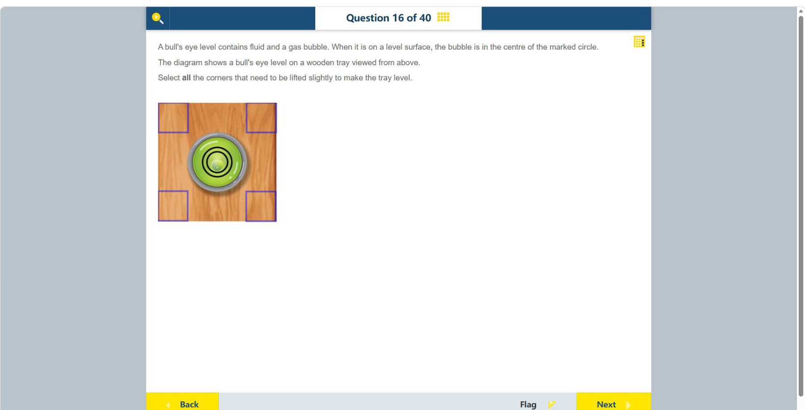

# 第 16 题

## 原题

## 分析

[查看知识体系图](../knowledge-map.md)

### 中文分析

#### 知识背景

圆形水平仪中的气泡会移动到液面较高的一侧。若气泡偏离中心，就能判断托盘倾斜的方向；要把托盘调平，应抬高与气泡偏移方向相反的低侧。一次沿同一方向倾斜时，通常抬起同一边的两个角。

#### 图示细读

1. 木托盘画的是俯视图，四角的紫色方框是可选择抬起的位置；图的“上、下”指托盘在画面中的两侧，不是侧视图中的高度。
2. 中央水平仪有黑色同心圆作为中心参照。应观察内部淡色圆形气泡，而不是外圈金属边框或边缘的亮白反光；气泡中心位于黑圆中心的下方，左右偏移不明显。
3. 气泡浮向较高的一侧，所以画面下侧是高侧，画面上侧是低侧。图中没有倾斜角度刻度，能判断的是调节方向，而不是需要抬高多少毫米。
4. 抬起上侧的左、右两个角，可一起提高这一条低边；只抬一个角会引入左右方向的倾斜。不能因为气泡在下侧就抬下侧，那会让原本的高侧更高。

#### 推理与答案

俯视图中气泡略偏向托盘下侧，表示下侧较高、上侧较低。要使气泡回到中心，应抬起 **上方的两个角（左上和右上）**。关键是抬高低侧，而不是抬高气泡所在的高侧；调平后气泡才回到圆圈中央。

### English Analysis

#### Background

The bubble in a circular spirit level moves toward the higher side of the liquid surface. Its displacement indicates the direction of tilt. To level the tray, raise the low side, opposite the direction in which the bubble has shifted. A tilt along one axis is corrected by lifting the two corners on that side.

#### Reading the diagram

1. The wooden tray is shown from above. The purple squares mark the four selectable corners; “top” and “bottom” describe positions in the picture, not heights in a side view.
2. The black concentric circles provide a centre reference. Track the pale circular bubble inside them, not the metal rim or bright reflections near its edge. The bubble centre is below the circle centre, with no clear sideways displacement.
3. The bubble floats toward the high side, so the bottom of the picture is the high edge and the top is the low edge. There is no angle scale: the diagram establishes the correction direction, not a lifting distance in millimetres.
4. Lifting both upper corners raises the whole low edge; lifting just one would introduce sideways tilt. Lifting the bottom because the bubble is there would make the already high edge higher.

#### Reasoning and answer

In the top view, the bubble is slightly displaced toward the lower edge of the picture, indicating that edge is high and the opposite edge is low. Lift **the two upper corners (top-left and top-right)** to bring the tray level and move the bubble back to the centre. Lift the low side, not the side toward which the bubble has moved.
