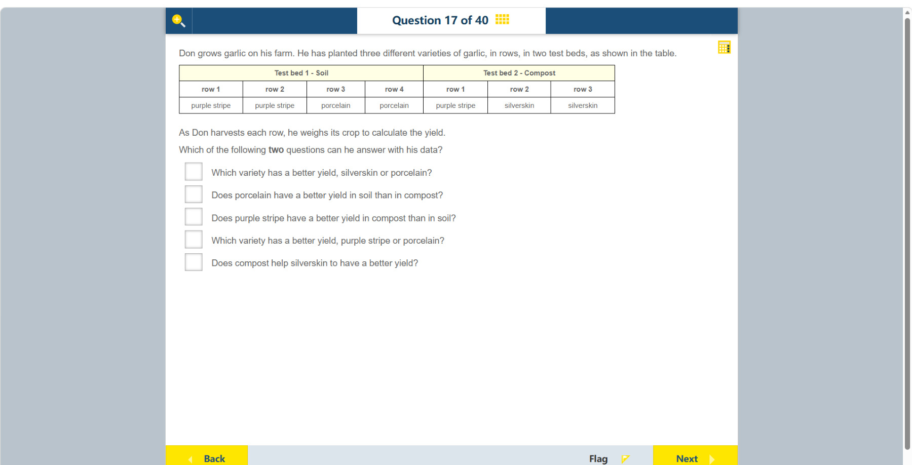

# 第 17 题

## 原题

**教材阅读器 / Textbook reader:** [Chapter 6, Topic 1: Reasoning from evidence（纸本 p.30 / PDF p.39）](../textbook-reader.md?page=39)

## 分析

[查看知识体系图](../knowledge-map.md)

### 教材 Topic 技能 / Textbook Topic Skills

**Chapter 6, Topic 1: Reasoning from evidence / 第 6 章 Topic 1：基于证据推理**（[教材 PDF 第 38 页 / Textbook PDF p. 38](../textbook-reader.md?page=38)）

| ATL skills / ATL 技能 | Science skills / 科学技能 |
| --- | --- |
| 运用头脑风暴和视觉图示产生新想法与探究；提出“如果……会怎样”的问题并形成可检验假设；给予和接收有意义的反馈。 Use brainstorming and visual diagrams to generate new ideas and inquiries; ask “what if” questions and generate testable hypotheses; give and receive meaningful feedback. | 使用科学推理提出可检验的问题和假设；说明如何操纵变量，以及如何收集足够的数据。 Formulate testable questions and hypotheses using scientific reasoning; explain how to manipulate variables and collect enough data. |

### 中文分析

#### 知识背景

比较不同处理的实验数据时，要确认数据中是否同时包含待比较的条件。若品种只出现在一种介质中，就无法分辨产量差异来自品种还是介质；要判断介质效果，最好比较同一品种在 soil 与 compost 中的产量。

#### 图示细读

1. 先读合并表头：左边是 Test bed 1 - Soil（土壤），右边是 Test bed 2 - Compost（堆肥）。下面的 row 1、row 2 等是各试验床内的种植行号，不是产量排名，也不是测量数值。
2. 按表头向下对应品种：土壤床第 1、2 行是 purple stripe，第 3、4 行是 porcelain；堆肥床第 1 行是 purple stripe，第 2、3 行是 silverskin。两个床都叫 row 1，不代表这两行使用相同介质。
3. 可把种植组合整理为下表。寻找同一行中两个介质都有记录的品种，能找到 purple stripe；寻找同一介质中的不同品种，则能在土壤列找到 purple stripe 与 porcelain。
4. 比较 silverskin 与 porcelain 时，品种和介质同时改变，不能把差别单独归因于品种；porcelain 缺堆肥组，silverskin 缺土壤组，空缺不能当作零产量。
5. 表内没有收获质量或单位，题干说以后逐行称量。它支持判断“哪些问题可以研究”，不能现在就断言哪个品种产量高。紫条蒜两种介质中的行数不同，实际比较也不能把两行总质量和一行总质量直接当作介质效果。

| 品种 | 土壤床 | 堆肥床 |
| --- | --- | --- |
| purple stripe（紫条蒜） | 第 1、2 行 | 第 1 行 |
| porcelain（瓷白蒜） | 第 3、4 行 | 无 |
| silverskin（银皮蒜） | 无 | 第 2、3 行 |

#### 推理与答案

表中紫条蒜同时种在土壤和堆肥中，所以可以比较 **紫条蒜在堆肥中的产量是否高于土壤**。紫条蒜和瓷白蒜也都在土壤中，能在相同介质下比较 **哪种品种产量更高**。瓷白蒜没有堆肥组，银皮蒜没有土壤组，因此涉及它们跨介质比较的问题无法由这组数据回答。可选的两项是第 3、4 项。

### English Analysis

#### Background

To compare treatments, the data must include the conditions being compared. If a variety occurs in only one medium, a yield difference cannot be separated from a medium effect. The effect of soil versus compost is best tested using the same variety in both.

#### Reading the diagram

1. Read the spanning headers first: Test bed 1 - Soil on the left and Test bed 2 - Compost on the right. “Row 1”, “row 2”, and so on identify planted rows within each bed, not yield rankings or measured values.
2. Follow each header down to the varieties: soil rows 1 and 2 contain purple stripe, and rows 3 and 4 porcelain; compost row 1 contains purple stripe, and rows 2 and 3 silverskin. The two entries called row 1 do not use the same medium.
3. Rearrange the planting combinations below. A variety with entries in both medium columns is purple stripe. Different varieties within the same medium can be found by comparing purple stripe with porcelain in the soil column.
4. Comparing silverskin with porcelain changes both variety and medium, so a difference cannot be attributed to variety alone. Porcelain lacks a compost group and silverskin lacks a soil group; an absent group is not a zero yield.
5. No harvested masses or measurement units appear in this table; the stem says each row will be weighed. It establishes which questions can be investigated, not which variety already has the higher yield. Purple stripe also has unequal numbers of rows in the two media, so two-row and one-row total masses must not be treated directly as a medium effect.

| Variety | Soil bed | Compost bed |
| --- | --- | --- |
| Purple stripe | Rows 1 and 2 | Row 1 |
| Porcelain | Rows 3 and 4 | Absent |
| Silverskin | Absent | Rows 2 and 3 |

#### Reasoning and answer

Purple stripe garlic appears in both soil and compost, so Don can ask whether **purple stripe yields better in compost than in soil**. Purple stripe and porcelain both appear in soil, so he can also compare **their yields under the same soil condition**. Porcelain has no compost group and silverskin has no soil group, so their cross-medium comparisons are unsupported. The answer is the **third and fourth** questions.
