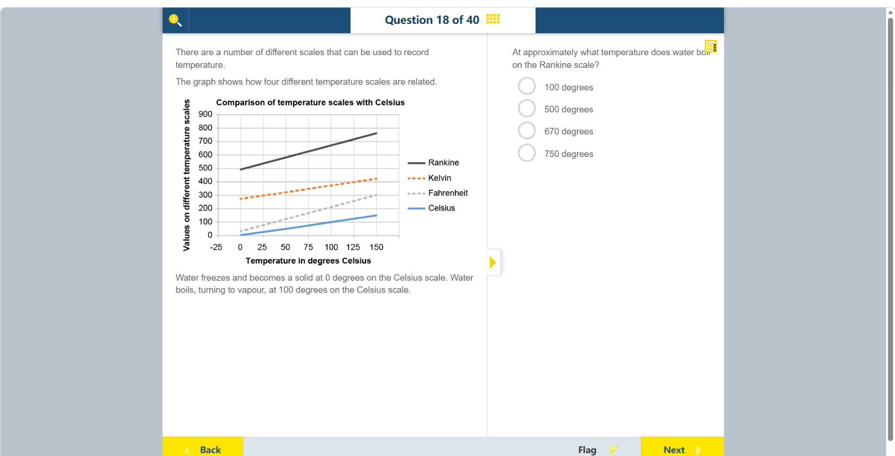

# 第 18 题

## 原题

## 分析

[查看知识体系图](../knowledge-map.md)

### 中文分析

#### 知识背景

Rankine 和 Kelvin 都是以绝对零度为零点的绝对温标；Rankine 每一度的大小与华氏度相同。它与开尔文的关系为 $^\circ\!R=\frac{9}{5}K$。摄氏 100°C 的水沸点对应约 373 K，即约 672°R。

要区分温标的“零点”和“每一度的大小”：摄氏与华氏的零点不是绝对零度，而 Kelvin 和 Rankine 是；Kelvin 的一度等于摄氏的一度，Rankine 的一度等于华氏的一度。因此不能只按 $9/5$ 缩放摄氏读数，必须先换算绝对温度：$^\circ\!R=\frac{9}{5}(°C+273.15)$。对本题，$100°C$ 对应 $671.67°R$，图上读作约 $670°R$。

#### 图示细读

1. 图题是“Comparison of temperature scales with Celsius”。横轴是摄氏温度，标出 -25、0、25、50、75、100、125、150，每格间隔 25°C；纵轴是各温标对应的数值，范围 0–900，每个主要间隔为 100。纵轴的单位必须随所选曲线判断，不能一律当作摄氏度。
2. 图例将深灰实线对应 Rankine，橙色虚线对应 Kelvin，浅灰虚线对应 Fahrenheit，蓝色实线对应 Celsius。先确认目标是最上面的深灰线，而不是靠近它的 Kelvin 线。
3. 题干给出水在 100°C 沸腾，因此从横轴 100 向上沿同一竖直网格线找到 Rankine 线，再水平向左对照纵轴。交点在 600 与 700 之间，明显较靠近 700，约为 670°R；网格不支持读出精确个位数。
4. 同一条竖直线上四个交点是同一个物理温度的不同表示。例如在 100°C 处，蓝线是 100，浅灰线约 212，橙线约 373，深灰线约 672。Rankine 数值较大不表示水变得更热。
5. 在横轴 0°C 处，Rankine 线已接近 490，而非 0。这直接显示两种温标零点不同；不能从原点画假想直线，也不能把右端约 750 的读数当作水的沸点，因为右端对应的是 150°C。

#### 推理与答案

在横轴 100°C 处向上读 Rankine 曲线，纵轴约为 670–675°R。最接近的选项是 **670 degrees**。温标换算不能直接把 100°C 当成 100 Rankine，因为 Rankine 的零点在绝对零度。

### English Analysis

#### Background

Rankine and Kelvin are absolute temperature scales whose zero is absolute zero. A Rankine degree has the same size as a Fahrenheit degree, and $^\circ\!R=\frac{9}{5}K$. Water boils at 100°C, about 373 K, which is approximately 672°R.

Distinguish a scale's zero point from the size of one degree. Celsius and Fahrenheit do not start at absolute zero, whereas Kelvin and Rankine do. A kelvin is the same size as a Celsius degree, while a Rankine degree is the same size as a Fahrenheit degree. Therefore, do not merely multiply a Celsius reading by $9/5$; first convert to absolute temperature: $^\circ\!R=\frac{9}{5}(°C+273.15)$. For this question, $100°C$ is $671.67°R$, read from the graph as about $670°R$.

#### Reading the diagram

1. The title is “Comparison of temperature scales with Celsius”. The horizontal axis gives Celsius temperature at -25, 0, 25, 50, 75, 100, 125, and 150, in 25°C intervals. The vertical axis gives the corresponding scale values from 0 to 900 in major intervals of 100. Its unit depends on the chosen line; it is not always Celsius.
2. The legend identifies Rankine as the dark-grey solid line, Kelvin as the orange dashed line, Fahrenheit as the light-grey dashed line, and Celsius as the blue solid line. Select the uppermost dark-grey line, not the nearby Kelvin line.
3. The stem states that water boils at 100°C. Follow the vertical grid line above 100 to its intersection with Rankine, then read horizontally left. The intersection lies between 600 and 700, much nearer 700, at about 670°R. The grid does not justify an exact single-degree reading.
4. The four intersections on one vertical line represent the same physical temperature on different scales. At 100°C, the blue line reads 100, the light-grey line about 212, the orange line about 373, and the dark-grey line about 672. A larger Rankine number does not mean hotter water.
5. At 0°C, the Rankine line is already near 490 rather than zero, showing the different zero points. Do not invent a line through the origin or use the right-end reading near 750 as the boiling point: that endpoint corresponds to 150°C.

#### Reasoning and answer

Read the Rankine line at 100°C on the horizontal axis. It is about 670–675°R, so the closest choice is **670 degrees**. Do not treat 100°C as 100°R; the scales have different zero points.
