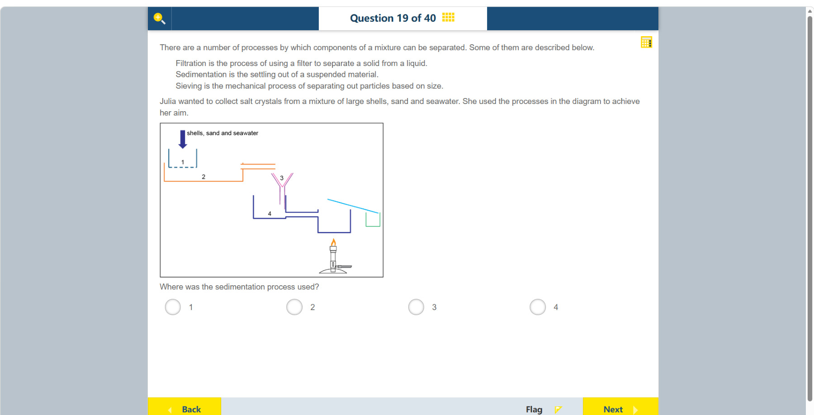

# 第 19 题

## 原题

## 分析

[查看知识体系图](../knowledge-map.md)

### 中文分析

#### 知识背景

筛分按颗粒大小分离固体；沉降让悬浮的较重颗粒在静置时落到底部；过滤用多孔滤材截留固体而让液体通过；蒸发则可从盐水中回收溶解的盐。

#### 图示细读

1. 左上方向下的粗箭头标为 shells, sand and seawater，表示贝壳、沙和海水一起进入装置。1 的蓝色容器底部画成虚线，表示有孔的筛分部位：大贝壳留下，较小的沙粒和海水可进入下方橙色的 2。
2. 2 是接收混合物的较宽容器，右上方有通往下一装置的出口。题目给出的沉降定义是悬浮物下沉；在这一阶段，沙可留在底部，上部液体再流向右边。图没有逐粒画出沉积层，判断依据是容器在“筛分后、过滤前”的位置和沉降的定义，不是把橙色线条当作沙粒。
3. 沿出口向右读，3 是粉色漏斗形部位，下端通向标 4 的蓝色收集容器。这一区别很重要：经过多孔滤材截留固体属于过滤，不能因为漏斗中物质向下流就把 3 叫作沉降。
4. 4 后面的通道连到火焰上方的容器，再有一条斜向右下的线通向右端小容器。火焰表明后续加热；斜线表示后续收集方向，而不是沙粒下沉的轨迹。图未标出这里的温度或各容器中的最终物质量，无需补造这些信息来定位沉降步骤。
5. 读完整个顺序，再逐项区分：1 的筛孔按大小分离，2 让颗粒在液体中沉下，3 的漏斗负责过滤，4 接收过滤后的液体。识别的是发生分离的机制，不是编号最大或位置最低的容器。

#### 推理与答案

流程中先用步骤 1 筛掉大贝壳，步骤 2 让沙粒从海水中沉到容器底部，随后再分离液体并加热盐水。题目问沉降发生在哪里，答案是 **步骤 2**。沉降与过滤不同：沉降依赖重力和静置，不需要滤纸。

### English Analysis

#### Background

Sieving separates solids by particle size. Sedimentation allows suspended, denser particles to settle under gravity. Filtration traps solids in a porous material while liquid passes through, and evaporation can recover dissolved salt from seawater.

#### Reading the diagram

1. The thick downward arrow at the upper left is labelled “shells, sand and seawater”, showing the mixed input. The blue apparatus numbered 1 has a dashed base representing the perforated sieving region: large shells remain while smaller sand particles and seawater can enter the orange container numbered 2 below.
2. Number 2 is the wider receiving container, with an outlet at its upper right leading onward. The stem defines sedimentation as suspended material settling: sand can remain at the bottom while upper liquid passes to the right. Individual sediment particles are not drawn; the evidence is this container's position after sieving and before filtration, together with the definition, not the orange outline itself.
3. Follow the outlet rightward to the pink funnel-shaped part numbered 3, whose lower end leads into the blue collecting vessel numbered 4. Trapping solids with a porous filter is filtration; downward flow through a funnel does not by itself make number 3 sedimentation.
4. The passage after 4 connects to a vessel above a flame; a further line slopes down to a small vessel on the right. The flame indicates later heating, and the sloping line indicates an onward collection route, not a sand particle's settling path. Temperatures and final quantities are not labelled and need not be invented to locate sedimentation.
5. Distinguish the mechanisms in sequence: the sieve at 1 separates by size, 2 lets particles settle in liquid, the funnel at 3 filters, and 4 collects filtered liquid. The relevant evidence is the separation mechanism, not the largest number or lowest-positioned container.

#### Reasoning and answer

Step 1 sieves out the large shells. At step 2, the sand settles out of the seawater before later separation and heating. Therefore sedimentation occurs at **step 2**. Unlike filtration, sedimentation relies on settling under gravity rather than a filter paper.
