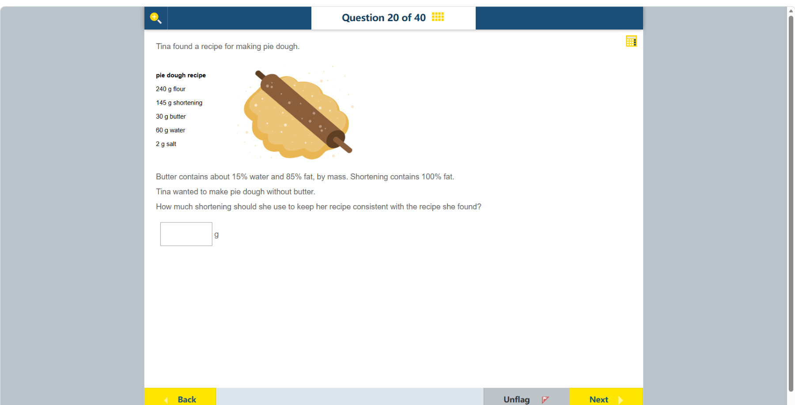

# 第 20 题

## 原题

## 分析

[查看知识体系图](../knowledge-map.md)

### 中文分析

#### 知识背景

配方替换应保持主要成分比例。黄油约 85% 是脂肪、15% 是水；shortening 是 100% 脂肪。因此用 shortening 替代黄油时，要按黄油实际提供的脂肪质量换算，而不是把两者质量直接视为等效。

#### 推理与答案

30 g 黄油提供 $30\times0.85=25.5$ g 脂肪。原配方还有 145 g shortening，所以总脂肪需由 $145+25.5=170.5$ g shortening 提供。答案是 **170.5 g（约 171 g）**。若还要保持水分不变，黄油原来带入的 4.5 g 水也应另行补回；这不改变 shortening 的计算。

### English Analysis

#### Background

Ingredient substitutions should preserve the relevant component proportions. Butter is about 85% fat and 15% water, whereas shortening is 100% fat. Replace butter based on the fat it contributes, not by matching its total mass.

#### Reasoning and answer

The 30 g of butter contributes $30\times0.85=25.5$ g of fat. Add this to the recipe's existing 145 g of shortening: $145+25.5=170.5$ g. Use **170.5 g (about 171 g) of shortening**. If the dough's water content must also remain unchanged, add back the 4.5 g of water that the butter supplied; that does not change the shortening amount.
