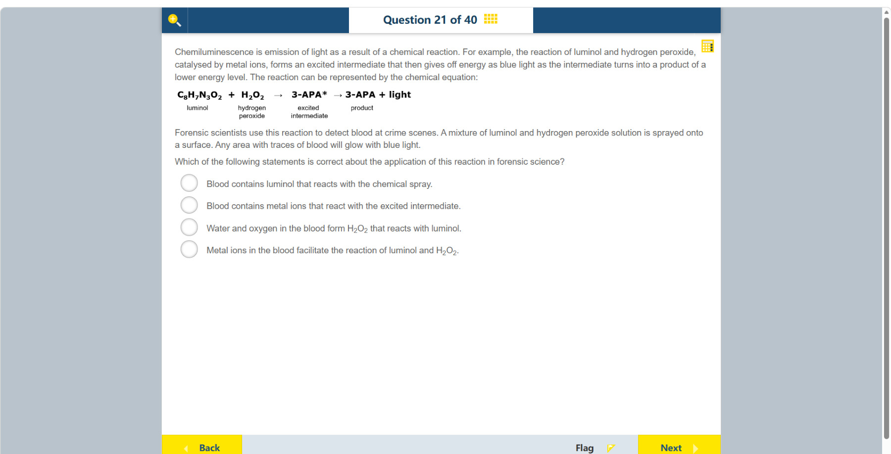

# 第 21 题

## 原题

## 分析

[查看知识体系图](../knowledge-map.md)

### 教材 Topic 技能 / Textbook Topic Skills

**Chapter 5, Topic 2: Energy changes in chemistry / 第 5 章 Topic 2：化学中的能量变化**（[教材 PDF 第 28 页 / Textbook PDF p. 28](../textbook-reader.md?page=28)）

| ATL skills / ATL 技能 | Science skills / 科学技能 |
| --- | --- |
| 得出合理结论并进行概括；使用并解释学科专用术语和符号；检验概括与结论。 Draw reasonable conclusions and generalizations; use and interpret discipline-specific terms and symbols; test generalizations and conclusions. | 将数据整理并制成表格以供处理；解读科学探究数据并用科学推理解释结果；绘制散点图并识别趋势；设计检验假设的方法、控制变量和收集数据，并评价和改进方法。 Organize and present data in tables; interpret investigation data using scientific reasoning; plot scatter graphs and identify trends; design a method to test a hypothesis, manipulate variables and collect data, and evaluate and improve the method. |

### 中文分析

#### 知识背景

化学发光（chemiluminescence）是化学反应释放能量时以光的形式发出能量。反应物先形成较高能量的激发态中间体，随后回到较低能量状态并放出蓝光。催化剂能加快反应，但通常不被反应消耗。

图中的星号表示分子处于激发态，即能量高于普通状态；它不是另一种物质。中间体转为较低能量的产物时，能量差以光子释放出来，这就是化学发光。催化剂的作用是提供较容易发生的反应途径、提高反应速率，本身不等于反应物，也通常会在反应后再生。因而本题要分清：喷剂提供 luminol 和过氧化氢，血迹中的金属离子催化它们的反应。

#### 图示细读

1. 反应示意式从左到右读：$\mathrm{C_8H_7N_3O_2}$ 下标为 luminol，$\mathrm{H_2O_2}$ 下标为 hydrogen peroxide。两者之间的加号表示一起参与反应，不表示血液原本含有这两种物质；题干说明它们来自喷洒的混合液。
2. 第一根向右箭头指向 $\mathrm{3\!\text{-}\!APA}^{*}$，其下方写着 excited intermediate。星号标记激发态，不是乘号，也不是额外一种试剂；这里强调先形成较高能量的中间体。
3. 第二根向右箭头从带星号的中间体指向不带星号的 3-APA，并在右侧写“+ light”。应把这一步理解为中间体转为较低能量产物，同时释放光能，而不是光从外部照进反应物。
4. 金属离子并未画成式子左侧的反应物；它们的催化作用由上方文字说明。将文字与两段箭头结合，血液提供的是促使反应发生的催化条件，不是 luminol，也不是与星号所示中间体反应的另一种原料。这是过程简式，不宜用它推断完整的配平反应或所有副产物。

#### 推理与答案

现场喷洒物提供 luminol 和过氧化氢；血迹中的金属离子（例如血红素中的铁）**促进 luminol 与 H₂O₂ 的反应**，所以血迹处发光。正确说法是“血液中的金属离子促进 luminol 和 H₂O₂ 的反应”。血液不需要含有 luminol，也不是金属离子去和激发态中间体反应。

### English Analysis

#### Background

Chemiluminescence occurs when a chemical reaction releases energy as light. Reactants form an excited intermediate, which emits blue light as it returns to a lower-energy state. A catalyst speeds a reaction without normally being consumed.

The asterisk in the scheme marks a molecule in an excited state, at higher energy than its ordinary state; it is not a different substance. As the intermediate becomes a lower-energy product, the energy difference is released as photons, producing chemiluminescence. A catalyst makes a reaction pathway easier and increases the reaction rate; it is not itself a reactant and is normally regenerated. In this question, the spray supplies luminol and hydrogen peroxide, while metal ions in the blood catalyse their reaction.

#### Reading the diagram

1. Read the reaction scheme from left to right. $\mathrm{C_8H_7N_3O_2}$ is labelled luminol and $\mathrm{H_2O_2}$ hydrogen peroxide. The plus sign groups the reactants; it does not imply that blood already contains both. The stem says the sprayed mixture supplies them.
2. The first rightward arrow leads to $\mathrm{3\!\text{-}\!APA}^{*}$, labelled “excited intermediate”. The asterisk marks an excited state, not multiplication or an extra reagent; this stage forms a higher-energy intermediate.
3. The second rightward arrow leads from the starred intermediate to unstarred 3-APA with “+ light” on the right. This shows formation of a lower-energy product accompanied by release of light energy, not external light shining into the reactants.
4. Metal ions are not drawn as reactants on the left; their catalytic role is stated in the text above. Combine that text with the two arrows: blood supplies catalytic conditions, not luminol or another ingredient that reacts with the starred intermediate. This is a simplified process scheme, not a basis for inferring a complete balanced reaction or every by-product.

#### Reasoning and answer

The spray supplies luminol and hydrogen peroxide. Metal ions in traces of blood, including iron in haem, **catalyse the reaction between luminol and H₂O₂**, producing light at the blood trace. Thus the supported statement is that blood metal ions facilitate that reaction. Blood need not contain luminol, and the ions do not react with the excited intermediate itself.
