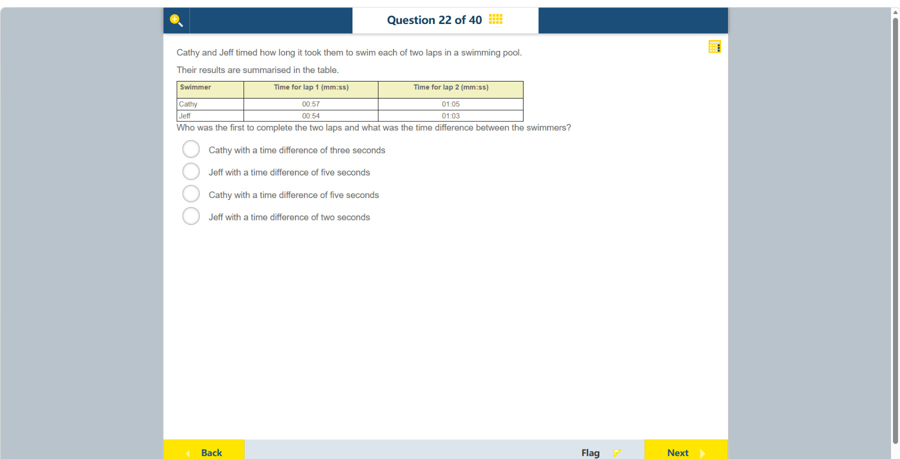

# 第 22 题

## 原题

## 分析

[查看知识体系图](../knowledge-map.md)

### 中文分析

#### 知识背景

比较总用时要把各段时间统一成秒再相加。记录格式 mm:ss 中，冒号前是分钟，后是秒；不能把秒数直接当作小数分钟。

#### 图示细读

1. 表格左列 Swimmer 是泳者姓名，每一横行属于同一个人；右边两列分别是第 1 圈和第 2 圈的用时。比较两圈总用时，应沿同一人的行相加，而不是把同一列两个人的时间相加。
2. 两个时间列都标明 mm:ss：Cathy 的 00:57 与 01:05 是 57 秒与 1 分 5 秒；Jeff 的 00:54 与 01:03 是 54 秒与 1 分 3 秒。01:05 不是 1.05 分钟，也不是 105 秒。
3. 先在同一圈内比较：Jeff 第 1 圈少用 3 秒，第 2 圈少用 2 秒。这两项优势需要相加，表中的 3 秒或 2 秒都不是完整比赛的时间差。
4. 表头写的是每圈用时，不是累计计时，因此第 2 圈列并不等于最终总时间。两圈相加时采用每分钟 60 秒的进位；总用时较小者先完成，不能把较大的数字理解成更快。

#### 推理与答案

Cathy 用时 $57+65=122$ 秒，即 2:02。Jeff 用时 $54+63=117$ 秒，即 1:57。Jeff 先完成，两人的总用时相差 $122-117=5$ 秒。答案是 **Jeff，快 5 秒**。

### English Analysis

#### Background

To compare total times, convert each lap time to seconds and add them. In mm:ss notation, the number after the colon is seconds, not a decimal fraction of a minute.

#### Reading the diagram

1. The left column, Swimmer, identifies each person; each horizontal row belongs to one swimmer. The other columns give lap 1 and lap 2 times. Add across one person's row for the two-lap total, not down a column across different swimmers.
2. Both time headings specify mm:ss. Cathy's 00:57 and 01:05 mean 57 seconds and 1 minute 5 seconds; Jeff's 00:54 and 01:03 mean 54 seconds and 1 minute 3 seconds. 01:05 is neither 1.05 minutes nor 105 seconds.
3. Compare matching laps first: Jeff takes 3 seconds less on lap 1 and 2 seconds less on lap 2. These advantages must be added; neither the 3-second nor the 2-second difference alone describes the whole race.
4. The headings specify individual lap times, not cumulative readings, so the lap 2 column is not the final total. Carry at 60 seconds per minute when adding the laps. A smaller elapsed time means an earlier finish, not a worse performance.

#### Reasoning and answer

Cathy swims for $57+65=122$ seconds, or 2:02. Jeff swims for $54+63=117$ seconds, or 1:57. Jeff finishes first, by $122-117=5$ seconds. The answer is **Jeff, by five seconds**.
