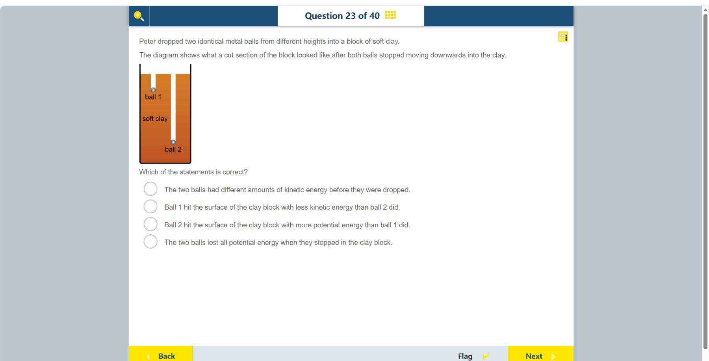

# 第 23 题

## 原题

**教材阅读器 / Textbook reader:** [Chapter 7, Topic 2: Transformation of energy and matter（纸本 p.41 / PDF p.50；含动能转换）](../textbook-reader.md?page=50)；[Chapter 15, Topic 2: Gravitational force（纸本 p.124 / PDF p.133）](../textbook-reader.md?page=133)

## 分析

[查看知识体系图](../knowledge-map.md)

### 教材 Topic 技能 / Textbook Topic Skills

**Chapter 7, Topic 2: Transformation of energy and matter / 第 7 章 Topic 2：能量与物质的转化**（[教材 PDF 第 46 页 / Textbook PDF p. 46](../textbook-reader.md?page=46)）

| ATL skills / ATL 技能 | Science skills / 科学技能 |
| --- | --- |
| 使用模型和模拟探索复杂系统与议题。 Use models and simulations to explore complex systems and issues. | 将数据整理并制成表格；将原始数据转换并呈现为适合视觉表示的形式。 Organize and present data in tables; transform and present raw data in a form suitable for visual representation. |

**Chapter 11, Topic 3: Forms of energy / 第 11 章 Topic 3：能量形式**（[教材 PDF 第 85 页 / Textbook PDF p. 85](../textbook-reader.md?page=85)）

| ATL skills / ATL 技能 | Science skills / 科学技能 |
| --- | --- |
| 鼓励他人参与；得出合理结论并进行概括；运用头脑风暴和视觉图示产生新想法与探究。 Encourage others to contribute; draw reasonable conclusions and generalizations; use brainstorming and visual diagrams to generate new ideas and inquiries. | 设计检验假设的方法并说明如何收集数据；整理并用表格呈现数据；改进方法以减少误差并拓展探究；形成并解释可检验假设、得出结论并用科学推理解释。 Design a method to test a hypothesis and explain how data will be collected; organize and present data in tables; improve a method to reduce errors and extend inquiry; formulate and explain testable hypotheses, draw conclusions and explain them using scientific reasoning. |

**Chapter 15, Topic 2: Gravitational force / 第 15 章 Topic 2：引力**（[教材 PDF 第 130 页 / Textbook PDF p. 130](../textbook-reader.md?page=130)）

| ATL skills / ATL 技能 | Science skills / 科学技能 |
| --- | --- |
| 鼓励他人参与；处理数据并报告结果。 Encourage others to contribute; process data and report results. | 绘制实验观察草图；设计检验假设的方法、操纵变量并收集数据；处理并用图表呈现数据；解读探究数据并用科学推理解释结果。 Draw sketches of experimental observations; design a method to test a hypothesis, manipulate variables and collect data; process and present data graphically; interpret investigation data and explain results using scientific reasoning. |

### 中文分析

#### 知识背景

物体从高处释放时，重力势能随高度降低而转化为动能。球撞击软黏土后，部分动能用于使黏土变形，并最终转化为内能等；压入更深通常表示撞击时有更多能量可用于做功。

#### 图示细读

1. 橙色区域标为 soft clay，图示是黏土块的剖面；两条从上表面向下的白色通道让读者看到球停止的位置，不是两根用于发射球的管子。题干明确这是两球停止向下运动之后的图。
2. 左边 ball 1 靠近黏土表面，右边 ball 2 明显更深。应从同一上表面比较进入黏土的深度，而不是把球在纸面上的高低误当作最初释放高度。
3. 题干说两球相同，因此不能用“ball 2 质量更大”解释更深的通道。在同一软黏土中，更长的压入路径说明球使黏土发生了更多变形，为撞击时较大的动能提供证据。
4. 图中的两球现在已停止，当前动能都为零；它支持比较的是撞击表面时的动能。图未标出质量、释放高度或深度刻度，只能作大小比较，不能据通道长度比例计算能量比，也不能推断所有重力势能都已消失。

#### 推理与答案

两球相同，但 ball 2 在黏土中停得更深，说明它撞击表面时动能较大。因此 **ball 1 撞击黏土时的动能小于 ball 2**。释放前两球均静止，动能都为零；ball 2 的较深凹痕与较大的撞击动能相符。停止后球仍处在重力场中，并非“势能全部消失”。

### English Analysis

#### Background

When an object is released from a height, gravitational potential energy is converted into kinetic energy as it falls. On impact, some kinetic energy deforms the clay and is eventually transferred to internal energy and other forms. A deeper penetration indicates more energy was available to do work on the clay.

#### Reading the diagram

1. The orange region is labelled “soft clay”, and the drawing is a cut section. Two white channels extending down from its surface reveal where the balls stopped; they are not launching tubes. The stem explicitly describes the state after downward motion has ceased.
2. Ball 1 on the left is close to the surface, whereas ball 2 on the right is much deeper. Compare penetration from the same top surface, not the balls' positions on the page as if they were their original release heights.
3. The stem says the balls are identical, so greater mass cannot explain ball 2's deeper channel. In the same soft clay, a longer penetration path indicates more deformation, providing evidence for greater kinetic energy at impact.
4. Both balls are now stationary and have zero current kinetic energy; the diagram supports a comparison at the moment of impact. It gives no masses, release heights, or depth scale, so do not calculate an energy ratio from channel lengths or conclude that all gravitational potential energy has disappeared.

#### Reasoning and answer

The balls are identical, but ball 2 stops deeper in the clay, indicating greater impact kinetic energy. Therefore **ball 1 hit the clay with less kinetic energy than ball 2**. Both balls were initially at rest, so their kinetic energy before release was zero. Potential energy is not simply “all lost” when the balls stop.
