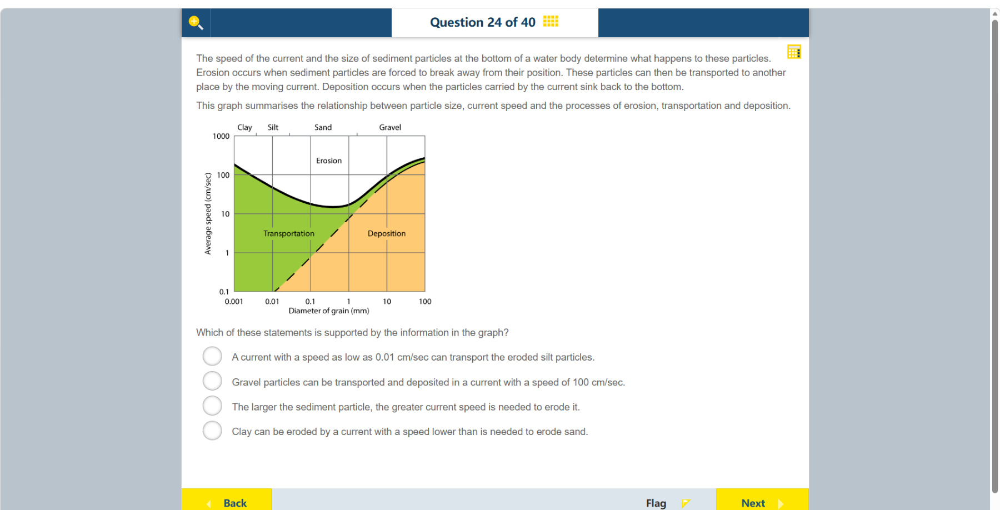

# 第 24 题

## 原题

## 分析

[查看知识体系图](../knowledge-map.md)

### 中文分析

#### 知识背景

河流搬运取决于流速与颗粒直径。侵蚀线以上的流速足以使颗粒脱离河床；侵蚀后，颗粒可能处于搬运区；流速低于沉积边界时，颗粒落回河床。两轴均为对数刻度，读图时要依据区域边界，而不是把刻度当线性等距数值。

侵蚀、搬运和沉积是不同阶段：侵蚀表示颗粒从河床被带起，搬运表示已脱离的颗粒仍随水流移动，沉积表示水流已不足以让它继续悬浮或滚动。图上的边界是不同粒径对应的临界流速，不是河流中颗粒必然经历的固定顺序。对数轴每跨一个主刻度代表数值乘 10，而非加上相同数值；例如粒径从 1 mm 到 10 mm 与从 10 mm 到 100 mm 各跨一格。因此读图要定位实际坐标并判断所在区域，不能按纸面距离作线性插值。

#### 图示细读

1. 横轴 Diameter of grain (mm) 是颗粒直径，标出 0.001、0.01、0.1、1、10、100；每相邻主刻度增大 10 倍。纵轴 Average speed (cm/sec) 是平均流速，标出 0.1、1、10、100、1000，也每格增大 10 倍。因此一格不对应固定增加的毫米数或流速。
2. 顶部 Clay、Silt、Sand、Gravel 将粒径划分为黏土、粉砂、砂、砾粒。它们是横轴上的粒径类别，不是四条水流曲线；同属 Gravel 的颗粒仍有不同直径，不能用一个点代表所有砾粒。
3. 粗黑色弯曲上边界以上是白色 Erosion（侵蚀）区，下面绿色区域是 Transportation（搬运）区；绿色与橙色 Deposition（沉积）区由另一条向右上方延伸的边界分开。侵蚀是从河床脱离，搬运是已经脱离的颗粒随流移动，两者阈值不同。
4. 判断一个给定条件时，先用粒径定位横坐标，再用流速定位纵坐标，最后看交点颜色。例如约 1 mm、1 cm/s 的点落在橙色区；同样粒径、较高但仍低于侵蚀线的流速可落在绿色区，说明同一颗粒可随流速改变而转换状态。
5. 检查题目的 100 cm/s 时，沿标为 100 的水平线进入 Gravel 范围。靠近 10 mm 的位置接近边界；再向右，先经过窄的绿色区，较大直径处进入橙色区。因此“同一流速下有砾粒可搬运、有砾粒可沉积”说的是不同粒径，不是同一颗粒同时处于两种状态。扫描图不支持把交界粒径读得非常精确。
6. 黑色侵蚀线先下降，在砂粒范围附近较低，然后向砾粒方向上升，直接反驳“颗粒越大，侵蚀所需流速总越大”。另一个选项的 0.01 cm/s 低于纵轴最低显示值 0.1；不要将它误读成图中已有刻度，也不能从图外补画数据来支持这个选项。

#### 推理与答案

在流速约 100 cm/s 时，图中的某些 gravel 粒径落在搬运区，较粗颗粒则可落入沉积区。因此支持的说法是 **砾粒可以在 100 cm/s 的流动中被搬运或沉积，具体取决于粒径**。其他说法与边界相反：极低流速不能搬运已侵蚀的淤泥；黏土因内聚力通常比砂更难侵蚀；侵蚀阈值并非粒径越大就单调越高。

### English Analysis

#### Background

Sediment behaviour depends on current speed and grain diameter. Above the erosion threshold, grains are detached; after erosion they may be transported. Below the deposition boundary, grains settle. Both graph axes are logarithmic, so read the labelled regions and boundaries rather than assuming linear spacing.

Erosion, transportation, and deposition are distinct stages: erosion lifts grains from the bed, transportation moves detached grains with the current, and deposition occurs when the flow can no longer keep them moving or suspended. The boundaries show critical speeds for different grain sizes; they are not a fixed sequence that every grain must follow. On a logarithmic axis, each major interval multiplies the value by ten rather than adding a fixed amount. For example, 1 to 10 mm and 10 to 100 mm each span one interval. Locate the actual coordinates and identify the region; do not interpolate as if the axes were linear.

#### Reading the diagram

1. “Diameter of grain (mm)” on the horizontal axis is labelled 0.001, 0.01, 0.1, 1, 10, and 100; successive major ticks multiply by ten. “Average speed (cm/sec)” on the vertical axis is labelled 0.1, 1, 10, 100, and 1000, also in tenfold steps. One grid interval therefore does not mean a fixed added diameter or speed.
2. Clay, Silt, Sand, and Gravel at the top classify grain sizes along the horizontal axis; they are not four current-speed curves. Gravel still spans different diameters, so one point cannot represent every gravel particle.
3. The white Erosion region lies above the thick curved black boundary, with green Transportation below. A second boundary rising to the right separates green transportation from orange Deposition. Erosion detaches grains from the bed; transportation carries already detached grains, so their thresholds differ.
4. For a specified condition, locate diameter horizontally and speed vertically, then inspect the intersection's region. For example, about 1 mm at 1 cm/s lies in orange. The same diameter at a higher speed below the erosion boundary can lie in green, showing how one grain size changes behaviour with flow speed.
5. To test 100 cm/s, follow the horizontal line marked 100 into the Gravel range. Near 10 mm it approaches the boundaries; farther right it passes through a narrow green interval and then orange at larger diameters. Thus transportation and deposition at one speed refer to different gravel sizes, not one particle doing both simultaneously. The scan does not justify a highly precise boundary diameter.
6. The black erosion threshold first falls, is low around the sand range, then rises toward gravel. This contradicts the claim that larger grains always need faster flow for erosion. The alternative mentioning 0.01 cm/s is below the lowest displayed vertical value, 0.1; do not mistake it for a plotted tick or invent data outside the graph to support it.

#### Reasoning and answer

At about 100 cm/s, some gravel sizes lie in the transportation region, while coarser grains can lie in the deposition region. The supported statement is that **gravel can be transported or deposited at a current speed of 100 cm/s, depending on grain size**. Very slow flow cannot transport eroded silt; cohesive clay generally needs a higher speed to erode than sand; and the erosion threshold does not increase monotonically with particle size.
