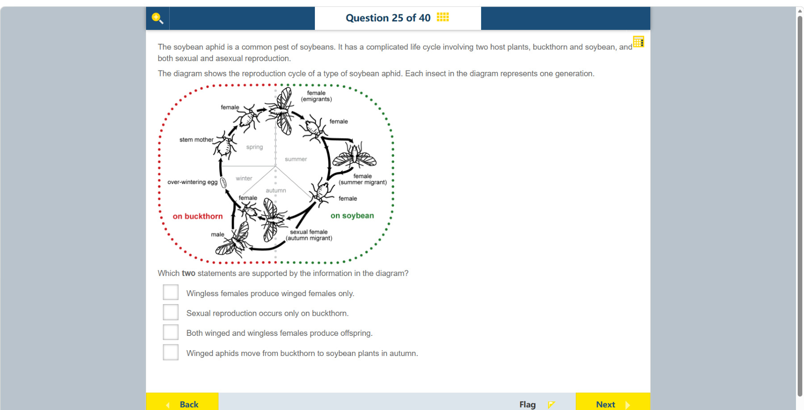

# 第 25 题

## 原题

## 分析

[查看知识体系图](../knowledge-map.md)

### 教材 Topic 技能 / Textbook Topic Skills

**Chapter 9, Topic 1: Interactions between organisms / 第 9 章 Topic 1：生物之间的相互作用**（[教材 PDF 第 64 页 / Textbook PDF p. 64](../textbook-reader.md?page=64)）

| ATL skills / ATL 技能 | Science skills / 科学技能 |
| --- | --- |
| 提出“如果……会怎样”的问题并形成可检验假设；收集并分析数据以寻找解决方案、作出知情决策。 Ask “what if” questions and generate testable hypotheses; collect and analyse data to identify solutions and make informed decisions. | 形成可检验假设并用科学推理解释；设计检验假设的方法、操纵变量并说明数据如何收集；整理数据表并解读数据、得出有依据的结论。 Formulate and explain testable hypotheses using scientific reasoning; design a method to test a hypothesis, manipulate variables and explain data collection; organize data tables and interpret data to draw justifiable conclusions. |

**Chapter 12, Topic 1: Movement in plants and animals / 第 12 章 Topic 1：植物与动物的运动**（[教材 PDF 第 96 页 / Textbook PDF p. 96](../textbook-reader.md?page=96)）

| ATL skills / ATL 技能 | Science skills / 科学技能 |
| --- | --- |
| 运用已有知识产生新想法、产品或过程；解读数据；有效且有成效地使用技术。 Apply existing knowledge to generate new ideas, products or processes; interpret data; select and use technology effectively and productively. | 形成可检验假设并用科学推理解释；设计检验假设的方法、操纵变量并收集足够数据；整理数据表并解释探究结果。 Formulate testable hypotheses using scientific reasoning; design a method to test a hypothesis, manipulate variables and collect enough data; organize data tables and explain investigation results. |

### 中文分析

#### 知识背景

蚜虫生活史可在不同寄主之间转换，并在不同季节进行无性或有性生殖。无性生殖可快速增加种群；有性生殖形成越冬卵，帮助种群度过不利季节。判断题目陈述时应沿箭头追踪每一代及其寄主，不能仅凭常见印象推断。

这里的无性世代可通过孤雌生殖产生后代：雌蚜不与雄蚜交配，也能繁殖；所以“能产后代”本身不代表正在进行有性生殖。图示生活史在温暖季节利用连续的雌性世代快速繁殖，秋季再出现有性雌蚜与雄蚜并形成越冬卵。这种随季节切换繁殖方式的模式解释了为何夏季大豆上的繁殖和秋季回到鼠李上的有性阶段不能混为一谈；结论限于题图所示的蚜虫生活史。

#### 图示细读

1. 先看寄主边界：左半圈红色点线标为 on buckthorn（在鼠李上），右半圈绿色点线标为 on soybean（在大豆上），中间灰色点线帮助区分两侧。外圈彩色点线不是迁徙路线；只有黑色带箭头的连接线表示生活史的方向。
2. 圈内 spring、summer、autumn、winter 表示相应季节区域，没有月份刻度。题干特别说明每一只画出的昆虫代表一代，所以不同虫形之间的箭头常表示产生下一代，不能把整圈误读成同一只蚜虫逐步变成不同形态。
3. 从左侧 over-wintering egg（越冬卵）开始，向上的箭头到 stem mother（干母），再向右上到 female，接着到顶部有翅的 female (emigrants)。这是从越冬到春季的次序；顶部箭头继续指向右侧大豆上的 female，显示春季从鼠李到大豆的转换。
4. 夏季右侧的无翅 female 连向后续无翅 female，也有通往有翅 female (summer migrant) 的分支；有翅夏季迁移型又连到下一代 female。应分别追踪分支的起点与箭头尖端：图支持有翅、无翅雌蚜都能产生后代，也直接反驳“无翅雌蚜只产生有翅雌蚜”。有翅不等于必定进行有性生殖。
5. 右下侧的雌蚜沿秋季路径连接到下方有翅、标为 sexual female (autumn migrant) 的形态，以及左下的 male。结合指向左侧的箭头和寄主标注，应读为秋季回到鼠李，而非秋季从鼠李移到大豆；不要仅凭虫子的头朝向推断迁徙方向。
6. 左下的 female 与 male 所在分支最终接回越冬卵。这里同时出现雌、雄和卵，而且都在鼠李侧，才是判断图中有性生殖位置的证据；大豆侧的夏季雌性世代不能仅因能产后代就算作有性生殖。
7. 最后把路径闭合为“卵越冬 → 春季鼠李上的世代 → 到大豆并在夏季繁殖 → 秋季回鼠李 → 有性生殖形成越冬卵”。图没有给出每代数量、精确迁飞日期或繁殖速率；它支持的是这张生活史图中的寄主、季节和生殖关系，不宜扩展为所有蚜虫物种的通则。

#### 推理与答案

图中雄蚜与有性雌蚜出现在 buckthorn 一侧，因此“有性生殖只发生在 buckthorn”受图示支持。图中有翅与无翅雌蚜都沿箭头产生后代，因此 **both winged and wingless females produce offspring** 也成立。秋季迁徙方向不是 buckthorn 到 soybean；图中季节和寄主边界可用来排除该说法。

### English Analysis

#### Background

Aphids can alternate between host plants and switch between asexual and sexual reproduction across seasons. Asexual reproduction rapidly increases population size; sexual reproduction produces overwintering eggs that survive unfavourable conditions. Follow the arrows and host-plant regions to evaluate each statement.

The asexual generations shown can reproduce by parthenogenesis: a female produces offspring without mating with a male. Thus, producing offspring does not by itself mean that sexual reproduction is occurring. In the depicted cycle, successive female generations allow rapid reproduction during the warmer season, while sexual females and males appear in autumn and produce overwintering eggs. This seasonal switch explains why summer reproduction on soybean must not be confused with the sexual stage returning to buckthorn. This interpretation applies to the life cycle shown, not automatically to every aphid species.

#### Reading the diagram

1. Start with the host boundary: the red dotted left half is labelled “on buckthorn”, and the green dotted right half “on soybean”; the central grey dotted line helps distinguish the sides. The coloured perimeter is not a migration route. Direction is indicated by the black connecting lines with arrowheads.
2. Spring, summer, autumn, and winter mark seasonal regions, not a month scale. The stem explicitly says each drawn insect represents one generation. Arrows between forms therefore often connect parents with later generations, rather than showing one individual transforming into every form around the circle.
3. Begin with the “over-wintering egg” on the left. An upward arrow leads to the “stem mother”, then upward-right to a female, and onward to the winged “female (emigrants)” at the top. This is the winter-to-spring sequence. The next arrow leads to a female on the soybean side, showing the spring transition from buckthorn to soybean.
4. In the summer region on the right, a wingless female connects to a later wingless female, with a branch through the winged “female (summer migrant)”; the winged summer migrant also connects to a later female. Trace the starting point and arrowhead of each branch separately. Both winged and wingless females produce offspring, and the wingless-to-wingless route disproves “wingless females produce winged females only”. Wings do not automatically imply sexual reproduction.
5. The lower-right female connects along the autumn routes to the winged form labelled “sexual female (autumn migrant)” below and to the male at the lower left. Combine the leftward arrows with the host labels: the autumn transition returns to buckthorn, not from buckthorn to soybean. The direction an insect's head faces is not reliable migration evidence.
6. The branches containing the female and male at the lower left reconnect to the overwintering egg. The combination of female, male, and egg on the buckthorn side supports the location of sexual reproduction. Summer female generations on soybean are not sexual merely because they produce offspring.
7. Close the cycle as “overwintering egg → spring generations on buckthorn → transition to soybean and summer reproduction → autumn return to buckthorn → sexual reproduction producing overwintering eggs”. The diagram gives no population sizes per generation, exact migration dates, or reproductive rates. Its host, season, and reproduction relationships apply to this depicted life cycle, not automatically to every aphid species.

#### Reasoning and answer

The male and sexual female are shown on the buckthorn side, supporting the statement that **sexual reproduction occurs only on buckthorn**. Arrows also show offspring from both winged and wingless females, so **both winged and wingless females produce offspring**. The proposed autumn movement from buckthorn to soybean conflicts with the direction and seasonal labels in the diagram.
