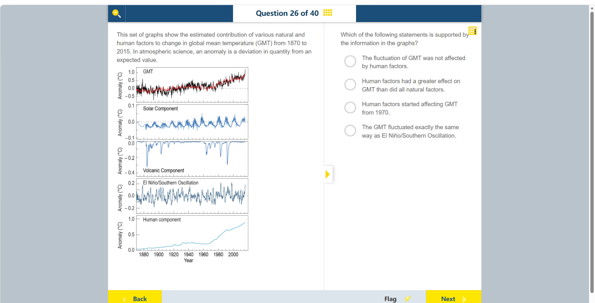

# 第 26 题

## 原题

**教材阅读器 / Textbook reader:** [Activity: Interpreting the change in carbon dioxide in the atmosphere（纸本 p.73 / PDF p.82）](../textbook-reader.md?page=82)；[Activity question on atmospheric CO₂ and air temperature（纸本 p.74 / PDF p.83）](../textbook-reader.md?page=83)

## 分析

[查看知识体系图](../knowledge-map.md)

### 教材 Topic 技能 / Textbook Topic Skills

**Chapter 6, Topic 1: Reasoning from evidence / 第 6 章 Topic 1：基于证据推理**（[教材 PDF 第 38 页 / Textbook PDF p. 38](../textbook-reader.md?page=38)）

| ATL skills / ATL 技能 | Science skills / 科学技能 |
| --- | --- |
| 运用头脑风暴和视觉图示产生新想法与探究；提出“如果……会怎样”的问题并形成可检验假设；给予和接收有意义的反馈。 Use brainstorming and visual diagrams to generate new ideas and inquiries; ask “what if” questions and generate testable hypotheses; give and receive meaningful feedback. | 使用科学推理提出可检验的问题和假设；说明如何操纵变量，以及如何收集足够的数据。 Formulate testable questions and hypotheses using scientific reasoning; explain how to manipulate variables and collect enough data. |

**Chapter 10, Topic 2: Effect of increased greenhouse gases on global temperature / 第 10 章 Topic 2：温室气体增加对全球温度的影响**（[教材 PDF 第 75 页 / Textbook PDF p. 75](../textbook-reader.md?page=75)）

| ATL skills / ATL 技能 | Science skills / 科学技能 |
| --- | --- |
| 仔细观察，以便识别问题。 Practise observing carefully in order to recognize problems. | 用科学推理提出可检验假设；整理并用表格呈现数据；解读数据并用科学推理解释结果；绘制散点图、识别趋势；使用恰当的科学术语，并提出方法的延伸探究。 Formulate a testable hypothesis using scientific reasoning; organize and present data in tables; interpret data and explain results using scientific reasoning; plot scatter graphs and identify trends; use appropriate scientific terminology and describe possible extensions to the method. |

### 中文分析

#### 知识背景

温度异常值（anomaly）表示观测值相对基准或预期值的偏离，不等于绝对温度。分量图分别显示太阳、火山、厄尔尼诺/南方涛动和人为因素对全球平均温度变化的估计贡献；要比较影响大小，应比较同一温度单位下的幅度和长期趋势。

例如 $+0.5°C$ 异常表示比所用基准期高 $0.5°C$，并不表示当地或全球的实际气温只有 $0.5°C$；负异常则表示低于基准。ENSO（El Niño–Southern Oscillation，厄尔尼诺—南方涛动）是热带太平洋海气系统的自然变率，会造成阶段性的升温或降温影响。各分量曲线是对不同影响因素的估计，不是彼此独立的温度观测；比较时要用各自纵轴读数和持续趋势，不能只比图上像素高度或把不同年份的峰值相加。

#### 图示细读

1. 五幅图自上而下是 GMT（全球平均温度异常）、Solar Component（太阳分量）、Volcanic Component（火山分量）、El Niño/Southern Oscillation（ENSO）和 Human component（人为分量）。最上图是整体变化，下面四图是估计贡献，不能把五条曲线都当作独立的全球温度记录或把 GMT 再加到分量中。
2. 各图横向对齐，共用底部 Year 年份轴；主要标出的年份为 1880、1900、1920、1940、1960、1980、2000，相隔 20 年，题干说明全图覆盖 1870–2015。比较同一年时，应在各面板中取相同横向位置，而不是把各自的最高点当成发生于同一年。
3. 纵轴都写 Anomaly (°C)，但刻度不同：GMT 的主要刻度相隔 0.5°C，太阳为 0.1°C，火山和 ENSO 为 0.2°C，人为为 0.5°C。下表概括可见标值；等高面板并不代表等大的温度变化，必须先换回 °C 才比较。
4. 零异常表示相对基准没有偏离，不表示地球平均气温为 0°C；负值表示偏冷贡献，不是“没有影响”。例如火山图的向下尖峰是短暂降温作用，不能因为朝下就忽略它。扫描图不足以逐个确认喷发名称和精确日期，不应给尖峰补上未印出的事件标签。
5. 沿人为曲线从左向右追踪，1970 年之前已有正向贡献，约 1940 年也在 0.2°C 附近；1960–1970 年后升幅明显，到右端接近 0.9°C。因此“1970 年开始影响”和“1970 年前后开始明显加速”是不同说法，前者与曲线不符。
6. 比较长期效果，应在同一时期按有正负号的数值考虑自然分量，而不是把不同年份的极值或各面板的像素高度相加。太阳和 ENSO 的起伏较小，火山降温多为短暂事件，没有呈现能匹配人为曲线后期持续上升的自然合计趋势；这支持题目中人为因素影响更大的选项，不能读成每一年人为贡献都大于每一次自然波动。
7. 最上图有黑、红两条线，扫描页没有给它们单独的图例，因而不擅自指定为某种模型或观测方法。仍可看出 GMT 后期上升，而 ENSO 围绕零上下变化，二者并非“完全相同”。图能支持定性比较，但不能仅凭扫描页精确分配每年的贡献百分比。

| 面板 | 可见主要纵轴标值（°C） | 应关注的信息 |
| --- | --- | --- |
| GMT | -0.5、0、0.5、1.0 | 短期波动之上，后期整体上升 |
| 太阳分量 | -0.1、0、0.1 | 在零附近较小幅度起伏 |
| 火山分量 | -0.4、-0.2、0 | 多次短暂向下尖峰，随后回升 |
| ENSO | -0.2、0、0.2 | 正负交替，缺少类似人为分量的持续上升 |
| 人为分量 | 0、0.5、1.0 | 后期由约 0.2 上升至接近 0.9 |

#### 推理与答案

人为分量自 20 世纪后半叶快速上升，到 2015 年接近 $+0.9^\circ\mathrm C$；太阳分量波动较小，火山分量主要是短暂负向脉冲，ENSO 则上下波动、长期净趋势有限。因此图表支持 **人为因素对 GMT 的影响大于所示自然因素的合计影响**。图中也显示人为分量早于 1970 年已存在，所以“始于 1970”不成立。

### English Analysis

#### Background

A temperature anomaly is a deviation from a reference or expected value, not an absolute temperature. The component plots estimate contributions from solar variability, volcanoes, El Niño/Southern Oscillation (ENSO), and human factors. Compare their magnitudes and long-term patterns in the same temperature units, while checking each panel's different vertical scale.

For example, a $+0.5°C$ anomaly means $0.5°C$ above the chosen reference period; it does not mean the actual local or global temperature is only $0.5°C$. A negative anomaly is below that reference. ENSO (El Niño–Southern Oscillation) is natural variability in the tropical Pacific ocean-atmosphere system that causes periods of warming or cooling influence. The component curves estimate contributions from different factors; they are not independent temperature observations. Compare their labelled values and sustained patterns, not pixel heights or peaks from different years added together.

#### Reading the diagram

1. From top to bottom, the five panels show GMT (global mean temperature anomaly), Solar Component, Volcanic Component, El Niño/Southern Oscillation (ENSO), and Human component. The top panel is the overall change; the other four estimate contributions. They are not five independent global temperature records, and GMT must not be added to its components again.
2. The panels align horizontally and share the bottom Year axis. Major labelled years are 1880, 1900, 1920, 1940, 1960, 1980, and 2000, spaced 20 years apart; the stem specifies coverage from 1870 to 2015. Compare the same horizontal position across panels for a given year, rather than assuming their peaks occurred together.
3. Every vertical axis says Anomaly (°C), but the tick intervals differ: 0.5°C for GMT, 0.1°C for solar, 0.2°C for volcanic and ENSO, and 0.5°C for human. The table summarises visible tick labels. Equally tall panels do not represent equal temperature changes; compare values in °C, not line heights on the page.
4. Zero anomaly means no deviation from the reference, not an absolute global temperature of 0°C. Negative values represent cooling contributions, not “no effect”. Volcanic downward spikes therefore indicate temporary cooling and must not be ignored. The scan does not identify each eruption or its exact date; do not add unprinted event labels to the spikes.
5. Follow the human curve left to right: a positive contribution exists before 1970, and around 1940 it is already near 0.2°C. The increase becomes pronounced after roughly 1960–1970 and approaches 0.9°C at the right end. “Started affecting temperature in 1970” is different from “began increasing rapidly around then”; the former conflicts with the curve.
6. To compare long-term effects, consider signed natural-component values over the same period, not sums of peaks from different years or pixel heights across panels. Solar and ENSO fluctuations are smaller, and volcanic cooling is mainly temporary. The natural components do not show a combined sustained rise matching the late human increase, supporting the greater-human-effect option. This does not mean human effects exceeded every natural fluctuation in every year.
7. The top panel contains black and red lines without a separate legend on the scan, so do not assign them specific observational or modelling methods. Their later GMT rise still contrasts with ENSO's fluctuations around zero: the two do not vary “exactly the same way”. The scan supports qualitative comparison, not precise annual contribution percentages.

| Panel | Visible major vertical labels (°C) | Pattern to inspect |
| --- | --- | --- |
| GMT | -0.5, 0, 0.5, 1.0 | Later overall rise with short-term fluctuations |
| Solar | -0.1, 0, 0.1 | Small oscillations near zero |
| Volcanic | -0.4, -0.2, 0 | Brief downward spikes followed by recovery |
| ENSO | -0.2, 0, 0.2 | Alternating positive and negative values, without a human-like sustained rise |
| Human | 0, 0.5, 1.0 | Later rise from about 0.2 to nearly 0.9 |

#### Reasoning and answer

The human component rises rapidly in the latter half of the 20th century, reaching nearly $+0.9^\circ\mathrm C$ by 2015. Solar variation is smaller, volcanic effects are brief negative pulses, and ENSO fluctuates without a comparable long-term rise. The graphs support that **human factors had a greater effect on GMT than the natural factors shown combined**. The human component is present before 1970, so that proposed start date is incorrect.
