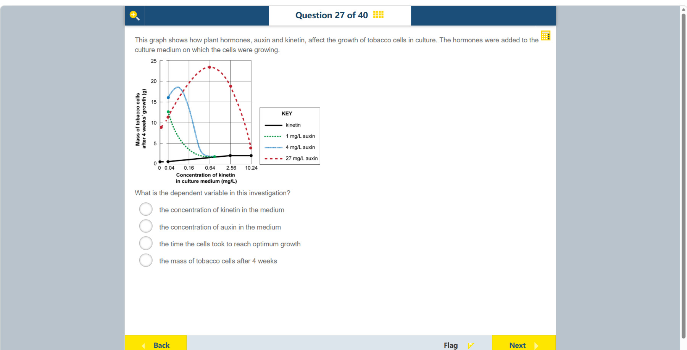

# 第 27 题

## 原题

## 分析

[查看知识体系图](../knowledge-map.md)

### 教材 Topic 技能 / Textbook Topic Skills

**Chapter 15, Topic 1: Plant responses / 第 15 章 Topic 1：植物的响应**（[教材 PDF 第 130 页 / Textbook PDF p. 130](../textbook-reader.md?page=130)）

| ATL skills / ATL 技能 | Science skills / 科学技能 |
| --- | --- |
| 提出“如果……会怎样”的问题并形成可检验假设；解读数据；得出合理结论并进行概括。 Ask “what if” questions and generate testable hypotheses; interpret data; draw reasonable conclusions and generalizations. | 形成可检验假设并用科学推理解释；设计检验假设的方法、选择器材并说明变量控制和数据收集；解读数据并讨论数据对结论的支持程度；用合适图表呈现数据。 Formulate testable hypotheses using scientific reasoning; design a method, select equipment, and explain variable control and data collection; interpret data and discuss how well it supports a conclusion; present data in an appropriate graph. |

### 中文分析

#### 知识背景

因变量是实验者测量来观察处理效果的结果；自变量是主动改变的因素。图表通常把自变量放在横轴、因变量放在纵轴。多条曲线可表示另一种处理水平下的比较。

#### 图示细读

1. 横轴标为培养基中 kinetin 的浓度，单位 mg/L；可见刻度是 0、0.04、0.16、0.64、2.56、10.24。正数刻度依次乘 4，不是每格增加相同浓度，因此不能把相邻刻度的中点按线性平均随意读值。
2. 纵轴完整标签是“Mass of tobacco cells after 4 weeks growth (g)”，即生长 4 周后烟草细胞的质量，单位 g，主要刻度从 0 到 25、间隔 5。标签中“4 weeks”是统一的测量时点，不是纵轴测量时间，也不是细胞达到最佳生长所需时间。
3. 图例中黑色实线标 kinetin，绿色点线为 1 mg/L auxin，蓝色细点线为 4 mg/L auxin，红色虚线为 27 mg/L auxin。颜色和线型区分不同处理曲线；图例里的 auxin 浓度是条件，不是纵轴上读出的质量。
4. 取横轴 0.64 mg/L 向上比较各线：红线的实心点在约 23–24 g，蓝、绿和黑线在较低处，约 1–2 g。固定 kinetin 浓度后，这些不同纵坐标说明不同处理产生不同质量结果；不能把红线较高说成“auxin 浓度为 23 g”。
5. 沿红线向右读，细胞质量先上升，在 0.64 mg/L 附近较高，再在 2.56 和 10.24 mg/L 处下降。横轴不是时间，这种起伏不是同一批细胞先长大再缩小的时间过程，而是不同浓度处理在同一 4 周终点的比较。实心点是图上标出的数据位置，连线的形状不能用来捏造未标出的精确测量值。

#### 推理与答案

研究者改变培养基中的 kinetin 浓度，并用不同 auxin 浓度画出多条曲线。纵轴记录的是培养 4 周后的烟草细胞质量，所以因变量是 **4 周后烟草细胞的质量**。auxin 浓度是分组条件，不是本题图中所测的结果。

### English Analysis

#### Background

The dependent variable is the measured outcome used to assess an effect; the independent variable is deliberately changed. Graphs usually place the independent variable on the horizontal axis and the dependent variable on the vertical axis. Multiple curves can show different levels of another treatment.

#### Reading the diagram

1. The horizontal axis is kinetin concentration in the culture medium, in mg/L, with visible labels 0, 0.04, 0.16, 0.64, 2.56, and 10.24. Successive positive labels multiply by four rather than increasing by a fixed amount, so do not estimate intermediate values using a simple linear midpoint.
2. The full vertical label is “Mass of tobacco cells after 4 weeks growth (g)”. It measures mass at the four-week endpoint in grams, with major ticks from 0 to 25 in steps of 5. “4 weeks” specifies a common measurement time, not a measured duration or time taken to reach optimum growth.
3. The key labels the black solid line kinetin, green dotted line 1 mg/L auxin, blue finely dotted line 4 mg/L auxin, and red dashed line 27 mg/L auxin. Colours and line styles distinguish treatment curves. The auxin concentrations in the key are conditions, not masses read from the vertical axis.
4. At 0.64 mg/L kinetin, compare the lines vertically: the red filled point is about 23–24 g, whereas the blue, green, and black lines are much lower, around 1–2 g. With kinetin held fixed, these vertical differences show different mass outcomes under different treatments; the red line does not indicate “23 g auxin”.
5. Following the red curve rightward, mass rises, is high near 0.64 mg/L, then falls at 2.56 and 10.24 mg/L. The horizontal axis is not time, so this is not one cell culture growing then shrinking. It compares concentration treatments at the same four-week endpoint. Filled points mark data positions; connecting curves cannot justify invented exact measurements at unmarked positions.

#### Reasoning and answer

Kinetin concentration is varied along the horizontal axis, with separate curves for auxin concentrations. The vertical axis measures cell mass after four weeks. The dependent variable is **the mass of tobacco cells after 4 weeks**; auxin concentration is a grouping condition, not the measured outcome.
