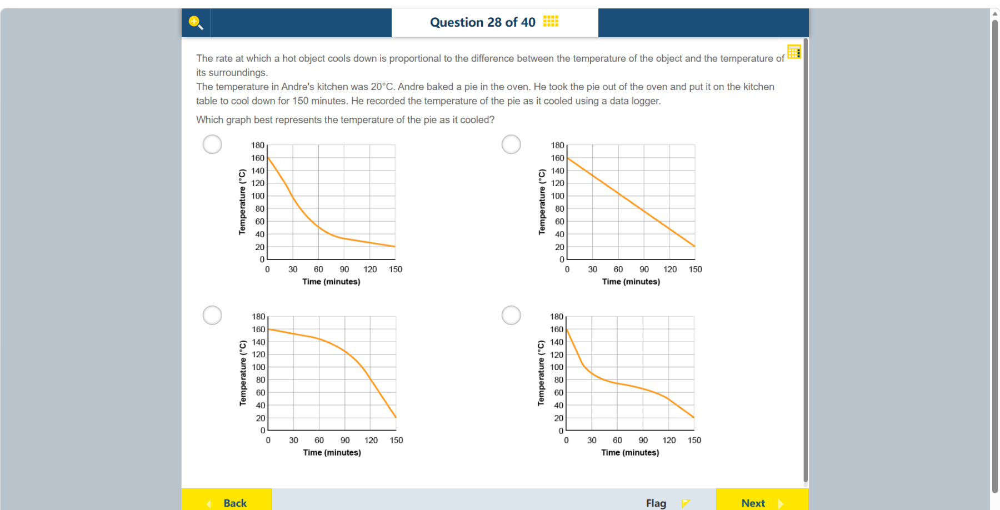

# 第 28 题

## 原题

## 分析

[查看知识体系图](../knowledge-map.md)

### 教材 Topic 技能 / Textbook Topic Skills

**Chapter 11, Topic 3: Forms of energy / 第 11 章 Topic 3：能量形式**（[教材 PDF 第 85 页 / Textbook PDF p. 85](../textbook-reader.md?page=85)）

| ATL skills / ATL 技能 | Science skills / 科学技能 |
| --- | --- |
| 鼓励他人参与；得出合理结论并进行概括；运用头脑风暴和视觉图示产生新想法与探究。 Encourage others to contribute; draw reasonable conclusions and generalizations; use brainstorming and visual diagrams to generate new ideas and inquiries. | 设计检验假设的方法并说明如何收集数据；整理并用表格呈现数据；改进方法以减少误差并拓展探究；形成并解释可检验假设、得出结论并用科学推理解释。 Design a method to test a hypothesis and explain how data will be collected; organize and present data in tables; improve a method to reduce errors and extend inquiry; formulate and explain testable hypotheses, draw conclusions and explain them using scientific reasoning. |

### 中文分析

#### 知识背景

牛顿冷却定律指出，物体冷却速率与物体和环境之间的温差成正比。热物体刚离开烤箱时温差最大，降温最快；越接近室温 20°C，温差越小，冷却越慢。温度会逐渐接近室温，而不会在有限时间内突然穿过它。

#### 图示细读

1. 四个选项都是温度随时间变化图：横轴 Time (minutes) 从 0 到 150，每格 30 分钟；纵轴 Temperature (°C) 从 0 到 180，每格 20°C。橙线表示馅饼温度，不是室温或降温速率。
2. 四条线都从约 160°C 出发，最后画到约 20°C，因此仅看起点和终点不能区分答案。题干给出厨房为 20°C；应把这个温度作为冷却的参照，而不是把纵轴的 0°C 当作目标。
3. 沿左上图从左往右读：0–30 分钟大约从 160°C 降到 100°C，30–60 分钟约降到 50°C，之后降幅更小。这些是图上估读值；关键是相同时间间隔的温度下降量总体减小，线也逐渐变平。
4. 对比其他图：右上是斜率不变的直线；左下后段比前段更陡；右下虽一开始快速下降，但末段又变陡。后两者都出现接近室温时反而加快降温的趋势，与题干的温差关系不符。
5. 左上是四图中最符合规律的示意图，不宜把它当作精确的指数函数测量结果。图线在 150 分钟处画到约 20°C，并不能证明物体恰在那一刻精确达到室温；选择依据是整体降温趋势。

#### 推理与答案

正确曲线应从约 160°C 开始，先陡降、随后逐渐变平，并趋近 20°C。四图中符合该“快速起初、后续放缓并渐近环境温度”形状的是 **左上图**。直线图表示恒定降温速率；先变慢后突然加速的曲线与温差驱动的冷却不符。

### English Analysis

#### Background

Newton's law of cooling states that the cooling rate is proportional to the temperature difference between an object and its surroundings. The pie initially has a large difference from the 20°C kitchen and cools quickly; as it approaches room temperature, the difference and cooling rate decrease. Its temperature approaches, rather than suddenly crossing, room temperature.

#### Reading the diagram

1. All four options plot temperature against time: Time (minutes) runs from 0 to 150 in 30-minute divisions, and Temperature (°C) runs from 0 to 180 in 20°C divisions. The orange line represents the pie's temperature, not room temperature or cooling rate.
2. All lines begin near 160°C and end near 20°C, so their endpoints alone cannot identify the answer. The stated kitchen temperature of 20°C is the cooling reference; the axis minimum of 0°C is not the target.
3. Read the upper-left graph from left to right: during 0–30 minutes the temperature falls roughly from 160°C to 100°C, and by 60 minutes it is near 50°C, with smaller falls later. These are visual estimates. The important feature is a generally decreasing temperature drop over equal time intervals and a flattening line.
4. Compare the alternatives: the upper-right line has constant slope; the lower-left becomes steeper later; and the lower-right initially falls quickly but steepens again near the end. The latter two show cooling speeding up as the pie approaches room temperature, contrary to the stated temperature-difference relationship.
5. The upper-left is the best schematic among the options, not a precise measured exponential curve. Its endpoint near 20°C at 150 minutes does not establish that the pie reaches exactly room temperature at that instant; the overall cooling trend determines the choice.

#### Reasoning and answer

The correct curve starts near 160°C, falls steeply at first, then flattens toward 20°C. This is the **upper-left graph**. A straight line would imply a constant cooling rate, while a curve that accelerates late does not match cooling driven by the temperature difference.
