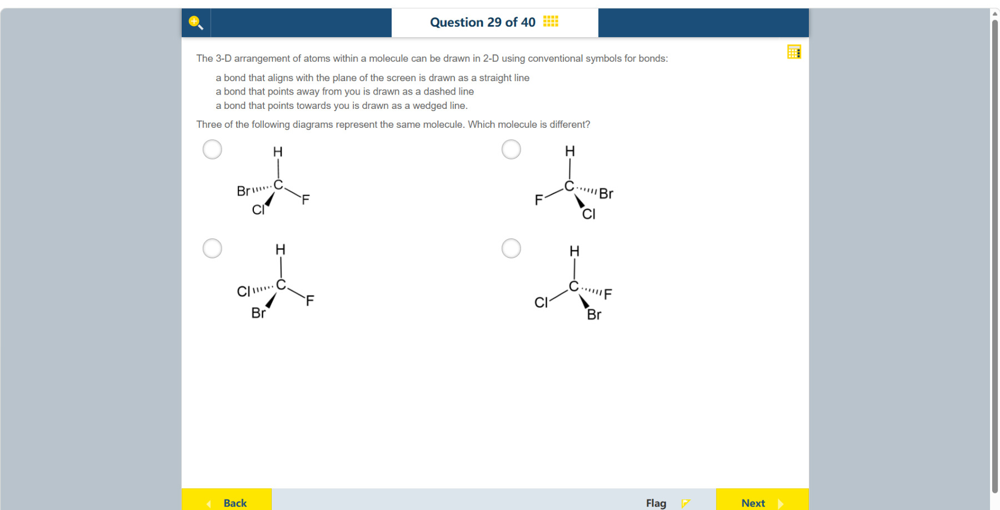

# 第 29 题

## 原题

## 分析

[查看知识体系图](../knowledge-map.md)

### 教材 Topic 技能 / Textbook Topic Skills

**Chapter 11, Topic 2: Structure of organic molecules / 第 11 章 Topic 2：有机分子的结构**（[教材 PDF 第 84 页 / Textbook PDF p. 84](../textbook-reader.md?page=84)）

| ATL skills / ATL 技能 | Science skills / 科学技能 |
| --- | --- |
| 使用并解释学科专用术语和符号；获取信息以增进认知并传达给他人。 Use and interpret a range of discipline-specific terms and symbols; access information to be informed and inform others. | 使用适当的科学规范表示分子并命名有机化合物；绘制散点图以识别变量关系。 Use appropriate scientific conventions to visually represent molecules and name organic compounds; plot scatter graphs to identify relationships between variables. |

### 中文分析

#### 知识背景

楔形键表示键朝向观察者，虚线键表示键指向纸面后方，普通线表示大致位于纸面内。中心碳连接 H、F、Cl、Br 四种不同基团时具有四面体手性；旋转整张三维结构不会改变手性，镜像反射才会改变。

#### 图示细读

1. 四图的中心都是 C，上方 H 都用普通直线连接；差别在另外三个原子绕 C 的位置和键的前后方向。这里没有长度刻度，键画得长短不同不表示键长不同。
2. 先按题干图例还原空间：普通线在纸面内，实心楔形伸向观察者，虚线伸向纸面后方。楔形不是反应箭头，虚线也不是断开的键。
3. 用下表把各图的三条关键键分开记录，避免只记标签的左右位置。

4. 固定上方 C–H 的方向看其余三个基团：左上和右上把整个左右布局反射了，但 Cl 仍朝前、Br 仍朝后，是镜像关系；左上和左下则在相同的空间键位上交换了 Cl 与 Br，也会反转手性。
5. 检验右上、左下、右下是否相同，要在脑中绕 C–H 轴旋转三维结构，保留各基团绕轴的循环次序，而不是把平面纸张翻面。它们的次序可通过旋转相配；左上需镜像反射或交换两个基团才能相配，所以不同。

| 选项位置 | 朝向观察者的楔形键 | 背向观察者的虚线键 | 纸面内的另一条键 |
| --- | --- | --- | --- |
| 左上 | Cl | Br | F 在右下 |
| 右上 | Cl | Br | F 在左下 |
| 左下 | Br | Cl | F 在右下 |
| 右下 | Br | F | Cl 在左下 |

#### 推理与答案

按原子序数排列优先级为 Br > Cl > F > H。逐图把三维键方向还原并比较这四个基团的空间顺序，右上、左下、右下三图可通过空间旋转互相重合；**左上图的构型相反**，是不同的分子。不能只比较平面上标签左右位置，因为楔形和虚线所表示的前后方向同样重要。

### English Analysis

#### Background

A solid wedge points toward the viewer, a dashed bond points behind the plane, and a straight line lies approximately in the plane of the page. A carbon attached to four different groups (H, F, Cl and Br) is tetrahedral and chiral. Rotating a molecule does not change its handedness; reflecting it does.

#### Reading the diagram

1. Each structure has C at its centre and H above it on a straight bond. The differences concern the other three atoms' positions and the bonds' depth directions. There is no length scale; different drawn lengths do not establish different bond lengths.
2. Reconstruct depth using the supplied key: a straight line lies in the page, a solid wedge points toward the viewer, and a dashed bond points behind the page. A wedge is not a reaction arrow, and a dashed bond is not a broken connection.
3. Record the three key bonds separately to avoid relying only on left-right label positions.

4. Keeping the upward C–H direction fixed, the upper-left and upper-right drawings reflect the entire left-right arrangement while retaining Cl toward and Br away: they are mirror images. The upper-left and lower-left exchange Cl and Br at the same spatial bond positions, also reversing handedness.
5. To test the upper-right, lower-left and lower-right, mentally rotate the three-dimensional arrangement about C–H while preserving the cyclic order of the other groups, rather than flipping the sheet of paper. Their orders can match by rotation; the upper-left requires reflection or an exchange of two groups, making it different.

| Option position | Wedge toward viewer | Dashed bond away | Other in-plane bond |
| --- | --- | --- | --- |
| Upper-left | Cl | Br | F at lower right |
| Upper-right | Cl | Br | F at lower left |
| Lower-left | Br | Cl | F at lower right |
| Lower-right | Br | F | Cl at lower left |

#### Reasoning and answer

The priority order by atomic number is Br > Cl > F > H. Reconstruct each three-dimensional arrangement using the wedge and dashed bonds, then compare the order of the groups. The upper-right, lower-left and lower-right structures can be rotated to match; the **upper-left structure has the opposite configuration**. Comparing only left-right positions on the page would ignore the toward/away information.
