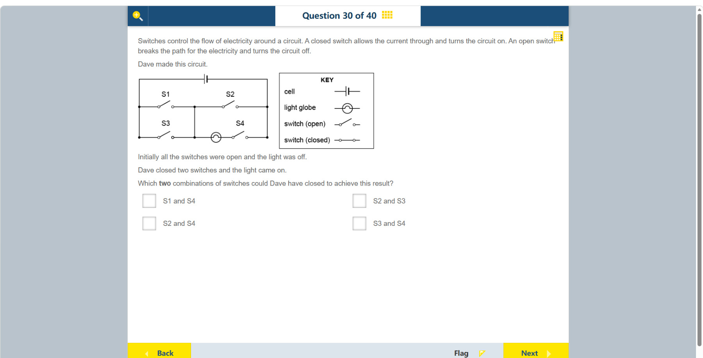

# 第 30 题

## 原题

## 分析

[查看知识体系图](../knowledge-map.md)

### 教材 Topic 技能 / Textbook Topic Skills

**Chapter 12, Topic 2: Electrochemistry and movement of electrons / 第 12 章 Topic 2：电化学与电子运动**（[教材 PDF 第 96 页 / Textbook PDF p. 96](../textbook-reader.md?page=96)）

| ATL skills / ATL 技能 | Science skills / 科学技能 |
| --- | --- |
| 得出合理结论并进行概括；收集并分析数据以寻找解决方案、作出知情决策。 Draw reasonable conclusions and generalizations; collect and analyse data to identify solutions and make informed decisions. | 解读科学探究数据并用科学推理解释结果。 Interpret data gained from scientific investigations and explain results using scientific reasoning. |

### 中文分析

#### 知识背景

灯泡发光需要包含电池、灯泡和闭合开关的完整导电回路。并联支路或旁路可能让电流绕过灯泡；即使电池的某条路径闭合，如果灯泡支路仍断开，灯泡也不会发光。

#### 图示细读

1. 右侧 KEY 给出电池、灯泡、开关断开和闭合的符号。左图上方长短两线是电池；下方圆圈中的曲线是灯泡；S1–S4 都画有缺口，表示初始全部断开。导线没有箭头，不要从线段朝向猜电流方向。
2. 先认清三个电气节点：左侧竖线连通 S1、S3 的左端；中央竖线把 S1 的右端、S2 的左端、S3 的右端和灯泡左端连在一起；右侧竖线连通 S2、S4 的右端。黑点表示明确的连接，中央上下两排不是彼此独立的回路。
3. 从电池左端追踪到中央节点，有 S1 和 S3 两条并联路径，任一闭合即可接通这一段。两者同时断开时，灯泡即使接上右端也得不到完整的电池回路。
4. 从中央节点回到电池右端，也有两条路径：上支路经过 S2，不经过灯泡；下支路依次经过灯泡和 S4。因此灯泡要发光，S4 必须闭合，且另一只闭合开关必须把左端接到中央节点。
5. 将题目列出的每一对开关闭合，其余保持断开，逐段检查是否能经过灯泡再回到电池。

6. 表中的箭头只是追踪路径的顺序，不是原图标出的方向。“存在闭合回路”不等于“灯泡所在回路闭合”；S2、S3 会直接跨接电池两端，实际电路还有短路风险，不能拿它当作安全的点灯方式。

| 闭合组合 | 可追踪的路径 | 灯泡结果 |
| --- | --- | --- |
| S1、S4 | 电池左端 → S1 → 中央节点 → 灯泡 → S4 → 电池右端 | 有完整灯泡回路 |
| S2、S4 | 中央节点与右端接通，但 S1、S3 都断开 | 与电池左端隔断，不亮 |
| S2、S3 | 电池左端 → S3 → 中央节点 → S2 → 电池右端 | 绕过灯泡，且 S4 断开，不亮 |
| S3、S4 | 电池左端 → S3 → 中央节点 → 灯泡 → S4 → 电池右端 | 有完整灯泡回路 |

#### 推理与答案

在图中，S1 或 S3 可把左侧电池端接到中央节点；要让电流经过灯泡，还必须经灯泡和 S4 返回右侧电池端。满足条件的两组是 **S1 与 S4**、**S3 与 S4**。S2 与 S3 会形成绕过灯泡的短路径，而 S2 与 S4 没有把左侧端接入回路，因此都不能点亮灯泡。

### English Analysis

#### Background

A lamp lights only when the cell, lamp and closed switches form a complete conducting loop. A bypass branch can let current avoid the lamp; a closed loop elsewhere in the circuit does not guarantee that current passes through the lamp.

#### Reading the diagram

1. The KEY identifies the cell, globe, open switch and closed switch. The unequal lines at the top are the cell; the circle with a curved filament below is the globe. S1–S4 all show gaps, so all are initially open. The wires have no arrows; their drawn orientation does not specify current direction.
2. Identify three electrical nodes: the left vertical wire joins the left ends of S1 and S3; the central vertical wire joins S1's right end, S2's left end, S3's right end and the globe's left end; the right vertical wire joins the right ends of S2 and S4. Black dots mark connections. The upper and lower rows are not independent circuits.
3. From the cell's left terminal to the central node, S1 and S3 provide parallel paths. Closing either connects this section. If both remain open, connecting the globe to the right terminal still cannot complete a circuit through the cell.
4. From the central node to the cell's right terminal, the upper path contains S2 but no globe; the lower path contains the globe followed by S4. Thus S4 must be closed for the globe to light, and the other closed switch must connect the left terminal to the central node.
5. Test each offered pair with all other switches left open, tracing through the globe and back to the cell.

6. The table's arrows indicate tracing order, not directions marked in the original. A closed loop somewhere is not necessarily a closed loop through the globe. S2 with S3 directly connects the cell terminals and poses a real short-circuit risk; it is not a safe lighting arrangement.

| Closed pair | Traceable path | Globe outcome |
| --- | --- | --- |
| S1, S4 | Cell left → S1 → central node → globe → S4 → cell right | Complete globe circuit |
| S2, S4 | Central node connects to right terminal, but S1 and S3 are open | Disconnected from cell left; off |
| S2, S3 | Cell left → S3 → central node → S2 → cell right | Bypasses globe; S4 is also open; off |
| S3, S4 | Cell left → S3 → central node → globe → S4 → cell right | Complete globe circuit |

#### Reasoning and answer

Either S1 or S3 connects the left side of the cell to the central node. To make current pass through the globe and return to the right side, S4 must also be closed. The two valid combinations are **S1 and S4** and **S3 and S4**. S2 and S3 create a bypass that avoids the globe, while S2 and S4 do not connect the left side into a complete loop.
