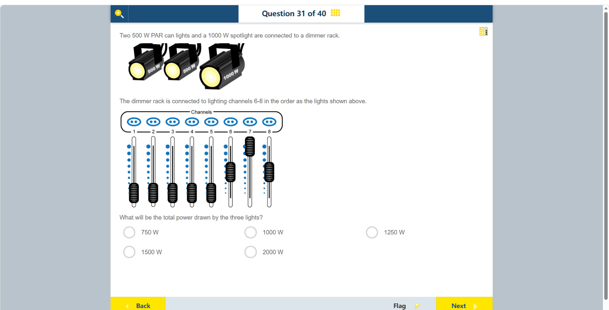

# 第 31 题

## 原题

## 分析

[查看知识体系图](../knowledge-map.md)

### 教材 Topic 技能 / Textbook Topic Skills

**Chapter 12, Topic 2: Electrochemistry and movement of electrons / 第 12 章 Topic 2：电化学与电子运动**（[教材 PDF 第 96 页 / Textbook PDF p. 96](../textbook-reader.md?page=96)）

| ATL skills / ATL 技能 | Science skills / 科学技能 |
| --- | --- |
| 得出合理结论并进行概括；收集并分析数据以寻找解决方案、作出知情决策。 Draw reasonable conclusions and generalizations; collect and analyse data to identify solutions and make informed decisions. | 解读科学探究数据并用科学推理解释结果。 Interpret data gained from scientific investigations and explain results using scientific reasoning. |

### 中文分析

#### 知识背景

调光器通过改变灯具获得的电功率比例控制亮度。若负载额定功率为 $P$、调光器输出比例为 $f$，实际功率约为 $fP$。多个灯具的总功率是各通道实际功率之和。

#### 图示细读

1. 上方三盏灯按左到右标为 500 W、500 W、1000 W。这些是各灯的额定功率，不是图中当前的耗电量；发黄的灯面也不能用于精确估算亮度或功率。
2. 题干明确说按上方灯的顺序接到通道 6–8。因此左灯对应 6，中灯对应 7，右侧较大的聚光灯对应 8。图没有逐根画出电缆，不能靠插座离哪盏灯近来配对。
3. 面板上方的 1–8 是通道编号，不是功率刻度。每个通道下面的竖槽、蓝色点列和黑色推杆表示该通道的设置；本题只读取 6、7、8，不把未接这三盏灯的 1–5 计入总功率。
4. 通道 7 的推杆在高位，6 和 8 在相同的中间位置。图上的蓝点没有标出百分数或瓦数；按此题示意图的预期读法，高位作满功率、中位作约半功率，不应声称读到了带数字的 50% 刻度。
5. 先逐通道把位置转为功率，再求和：相同的中位设置用于 500 W 和 1000 W 灯，所得功率不会相同。

6. 表中得到 1250 W，而 2000 W 只是三灯都满功率时的额定总和。此题把推杆位置简化为功率比例；真实调光器的输出曲线未必线性，不能仅由这张无数字刻度的示意图推断真实设备的精确耗电量。

| 通道 | 对应灯具 | 图示设置的解释 | 计算功率 |
| --- | --- | --- | --- |
| 6 | 左侧 500 W PAR 灯 | 约半功率 | 250 W |
| 7 | 中间 500 W PAR 灯 | 满功率 | 500 W |
| 8 | 右侧 1000 W 聚光灯 | 约半功率 | 500 W |

#### 推理与答案

通道 6、7、8 依次接两盏 500 W PAR 灯和一盏 1000 W 聚光灯。图中三个推杆分别约为 50%、100%、50%。实际功率为 $0.5\times500+1.0\times500+0.5\times1000=1250$ W。答案是 **1250 W**，不能把灯具标称功率直接相加而忽略调光器位置。

### English Analysis

#### Background

A dimmer controls brightness by changing the fraction of electrical power delivered to a lamp. For rated power $P$ and dimmer fraction $f$, the approximate actual power is $fP$. Total power is the sum across channels.

#### Reading the diagram

1. The three lamps are labelled 500 W, 500 W and 1000 W from left to right. These are rated powers, not their present consumption. The yellow lamp faces also do not provide precise brightness or power measurements.
2. The text explicitly connects them to channels 6–8 in the order shown: left lamp to 6, middle lamp to 7, and larger right-hand spotlight to 8. Individual cables are not drawn; do not assign lamps by proximity to sockets.
3. Numbers 1–8 above the panel are channel identifiers, not power graduations. The vertical slots, blue dots and black sliders show each channel's setting. Only 6, 7 and 8 feed the three specified lamps; channels 1–5 do not enter their total.
4. Channel 7's slider is high, while 6 and 8 occupy the same middle position. The blue dots have no percentage or wattage labels. The intended schematic reading is full power at the high position and approximately half power at the middle, not a measurement from a numbered 50% scale.
5. Convert each channel's position into power before adding. The same middle setting on a 500 W lamp and a 1000 W lamp gives different powers.

6. The table gives 1250 W; 2000 W is only the rated total with all three at full power. This question simplifies slider position to a power fraction. Real dimmer response need not be linear, so this unnumbered schematic cannot establish an actual device's exact consumption.

| Channel | Connected lamp | Interpretation of setting | Calculated power |
| --- | --- | --- | --- |
| 6 | Left 500 W PAR lamp | Approximately half power | 250 W |
| 7 | Middle 500 W PAR lamp | Full power | 500 W |
| 8 | Right 1000 W spotlight | Approximately half power | 500 W |

#### Reasoning and answer

Channels 6, 7 and 8 feed the two 500 W PAR lights and the 1000 W spotlight, in that order. Their sliders are approximately 50%, 100% and 50%. The total is $0.5\times500+1.0\times500+0.5\times1000=1250$ W. The answer is **1250 W**; the dimmer settings must be included, not just the nameplate ratings.
