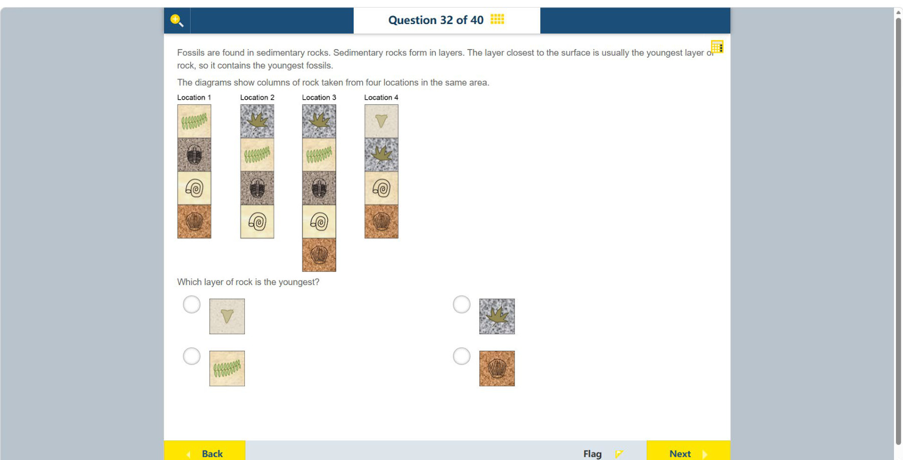

# 第 32 题

## 原题

## 分析

[查看知识体系图](../knowledge-map.md)

### 教材 Topic 技能 / Textbook Topic Skills

**Chapter 6, Topic 1: Reasoning from evidence / 第 6 章 Topic 1：基于证据推理**（[教材 PDF 第 38 页 / Textbook PDF p. 38](../textbook-reader.md?page=38)）

| ATL skills / ATL 技能 | Science skills / 科学技能 |
| --- | --- |
| 运用头脑风暴和视觉图示产生新想法与探究；提出“如果……会怎样”的问题并形成可检验假设；给予和接收有意义的反馈。 Use brainstorming and visual diagrams to generate new ideas and inquiries; ask “what if” questions and generate testable hypotheses; give and receive meaningful feedback. | 使用科学推理提出可检验的问题和假设；说明如何操纵变量，以及如何收集足够的数据。 Formulate testable questions and hypotheses using scientific reasoning; explain how to manipulate variables and collect enough data. |

### 中文分析

#### 知识背景

沉积岩通常按沉积先后形成层序；在未被翻转或强烈变形的地层中，越靠近地表的层一般越年轻（叠覆原理）。跨地点比较岩柱时，可用相同化石层对比地层，再确定哪一层位于其上。

#### 图示细读

1. 四根岩柱分别标为 Location 1–4，内部横线划分沉积层，每层用底色和化石形状作识别标记。图没有深度、厚度或年代刻度；柱顶排在同一高度是页面布局，不能据此判断它们同时形成。
2. 先从底往顶读最完整的 Location 3：橙底扇形壳 → 浅底螺旋壳 → 褐灰底分节椭圆化石 → 浅底绿色羽状叶 → 灰底多尖叶。按题干的正常层序假定，这给出从老到新的相对顺序。
3. Location 1 的四层对应 Location 3 的下四层；Location 2 对应 Location 3 的上四层。这种对比依赖共同化石及其上下顺序，不依赖各柱在屏幕上的绝对高度。
4. Location 4 从下往上为扇形壳、螺旋壳、灰底多尖叶、浅底三角形化石。它没有画出中间的分节椭圆和绿色羽状叶层；不能把缺层理解为其余共同层的年龄顺序颠倒，也不能由图确定缺层的具体原因。
5. 灰底多尖叶层在 Location 2、3、4 都出现，可作年轻端的对比标记。Location 3 显示它比绿色羽状叶层新，Location 4 又显示三角形化石层覆盖在它之上，因此三角形层比这些共同层都新。
6. 下方四个选项是从岩柱摘出的层块，不是新的岩柱。左上三角形层对应 Location 4 顶层；右上多尖叶、左下绿色羽状叶、右下扇形壳都有较老的层序证据。三角形化石的具体物种未标注，无需猜测其名称才能判断年龄。

#### 推理与答案

四个地点中的绿色羽状叶、分节椭圆化石、螺旋壳、扇形壳及灰底多尖叶标记帮助对齐共同岩层。Location 4 的浅黄色三角形化石层直接位于灰底多尖叶层之上；后者在 Location 3 又位于绿色羽状叶层之上。因此最年轻的是 **Location 4 顶部的浅黄色三角形化石层**。

### English Analysis

#### Background

Sedimentary layers are generally deposited in sequence. Unless strata have been overturned or strongly deformed, the layer nearest the surface is usually youngest (the principle of superposition). Fossils can correlate layers across different locations.

#### Reading the diagram

1. The four columns are labelled Location 1–4. Horizontal boundaries divide sedimentary layers, identified by background and fossil shape. No depth, thickness or age scale is given. Aligned column tops are a page-layout choice, not evidence of simultaneous formation.
2. Read the most complete column, Location 3, bottom to top: orange scallop-shaped shell → pale spiral shell → brown-grey segmented oval fossil → pale green feather-like leaf → grey lobed leaf. Under the stated normal-layering assumption, this is an older-to-younger sequence.
3. Location 1 matches Location 3's lower four layers, and Location 2 matches its upper four. Correlation uses shared fossils and their vertical order, not absolute height on the screen.
4. Location 4 reads upward as scallop-shaped shell, spiral shell, grey lobed leaf and pale triangular fossil. The segmented-oval and green feather-like-leaf layers are not shown there. Missing layers do not reverse the order of the shared ones, and the diagram does not establish the cause of their absence.
5. The grey lobed-leaf layer occurs at Locations 2, 3 and 4 and provides a younger-end correlation marker. Location 3 places it above the green feather-like leaf; Location 4 places the triangular fossil above it. Thus the triangular layer is younger than those shared layers.
6. The four options below are extracted layer samples, not additional columns. The upper-left triangular sample matches Location 4's top layer. The upper-right lobed leaf, lower-left green feather-like leaf and lower-right scallop-shaped shell all have evidence of an older position. The triangular fossil's species is not labelled and need not be guessed to determine relative age.

#### Reasoning and answer

The green feather-like leaf, segmented oval fossil, spiral shell, scallop-shaped shell and grey lobed leaf identify corresponding layers between the four columns. In Location 4, the pale triangular-fossil layer lies directly above the grey lobed-leaf layer, which in Location 3 lies above the green feather-like-leaf layer. The youngest is **the top pale layer with the triangular fossil in Location 4**.
