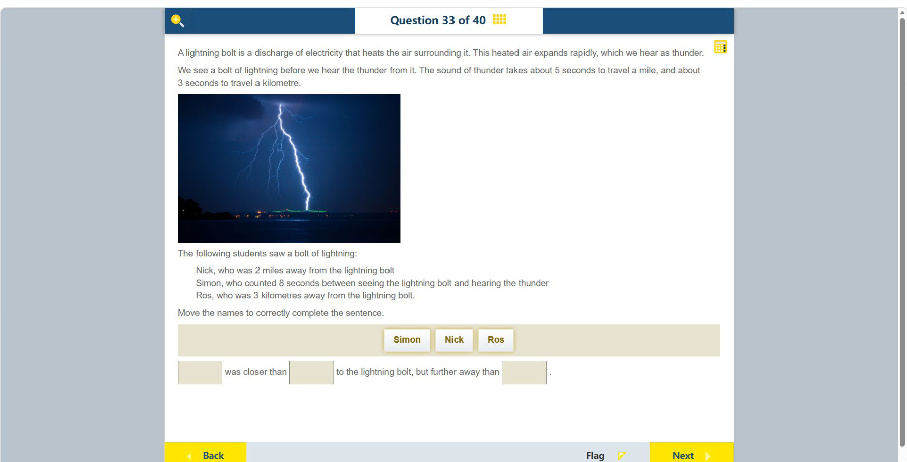

# 第 33 题

## 原题

**教材阅读器 / Textbook reader:** [Activity: Measuring velocity（纸本 p.95 / PDF p.104；按位移和时间计算）](../textbook-reader.md?page=104)

## 分析

[查看知识体系图](../knowledge-map.md)

### 教材 Topic 技能 / Textbook Topic Skills

**Chapter 8, Topic 3: Making waves / 第 8 章 Topic 3：波的形成**（[教材 PDF 第 54 页 / Textbook PDF p. 54](../textbook-reader.md?page=54)）

| ATL skills / ATL 技能 | Science skills / 科学技能 |
| --- | --- |
| 得出合理结论并进行概括；使用模型和模拟探索复杂系统与议题。 Draw reasonable conclusions and generalizations; use models and simulations to explore complex systems and issues. | 绘制实验观察草图；处理和解读数据，并用科学推理解释结果。 Draw sketches of experimental observations; process and interpret data and explain results using scientific reasoning. |

**Chapter 12, Topic 3: Velocity and acceleration / 第 12 章 Topic 3：速度与加速度**（[教材 PDF 第 97 页 / Textbook PDF p. 97](../textbook-reader.md?page=97)）

| ATL skills / ATL 技能 | Science skills / 科学技能 |
| --- | --- |
| 处理数据并报告结果；收集并整理相关信息以形成论证；分析复杂概念并综合形成新的理解。 Process data and report results; gather and organize relevant information to formulate an argument; analyse complex concepts and synthesize them to create new understanding. | 形成可检验假设并用科学推理解释；整理数据表、绘制带最佳拟合线的散点图并识别趋势；计算直线图像的梯度；改进方法以减少误差；解读探究数据并用科学推理解释结果。 Formulate testable hypotheses using scientific reasoning; organize data tables, plot scatter graphs with a line of best fit and identify trends; calculate the gradient of a straight-line graph; improve methods to reduce errors; interpret investigation data and explain results using scientific reasoning. |

### 中文分析

#### 知识背景

闪电光到达眼睛几乎是即时的，而雷声以有限声速传播，因此听到雷声的延迟可用于估计距离。题目给出近似换算：每英里约 5 秒、每千米约 3 秒；比较距离时要统一单位或先换算为同一单位。

#### 图示细读

1. 照片中可见明亮的主闪电通道及较细的分叉，下方是暗色地平线和远处灯光。它把题干的“看见闪电”具体化；亮线显示发光的放电通道，不是雷声的传播路线。
2. 照片没有距离标尺、时间标记或 Nick、Simon、Ros 的位置。不能由闪电在照片中的长度、亮度或靠近哪盏灯，推断任何学生离它多远；也不能仅凭单幅照片确定放电的运动方向。
3. 读图后应回到照片下方的文字数据：Nick 为 2 miles，Simon 的声光延迟为 8 seconds，Ros 为 3 kilometres。只有 Simon 需要先用延迟换算距离；照片本身不提供额外数值。
4. 下方句子有三个空格：第一个是被比较者，第二个比他更远，第三个比他更近。先把三人的距离统一比较，再按“中间者、最远者、最近者”填入；按钮的排列 Simon、Nick、Ros 不是距离顺序。

#### 推理与答案

Nick 的距离是 2 英里，约对应 10 秒声程；Simon 计时 8 秒，对应 $8/3\approx2.67$ km；Ros 距离 3 km。因此从近到远是 **Simon、Ros、Nick**。句子应为：Ros 比 Nick 近，但比 Simon 远。

### English Analysis

#### Background

Lightning is seen almost immediately, while thunder travels at a finite speed. The time delay can estimate distance. The question provides approximate conversions of 5 seconds per mile and 3 seconds per kilometre; compare distances in consistent units.

#### Reading the diagram

1. The photograph shows a bright main lightning channel with thinner branches, above a dark horizon and distant lights. It illustrates what the students see: the luminous discharge channel, not the route taken by thunder.
2. There is no distance scale, timestamp or marked position for Nick, Simon or Ros. The bolt's apparent length, brightness or proximity to a light cannot reveal any student's distance, and one photograph cannot determine the discharge's direction of motion.
3. After examining the photograph, use the text beneath it: Nick is 2 miles away, Simon records an 8-second light-to-sound delay, and Ros is 3 kilometres away. Only Simon needs a delay-to-distance conversion; the photograph supplies no extra numerical measurement.
4. The sentence has three blanks: the first names the person being compared, the second someone farther away, and the third someone nearer. Compare distances consistently, then enter middle, farthest and nearest. The displayed button order Simon, Nick, Ros is not a distance ranking.

#### Reasoning and answer

Nick is 2 miles away, corresponding to about 10 seconds of sound travel. Simon's 8-second delay corresponds to $8/3\approx2.67$ km. Ros is 3 km away. From nearest to farthest the order is **Simon, Ros, Nick**. Thus Ros is closer than Nick but farther away than Simon.
