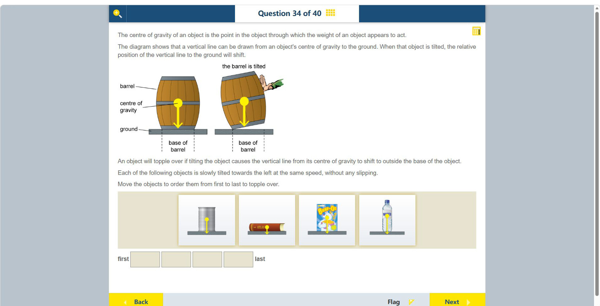

# 第 34 题

## 原题

## 分析

[查看知识体系图](../knowledge-map.md)

### 中文分析

#### 知识背景

物体是否倾倒取决于重心垂线是否落在支撑底面内。倾斜时，重心越高、支撑底面越窄，垂线越容易越过底边；底面宽、重心低的物体更稳定。题目说明物体不滑动，因此只比较倾倒几何条件。

#### 图示细读

1. 上方两个木桶图先解释判据：黄色圆点是 centre of gravity（重心），从圆点向下的黄色箭头是重力的竖直作用线；灰条是 ground，虚线标出 base of barrel 的底边范围。箭头不是木桶的运动方向。
2. 左桶直立时重心垂线落在底边内；右桶被倾斜后，桶身和底面一起改变方向，但黄色箭头仍竖直向下。判断倾倒要继续追踪这条竖线与支撑边缘的关系，不是看箭头是否沿着桶身中心轴。
3. 下排从左到右是罐、平放的书、竖直谷物盒、瓶子，每件物体也标出重心和垂线。它们都向左缓慢倾斜且不滑动，因此要比较重心到左侧底边的水平距离与重心高度，而不是下方灰色托板的宽度。
4. 瓶子的重心相对底宽最高，稍倾斜垂线就容易越过左边缘；罐次之。谷物盒虽然高，但向左方向的底宽相对重心高度更大；平放的书重心很低、底宽很大，需倾斜更多才越界。图没有尺寸刻度，只能作图示几何比较，不能给出精确临界角。
5. 下方 first → last 的空格要求按失稳先后重排，不是照搬图片从左到右的位置。稳定性也不是单看物体重量或总高度：决定因素是图中重心的作用线能否仍落在支撑范围内。

#### 推理与答案

对每个物体比较重心高度和向左的支撑半宽。细高的瓶子支撑底面窄，最早失稳；圆柱罐随后；竖直谷物盒底面相对较宽，之后倾倒；平放的书重心最低且底面最长，最晚倾倒。顺序为 **瓶子 → 罐 → 谷物盒 → 书**。

### English Analysis

#### Background

An object topples when the vertical line through its centre of gravity falls outside its support base. A high centre of gravity and narrow base make this happen sooner; a low centre of gravity and broad base improve stability. Since slipping is excluded, compare tipping geometry only.

#### Reading the diagram

1. The two barrel drawings establish the test. The yellow dot is the centre of gravity, and the downward yellow arrow is the vertical line of action of weight. The grey strip is the ground, and dashed guides mark the barrel's base limits. The arrow is not a motion arrow.
2. The upright barrel's line falls inside its base. When the right barrel is tilted, its body and base change orientation, but the yellow arrow remains vertically downward. Follow this line relative to the supporting edge rather than expecting it to follow the barrel's central axis.
3. The lower pictures show a can, a book lying flat, an upright cereal box and a bottle, each with its centre and vertical line. All tilt slowly left without slipping. Compare the horizontal distance from the centre to the left base edge with the centre's height, not with the width of the grey platform.
4. The bottle's centre is highest relative to its narrow base, so its line crosses the left edge after a small tilt; the can follows. The cereal box has a wider leftward base relative to its centre height. The flat book has a very low centre and broad base, requiring a larger tilt. No dimensional scale is provided, so this is a schematic geometric comparison, not a source of precise tipping angles.
5. The first-to-last blanks ask for a new instability ranking, not the displayed left-to-right order. Weight or overall height alone does not determine stability; the key is whether the marked centre's vertical line remains within the support limits.

#### Reasoning and answer

Compare the centre-of-gravity height with the half-width of the support in the direction of tilt. The tall, narrow bottle loses support first, followed by the can. The upright cereal box has a broader base relative to its centre of gravity, and the book lying flat has the lowest centre and broadest support, so it topples last. Order: **bottle → can → cereal box → book**.
