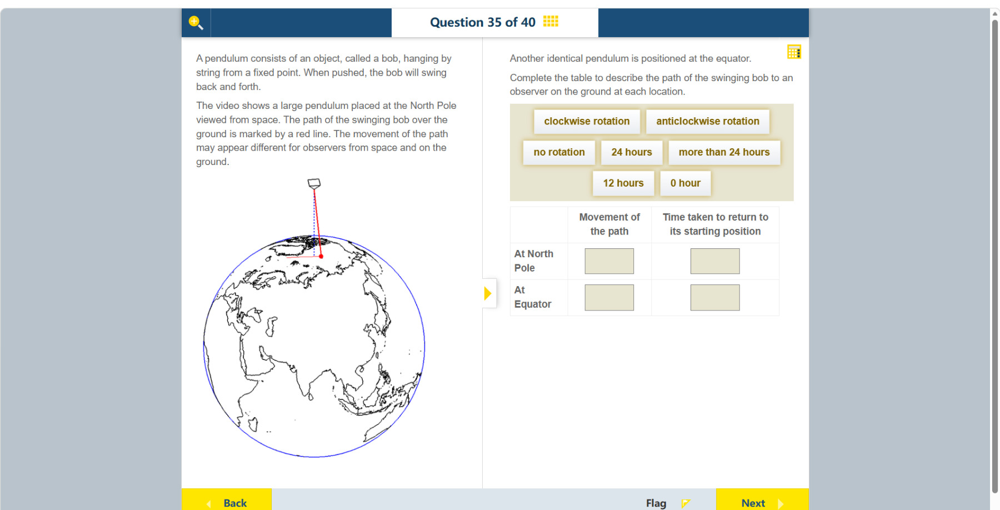

# 第 35 题

## 原题

## 分析

[查看知识体系图](../knowledge-map.md)

### 中文分析

#### 题目在问什么

题目比较同一个大型单摆放在北极和赤道时，地面观察者看到的摆动路径如何变化，以及该路径经过多久回到原来的方向。题目强调要区分太空观察者与地面观察者：关键变化来自地球自转造成的参考系差异。

#### 知识背景：傅科摆与参考系

摆球往返摆动的轨迹所在平面称为摆动平面。理想情况下，摆动平面在惯性空间中大致保持固定；地球及地面观察者则随地球自转。因此，地面观察者会看到摆动平面相对地面缓慢转动。这种现象称为傅科摆进动，是地球自转的证据之一。

地球自转方向是自西向东；从北极上空朝地球看，地面呈逆时针转动。北极处的摆动平面在惯性空间中近似保持原方向，因此相对这个逆时针转动的地面，它看起来顺时针转动。进动方向说的是摆动平面相对地面的转动，不是摆球沿着圆周顺时针绕行。赤道处，自转轴平行于当地地平面，地球自转在当地竖直方向上的分量为零，所以理想傅科摆没有进动。

在纬度 $\phi$ 处，摆动平面的表观转动角速度大小为

$$
\omega_{\mathrm{app}} = \Omega_{\oplus} |\sin\phi|,
$$

其中 $\Omega_{\oplus}$ 是地球自转角速度。北半球从上方观察，表观转动方向为顺时针；进动周期为

$$
T = \frac{T_{\oplus}}{|\sin\phi|}.
$$

这里的 $T_{\oplus}$ 是地球自转周期。北极的 $|\sin\phi|=1$，所以摆动平面约一天转一周。严格来说，傅科进动对应一个恒星日，约 23 小时 56 分钟；本题选项将它近似为 24 小时。

#### 图示细读

1. 左侧地球上方画有悬挂点、细长摆绳和红色摆球，蓝色虚线提供竖直参考。题干说明红线标记摆球在地面上的摆动路径；不要把斜摆绳与地面的红色路径混为一条线，也不要把蓝色地球轮廓当成摆动轨迹。
2. 这是题干所说视频的一幅静态画面，采用太空观察视角。画面没有连续帧、转向箭头或时间刻度，不能单凭红球在蓝色虚线右侧就判定摆动平面顺时针转动；那只是摆球某一瞬间的位置。
3. 右侧表格的两行分别是 At North Pole 和 At Equator；两列分别问 Movement of the path 与 Time taken to return to its starting position。要填的是地面观察者看到的路径方向变化及其返回时间，而不是摆球一次左右往返的周期。
4. 将图的太空视角换为地面视角：地球自西向东自转，从北极上空看地面为逆时针方向。理想摆动平面在惯性空间近似固定，所以北极地面在它下方转动时，地面观察者会看到摆动平面相对地面顺时针转动。赤道处地球自转没有当地竖直分量，因此没有这种傅科进动。赤道并没有另画摆图，应依据题干的位置比较，不能从地球照片上的大陆位置猜答案。
5. 上方选项块把转向词与时间词混在一起，须按列分类填写。北极按题目的一整周返回读法选约 24 hours；赤道的 no rotation 配 0 hour 表示路径始终没有离开原方向，不是摆球停止运动。静态原图无法独立核验完整视频中的运动细节。

#### 推理与答案

| 位置 | 地面观察到的路径变化 | 回到起始方向的时间 | 理由 |
| --- | --- | --- | --- |
| 北极 | 顺时针转动 | 24 小时 | 北极处表观进动最快，一个地球自转周期转满一周。 |
| 赤道 | 不转动 | 0 小时 | 赤道处 $\sin 0^\circ=0$，理想模型中的表观进动为零；路径始终保持原方向，因此无需等待就处在起始方向。 |

“0 小时”不是说摆球完成一次往返只需零时间，而是说摆动平面没有离开起始方向。

#### 易混淆点

- 摆球仍会来回摆动；题目问的是摆动平面的方向是否相对地面转动。
- 北极处的顺时针方向是从地面上方俯视时，地面观察者看到的相对运动方向。
- 赤道处的“no rotation”指傅科进动为零，不代表地球没有自转。

### English Analysis

#### What is being asked

The question compares the apparent motion of an identical pendulum at the North Pole and at the equator, as seen by an observer on the ground. It also asks how long the swing path takes to return to its initial orientation. The distinction between observers in space and on the ground is important because Earth rotates beneath the pendulum.

#### Background: Foucault pendulum and reference frames

The plane in which a pendulum swings is called its plane of oscillation. In the ideal model, this plane stays approximately fixed in inertial space, while Earth and a ground observer rotate with Earth. Consequently, the ground observer sees the plane of oscillation slowly turn relative to the ground. This is Foucault precession, a demonstration of Earth's rotation.

Earth rotates from west to east; viewed down toward Earth from above the North Pole, the ground turns anticlockwise. At the pole, the plane of oscillation stays approximately fixed in inertial space, so it appears to turn clockwise relative to the anticlockwise-rotating ground. This direction describes the plane's motion relative to the ground, not the bob travelling clockwise around a circle. At the equator, Earth's rotation has no component in the local vertical direction, so an ideal Foucault pendulum has no precession there.

At latitude $\phi$, the magnitude of the apparent precession rate is

$$
\omega_{\mathrm{app}} = \Omega_{\oplus} |\sin\phi|,
$$

where $\Omega_{\oplus}$ is Earth's angular rotation rate. In the Northern Hemisphere, the apparent rotation is clockwise when viewed from above. The precession period is

$$
T = \frac{T_{\oplus}}{|\sin\phi|}.
$$

At the North Pole, $|\sin\phi|=1$, so the plane makes one apparent turn in approximately one day. More precisely, the Foucault precession period is one sidereal day, about 23 hours 56 minutes; the exam rounds this to 24 hours.

#### Reading the diagram

1. Above Earth are a suspension point, a long pendulum string and a red bob, with a blue dashed vertical reference. The text identifies the red line as the bob's path over the ground. Do not confuse the sloping string with the ground path or the blue Earth outline with a swing trajectory.
2. This is one still frame of the stated video, viewed from space. It has no successive frames, rotation arrows or time scale. The red bob being right of the dashed reference cannot by itself establish clockwise precession; it shows an instantaneous bob position.
3. The table rows are At North Pole and At Equator. Its columns ask for Movement of the path and Time taken to return to its starting position. These concern the path's orientation and return time for a ground observer, not the period of one back-and-forth swing.
4. Change from the picture's space viewpoint to the ground viewpoint: Earth rotates west to east, so the ground turns anticlockwise when viewed from above the North Pole. An ideal swing plane remains approximately fixed in inertial space; as the polar ground rotates beneath it, a ground observer sees the plane turn clockwise relative to the ground. At the equator Earth's rotation has no local vertical component, so there is no Foucault precession. No separate equatorial pendulum picture is supplied; compare the stated locations rather than guessing from continental positions.
5. The option bank mixes direction words and time words; assign them to the correct columns. Under the question's full-turn return interpretation, the pole uses about 24 hours; no rotation at the equator pairs with 0 hour because the path never leaves its original orientation, not because the bob stops. The still image cannot independently verify the complete video's motion details.

#### Reasoning and answer

| Location | Path seen from the ground | Time to return to its starting orientation | Reason |
| --- | --- | --- | --- |
| North Pole | Clockwise rotation | 24 hours | Apparent precession is greatest at the pole, completing one turn per Earth rotation. |
| Equator | No rotation | 0 hour | At the equator, $\sin 0^\circ=0$, so ideal Foucault precession is zero. The plane remains in its starting orientation, so no waiting is needed to be at that orientation. |

“0 hour” does not mean the bob completes an oscillation in zero time. It means the plane of oscillation has not moved away from its starting orientation.

#### Common confusions

- The bob continues to swing back and forth; the question concerns the orientation of the plane of oscillation relative to the ground.
- Clockwise describes the apparent motion seen by a ground observer looking down from above the North Pole.
- “No rotation” at the equator means zero Foucault precession, not that Earth itself stops rotating.
