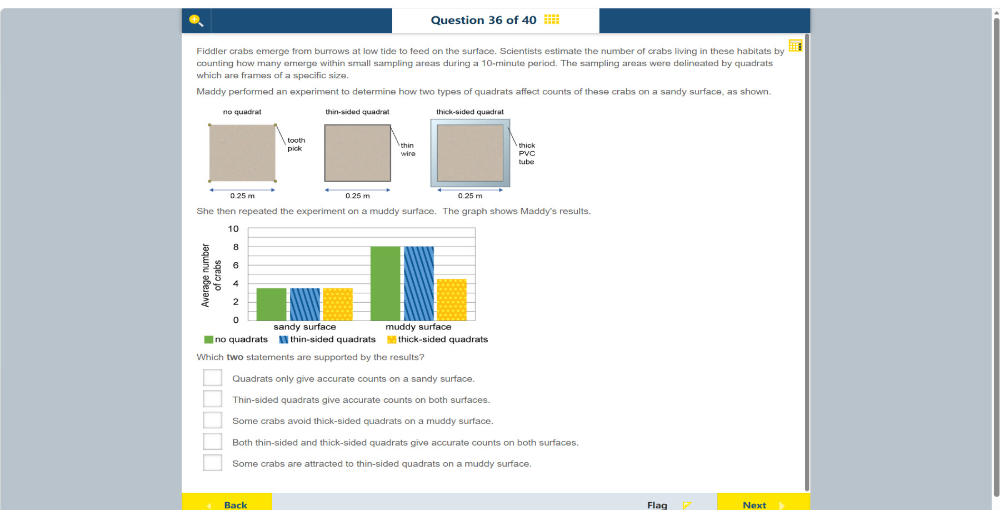

# 第 36 题

## 原题

## 分析

[查看知识体系图](../knowledge-map.md)

### 中文分析

#### 知识背景

Quadrat 是用来界定样方面积的框，研究者用样方内的个体数估计种群密度。工具本身不应显著改变被计数动物的行为；边框过厚可能遮挡或阻止动物进入样方。无样方的计数可作为比较基准。

#### 图示细读

1. 上方三个方形表示相同尺寸的采样区域：无框处理用四角 tooth pick（牙签）标记，薄框标 thin wire，厚框标 thick PVC tube。下方双向箭头标边长 0.25 m，不是螃蟹行进方向；图示采样面积相同，区别是边框处理。
2. 下方是分组柱形图：横轴两组为 sandy surface 和 muddy surface，并不是时间轴；纵轴 Average number of crabs 从 0 到 10，数字每隔 2 标注，水平小格为 1。题干规定每次观察 10 分钟，柱高是这段观察的平均个体数，不是每平方米密度或全部地下螃蟹数。
3. 先认图例：绿色实心为 no quadrats，蓝色斜纹为 thin-sided quadrats，黄色点纹为 thick-sided quadrats。同一地表内比较三根柱，沙地均约 3.5；泥地绿色和蓝色都为约 8，黄色约 4.5。平均数可以是小数，不表示真的数到半只螃蟹。
4. 再以无框柱作同地表的基准：薄框在两组均与绿色柱同高，厚框只在沙地相近，在泥地少约 3.5。不能直接用泥地 8 与沙地 3.5 的差别判定框是否有效，因为地表类型也同时改变了。
5. 泥地的厚框低值支持计数受框影响，与“一些螃蟹避开厚框”相容；蓝柱没有高于绿色柱，不能据此说薄框吸引了额外螃蟹。图中没有误差棒、重复次数或行为录像，因此不能由柱高证明差异的统计显著性，也不能确定躲避的具体机制。

#### 推理与答案

沙地上三种处理的平均数都约为 3–4；泥地上无样方与薄边框约为 8，而厚边框约为 4.5。薄边框在两种地表都接近无框基准，因此 **薄边框样方在两种表面都给出准确计数**；泥地厚边框计数下降，支持 **一些螃蟹避开厚边框样方**。图表支持的是计数差异，不直接证明具体行为机制。

### English Analysis

#### Background

A quadrat defines a sampling area used to estimate population density. The sampling device should not substantially alter the animals' behaviour. Thick sides may obstruct or deter animals from entering the frame. Counts without a quadrat provide a comparison baseline.

#### Reading the diagram

1. The three squares represent equal-sized sampling areas: the no-frame treatment uses tooth picks at the corners, the thin frame is labelled thin wire, and the thick frame is labelled thick PVC tube. The double-headed arrows specify a 0.25 m side length, not crab movement. Area is held constant while the boundary treatment changes.
2. The grouped bar chart has sandy surface and muddy surface categories, not a time axis. Average number of crabs runs from 0 to 10, labelled every 2 with horizontal grid divisions of 1. Each observation lasts 10 minutes according to the text. Bar height is a mean count during that interval, not density per square metre or the entire underground population.
3. Decode the legend first: solid green means no quadrats, blue stripes thin-sided quadrats, and yellow dots thick-sided quadrats. Compare bars within each surface: all sandy counts are about 3.5; on mud the green and blue counts are about 8 and yellow about 4.5. A fractional average does not mean an actual half-crab was counted.
4. Use the unframed count as the baseline for the same surface. Thin frames match the green bars in both groups. Thick frames match on sand but are about 3.5 lower on mud. Comparing muddy 8 directly with sandy 3.5 cannot test frame performance, because surface type also changes.
5. The lower thick-frame muddy count supports an effect on counting and is consistent with some crabs avoiding that frame. Blue is not higher than green, so the graph does not support extra attraction to thin frames. There are no error bars, replicate counts or behavioural footage; the bars alone cannot establish statistical significance or the precise avoidance mechanism.

#### Reasoning and answer

On sand, all three treatments average about 3–4 crabs. On mud, the no-quadrat and thin-sided counts are about 8, while the thick-sided count is about 4.5. Thin-sided quadrats therefore match the baseline on both surfaces, supporting **accurate counts with thin-sided quadrats on both surfaces**. The lower muddy-surface count with thick sides supports **some crabs avoid thick-sided quadrats**. The graph shows a count difference; the mechanism is an interpretation.
