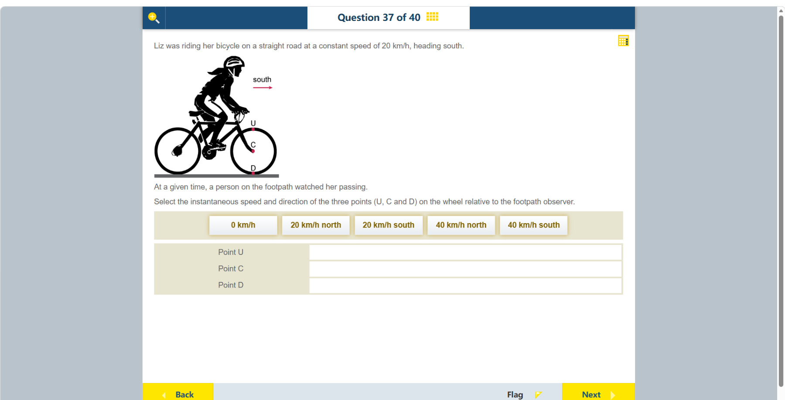

# 第 37 题

## 原题

## 分析

[查看知识体系图](../knowledge-map.md)

### 教材 Topic 技能 / Textbook Topic Skills

**Chapter 12, Topic 3: Velocity and acceleration / 第 12 章 Topic 3：速度与加速度**（[教材 PDF 第 97 页 / Textbook PDF p. 97](../textbook-reader.md?page=97)）

| ATL skills / ATL 技能 | Science skills / 科学技能 |
| --- | --- |
| 处理数据并报告结果；收集并整理相关信息以形成论证；分析复杂概念并综合形成新的理解。 Process data and report results; gather and organize relevant information to formulate an argument; analyse complex concepts and synthesize them to create new understanding. | 形成可检验假设并用科学推理解释；整理数据表、绘制带最佳拟合线的散点图并识别趋势；计算直线图像的梯度；改进方法以减少误差；解读探究数据并用科学推理解释结果。 Formulate testable hypotheses using scientific reasoning; organize data tables, plot scatter graphs with a line of best fit and identify trends; calculate the gradient of a straight-line graph; improve methods to reduce errors; interpret investigation data and explain results using scientific reasoning. |

### 中文分析

#### 知识背景

无滑动滚动时，轮上各点的地面速度等于车轮平动速度与绕轮心转动速度的矢量和。轮心只有平动；顶部的转动速度与前进方向相同；底部接触点的转动速度与平动速度相反，瞬时相互抵消。

#### 图示细读

1. 自行车右侧的红箭头标 south，表示本图向右就是向南，不是地图惯例中的向下。题干给出整车速度 20 km/h；原图没有轮径或角速度刻度，也没有为 U、C、D 各自画速度箭头。
2. 三个红点都在前轮：U 在轮缘最高处，C 在轮心，D 在轮缘与灰色路面相接处。下方三行要填写这些特定点相对于人行道观察者的瞬时速度，不是它们相对于轮心的速度。
3. 先把整个轮子作为平动物体看，三个点都有随轮心向右的 20 km/h 分量；再叠加各点绕 C 的转动分量。以正常无滑动滚动为假定，轮子向右前进时在本图中顺时针转动，轮缘相对 C 的速率也是 20 km/h。
4. 在 U，顺时针转动的切线方向向右，与平动同向；在 D，切线方向向左，与平动反向；C 位于转轴，没有绕轮心的速度分量。应比较切线方向，不能因为 U、D 上下排列就认为它们此刻向上或向下移动。
5. 将两个速度分量按方向相加，得到下表。这里的 north 是与图示向南相反的向左，不能把所有 20 都只按数值相加。

6. D 只在接地的这一瞬间相对地面静止；同一轮缘材料点随后会离开接触处，并非永久固定在路面。若轮胎打滑，表中的抵消条件就不成立；原图按通常的无滑动骑行模型理解，不从静态图片声称测出了打滑程度。

| 点 | 轮心平动分量 | 相对轮心转动分量 | 对地瞬时速度 |
| --- | --- | --- | --- |
| U | 20 km/h 向南 | 20 km/h 向南 | 40 km/h 向南 |
| C | 20 km/h 向南 | 0 | 20 km/h 向南 |
| D | 20 km/h 向南 | 20 km/h 向北 | 0 km/h，无运动方向 |

#### 推理与答案

自行车向南以 20 km/h 行驶。C 在轮心，速度为 **20 km/h 向南**；U 在轮顶，平动与转动速度同向，合速度为 **40 km/h 向南**；D 是与地面接触的轮底点，瞬时速度为 **0 km/h**。轮底瞬时静止不代表车轮没有转动。

### English Analysis

#### Background

For rolling without slipping, a point's ground velocity is the vector sum of the wheel's translational velocity and its rotational velocity about the centre. The centre has only translation. At the top, rotational velocity is in the travel direction; at the contact point, it opposes translation.

#### Reading the diagram

1. The red arrow labelled south points right, so rightward means south in this picture, not the downward direction often used on maps. The text gives a bicycle speed of 20 km/h. No wheel radius or angular-speed scale is given, and individual velocity arrows for U, C and D are not drawn.
2. The three red dots are on the front wheel: U at the highest rim point, C at the centre, and D where the rim touches the grey road. The three answer rows ask for instantaneous velocities relative to the footpath observer, not relative to the wheel centre.
3. First translate the whole wheel: each point receives a 20 km/h rightward component. Then add rotation about C. Under the normal rolling-without-slipping assumption, rightward travel requires clockwise rotation in this view, and the rim's speed relative to C is also 20 km/h.
4. At U, the clockwise tangential velocity points right, reinforcing translation. At D it points left, opposing translation. C is on the rotation axis and has no rotational velocity component. Use tangent directions; the vertical arrangement of U and D does not mean they move vertically at this instant.
5. Add the components with their directions as shown below. North here means left, opposite the marked south direction; do not simply add every numerical 20.

6. D is stationary relative to the ground only at the contact instant. The same material point later leaves contact; it is not permanently fixed to the road. If the tyre slips, this cancellation no longer follows. The picture is interpreted using ordinary no-slip cycling, not as a measurement of slip from a still image.

| Point | Centre's translation | Rotation relative to centre | Instantaneous ground velocity |
| --- | --- | --- | --- |
| U | 20 km/h south | 20 km/h south | 40 km/h south |
| C | 20 km/h south | 0 | 20 km/h south |
| D | 20 km/h south | 20 km/h north | 0 km/h, no motion direction |

#### Reasoning and answer

The bicycle moves south at 20 km/h. Point C at the centre moves **20 km/h south**. At U, the top of the wheel, the two velocities add to **40 km/h south**. At D, the contact point, they cancel instantaneously, giving **0 km/h**. The bottom point is instantaneously stationary relative to the ground even though the wheel is rotating.
