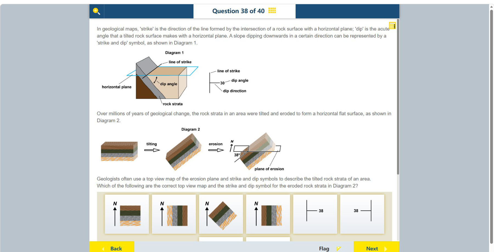
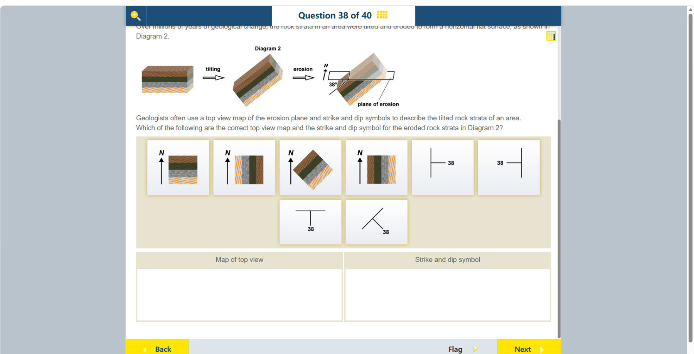

# 第 38 题

## 原题

## 分析

[查看知识体系图](../knowledge-map.md)

### 中文分析

#### 知识背景

地质图中的 strike（走向）是岩层面与水平面交线的方向；dip（倾向）是岩层面向下倾斜的方向，dip angle 是岩层面与水平面的夹角。水平侵蚀面切过倾斜岩层后，各岩层在顶视图中形成平行露头带；走向沿露头带延伸，倾向大致垂直于走向并指向较低的一侧。

#### 图示细读

1. 两张原页是同一道题的上下部分：第一张给 Diagram 1 的定义和 Diagram 2 的过程，第二张补全所有选项及两个填写区。不能只看第一页露出的前六个选项，否则会漏掉下排的两个走向／倾向符号。
2. Diagram 1 中蓝色框线是 horizontal plane，灰色斜面是 rock strata；两面相交的线标 line of strike。dip angle 的弧线量的是岩层面与水平面的夹角，不是两条地图条带之间的夹角。旁边符号的长线表走向，短横划在下倾的一侧，30 是这个示例的角度值，不是本题 Diagram 2 的答案。
3. Diagram 2 按左到右的过程箭头读取：起初是水平的褐色、绿色、灰色、橙色斜纹层，tilting 使它们倾斜，erosion 再把上部切除到水平面。过程箭头表示先后变化，不是岩层的走向、倾向或水流方向。
4. 最右块图的 plane of erosion 才是要俯视的水平面。用它与各层界面的交线追踪条带，不要把倾斜块体的可见侧面直接当成地图；淡化的上部提示被侵蚀去掉的部分，剩下层面仍然倾斜，侵蚀并未把岩层重新放平。
5. 保持 N 箭头所示北向不变，把水平面的交线投到俯视图：条带沿东北—西南方向延伸，跨带从西北侧到东南侧依次为褐、绿、灰、橙色斜纹。四张地图中第三张同时保留斜向排列及这一颜色顺序；不能仅把第二或第四张直条带地图旋转，却忽略其北向箭头。
6. 沿条带是走向；垂直条带、朝岩层降低的一侧是倾向。结合块图斜面，倾向为东南；38° 是斜面与水平侵蚀面的夹角，数字来源是图中标注而不是量取透视图的纸面角度。
7. 第二页右下符号的长线沿东北—西南，短划从长线伸向东南，旁写 38，三项正好对应条带、下倾侧和倾角。其他符号分别表示南北走向配东西倾、或东西走向配南倾；虽都写 38，方向仍不符。下方两个空框分别放地图和符号，不是要求把两个地图选项组合。

#### 推理与答案

先从 Diagram 2 的水平侵蚀面看岩层露头方向，再把地层颜色顺序和北向对到地图选项。露头带呈对角线排列，对应 **第三个（斜向条带）顶视图**；dip angle 为 38°，倾向指向东南侧，对应 **最后一个（右下斜向走向/倾向符号）**。不能把斜坡面的方向直接当作走向；走向是水平面与岩层面的交线。

### English Analysis

#### Background

On a geological map, strike is the direction of the line where a rock surface intersects a horizontal plane. Dip is the downward direction of the slope, and the dip angle is measured between the rock surface and the horizontal. Where a horizontal erosion surface cuts tilted strata, the exposed bands in a top view follow the strike; dip is approximately perpendicular to strike and points toward the lower side.

#### Reading the diagram

1. The two source images show upper and lower portions of one question. The first supplies Diagram 1's definitions and Diagram 2's sequence; the second reveals the complete options and both answer areas. Reading only the first image would miss the two lower strike-and-dip symbols.
2. In Diagram 1 the blue outline is the horizontal plane and the grey inclined surface is rock strata. Their intersection is labelled line of strike. The dip-angle arc measures the angle between the rock surface and horizontal, not an angle between map bands. In the adjacent symbol, the long line denotes strike, the short tick is on the down-dip side, and 30 is this example's angle, not the answer for Diagram 2.
3. Follow Diagram 2's process arrows left to right: initially horizontal brown, green, grey and orange-striped layers are tilted, then erosion removes the upper part to a horizontal plane. The arrows show the sequence of events, not strike, dip or water-flow directions.
4. The plane of erosion in the right-hand block is the horizontal surface to view from above. Trace its intersections with layer boundaries; do not copy a visible inclined side face as the map. The faded upper portion indicates removed material. The remaining beds stay tilted; erosion has not levelled the beds themselves.
5. Keep the marked N direction fixed and project those intersections into a top view. Bands run northeast–southwest, with brown, green, grey and orange stripes in order across them from northwest to southeast. The third map preserves both diagonal orientation and colour order. Rotating the second or fourth map while ignoring its north arrow would change the geographic directions.
6. Strike runs along the bands; dip runs perpendicular to them toward the descending side of the beds. The block shows southeast dip. The labelled 38° is the angle between the inclined bed and horizontal erosion plane, not an angle measured with a protractor on the perspective drawing.
7. The second image's lower-right symbol has a northeast–southwest long line, a short tick extending southeast, and 38 beside it: these match band direction, down-dip side and angle. The alternatives show north–south strike with east or west dip, or east–west strike with south dip. Sharing the number 38 does not make their directions correct. The two lower answer boxes require a map and a symbol, not two maps.

#### Reasoning and answer

Read the exposed band direction on the horizontal erosion plane in Diagram 2, keeping the north arrow and layer order aligned. The bands run diagonally, matching **the third, diagonal top-view map**. The 38° dip is toward the southeast side, matching **the final, lower-right strike-and-dip symbol**. The slope direction itself should not be mistaken for strike; strike is the horizontal intersection line.
