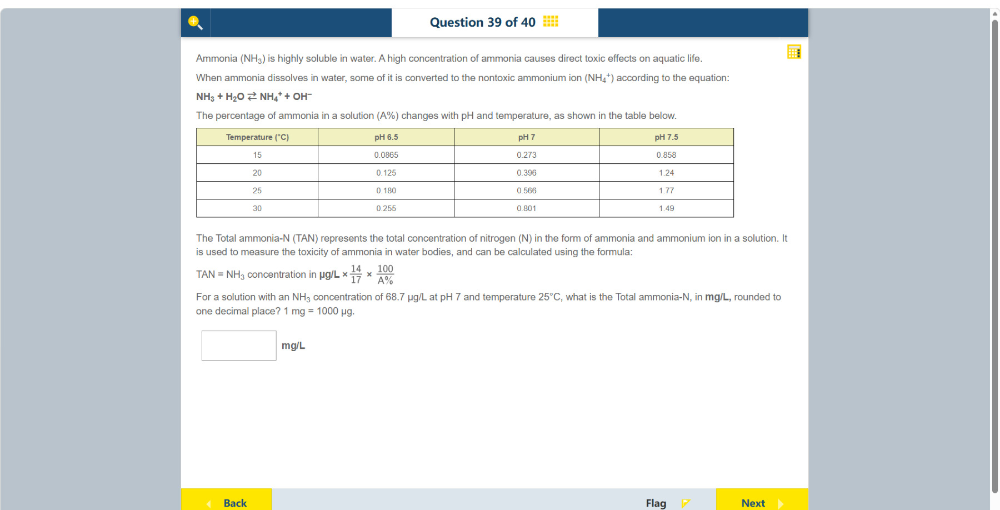

# 第 39 题

## 原题

## 分析

[查看知识体系图](../knowledge-map.md)

### 教材 Topic 技能 / Textbook Topic Skills

**Chapter 10, Topic 1: Environmental chemistry / 第 10 章 Topic 1：环境化学**（[教材 PDF 第 75 页 / Textbook PDF p. 75](../textbook-reader.md?page=75)）

| ATL skills / ATL 技能 | Science skills / 科学技能 |
| --- | --- |
| 处理数据并报告结果；提出“如果……会怎样”的问题并形成可检验假设；根据任务评估并选择信息来源和数字工具；解读数据。 Process data and report results; ask “what if” questions and generate testable hypotheses; evaluate and select information sources and digital tools based on their appropriateness to tasks; interpret data. | 用科学推理解释数据；使用恰当科学术语；批判性评价信息来源并注意局限或偏颇；设计检验假设的方法并提出延伸探究。 Explain data using scientific reasoning; use appropriate scientific terminology; critically evaluate information sources and their limitations or bias; design a method to test a hypothesis and describe extensions for further inquiry. |

**Chapter 13, Topic 2: Function of acids and bases / 第 13 章 Topic 2：酸与碱的作用**（[教材 PDF 第 109 页 / Textbook PDF p. 109](../textbook-reader.md?page=109)）

| ATL skills / ATL 技能 | Science skills / 科学技能 |
| --- | --- |
| 检验概括与结论；解读数据；收集并分析数据以寻找解决方案、作出知情决策；整理相关信息以形成论证。 Test generalizations and conclusions; interpret data; collect and analyse data to identify solutions and make informed decisions; gather and organize relevant information to formulate an argument. | 设计检验假设的方法并选择材料和设备；确保抽样随机以避免选择偏差；解读探究数据并用科学推理解释结果；说明减少误差的方法改进。 Design a method to test a hypothesis and select materials and equipment; ensure sampling is random to avoid selection bias; interpret investigation data and explain results using scientific reasoning; describe method improvements to reduce error. |

**Chapter 16, Topic 2: Balance in chemical reactions / 第 16 章 Topic 2：化学反应中的平衡**（[教材 PDF 第 136 页 / Textbook PDF p. 136](../textbook-reader.md?page=136)）

| ATL skills / ATL 技能 | Science skills / 科学技能 |
| --- | --- |
| 理解并使用数学符号；处理数据并报告结果。 Understand and use mathematical notation; process data and report results. | 在陌生情境中解决问题；整理并用表格呈现数据；分析数据并得出有依据的结论。 Solve problems set in unfamiliar situations; organize and present data in tables; analyse data to draw justifiable conclusions. |

### 中文分析

#### 知识背景

氨在水中可与水建立平衡：NH₃ + H₂O ⇌ NH₄⁺ + OH⁻。pH 和温度决定总氨中以游离氨 NH₃ 存在的比例 A%；游离氨毒性较强。题目给出的 TAN（总氨氮）公式先把 NH₃ 换算成氮质量，再按 A% 反推总氨氮。

#### 图示细读

1. 原题表格不是浓度测量表：左列 Temperature (°C) 给出 15、20、25、30°C，每行相隔 5°C；上方三列为 pH 6.5、pH 7、pH 7.5。其余单元格是题干定义的游离氨比例 A%，没有逐格重写百分号，不能把数值当成 mg/L。
2. 查本题数据先定位左列 25°C 所在行，再向右找到 pH 7 所在列，交点为 0.566，即 0.566%。同一行的 0.180 与 1.77 是不同 pH 条件，不能因它们靠近目标格而选用；行和列都匹配后无需插值。
3. 对照 pH 7 一列，15、20、25、30°C 依次为 0.273、0.396、0.566、0.801，说明固定 pH 时这列的游离氨比例随温度上升。25°C 一行也显示随 pH 增大而上升，但本题仅使用指定交点，不需要凭趋势重写其他单元格。
4. 表下公式把两个不同信息连接起来：68.7 μg/L 是题给 NH₃ 浓度，0.566% 是查表所得比例。14/17 把 NH₃ 质量换为其中的氮质量，再乘 100/0.566 由少量游离氨氮反推总氨氮；小比例意味着总量远大于游离部分，而非要乘 0.566。
5. 答题框旁单位是 mg/L，而公式输入单位是 μg/L。先算出的约 9996 μg/L 要除以 1000 后再保留一位小数。若把 0.566% 写成小数 0.00566，就应使用其倒数而不是再乘 100/0.00566，避免额外放大百倍。

#### 推理与答案

查表得 pH 7、25°C 时 $A=0.566\%$。代入：

$$
\mathrm{TAN}=68.7\,\mu\mathrm{g/L}\times\frac{14}{17}\times\frac{100}{0.566}\approx9996\,\mu\mathrm{g/L}.
$$

因为 $1000\,\mu\mathrm g=1\,\mathrm{mg}$，所以 TAN 约为 **10.0 mg/L**。14/17 是 NH₃ 中氮的质量分数；把 0.566% 代入时按题给公式使用百分数数值 0.566。

### English Analysis

#### Background

Ammonia equilibrates with water: NH₃ + H₂O ⇌ NH₄⁺ + OH⁻. pH and temperature determine the percentage A% of total ammonia present as free NH₃, which is more toxic. The given TAN formula converts NH₃ to nitrogen mass and scales by the free-ammonia fraction.

#### Reading the diagram

1. This is not a concentration-measurement table. Temperature (°C) gives rows 15, 20, 25 and 30°C at 5°C intervals; columns are pH 6.5, pH 7 and pH 7.5. Body entries are the defined free-ammonia percentage A%, even though each cell omits the percent sign. They are not mg/L values.
2. Locate the 25°C row, then move to the pH 7 column. Their intersection is 0.566, meaning 0.566%. The adjacent 0.180 and 1.77 apply to different pH conditions. Both row and column must match, and no interpolation is needed.
3. Down the pH 7 column, values at 15, 20, 25 and 30°C are 0.273, 0.396, 0.566 and 0.801, showing an increasing free-ammonia fraction with temperature in that column. The 25°C row also increases with pH. Use the specified intersection; no other cell needs to be rewritten from a trend assumption.
4. The formula below connects two different inputs: 68.7 μg/L is the given NH₃ concentration; 0.566% is the table fraction. Multiplying by 14/17 converts NH₃ mass to nitrogen mass, then 100/0.566 scales the small free-ammonia nitrogen portion up to total ammonia nitrogen. A small fraction makes the total much larger, rather than calling for multiplication by 0.566.
5. The answer box specifies mg/L, whereas the formula input is μg/L. Divide the calculated roughly 9996 μg/L by 1000 before rounding to one decimal place. If the percentage is instead expressed as the fraction 0.00566, use its reciprocal, not 100/0.00566, which would introduce an extra factor of 100.

#### Reasoning and answer

From the table, at pH 7 and 25°C, $A=0.566\%$. Substitute into the given formula:

$$
\mathrm{TAN}=68.7\,\mu\mathrm{g/L}\times\frac{14}{17}\times\frac{100}{0.566}\approx9996\,\mu\mathrm{g/L}.
$$

Since $1000\,\mu\mathrm g=1\,\mathrm{mg}$, this is **10.0 mg/L** to one decimal place. The factor 14/17 is the mass fraction of nitrogen in NH₃; use 0.566 as the percentage value in the formula provided.
