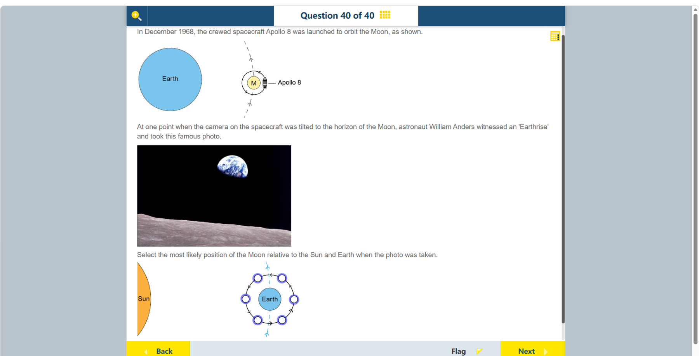

# 第 40 题

## 原题

## 分析

[查看知识体系图](../knowledge-map.md)

### 中文分析

#### 知识背景

地球、月球和太阳的相对位置决定从月球看地球的受光相位。地球被太阳照亮的一半始终朝向太阳；观察者位于月球上时，能看到多少受光面取决于月球相对日地连线的位置。月球越靠近太阳方向，月面观察到的地球越接近满相；月球远离太阳方向时，地球相位趋向新月。

#### 图示细读

1. 上方示意图标 Earth、M（月球）及 Apollo 8，绕 M 的小环和箭头表示飞船绕月运行，虚线表示月球更大尺度的运动轨道。它交代照片是在月球附近拍摄，不是从地球地面看月亮；这些小箭头也不能当作太阳光线。
2. 照片下方灰色崎岖带是月面地平线，上方蓝白色天体才是地球。地球可见的明亮部分明显超过半圆，但又不是完整亮圆，是凸相；沿地球下缘附近可见亮暗分界，不能把月面地平线误认为切掉地球的遮挡边界。
3. 下方选位图把 Sun 放在左侧，Earth 放在轨道中心，六个空圆圈是可选的月球位置。因此日光从左方照来，地球面向左的半球受光。图没有尺寸比例，不能用太阳或圆圈的画面大小求距离；蓝色虚线也不是日光方向。
4. 逐个把观察者放在月球圆圈处，朝中央地球看：正左位置几乎面对完整受光半球，地球接近满相；正右位置主要看到背光半球，接近暗相；左上和左下都能看到超过一半的亮面，右上和右下则主要看到较小的亮面。照片的凸相首先把候选缩小到左侧斜向位置。
5. 不要把“从月球看地球”换成“从地球看月球”：地球凸相对应月球从地球看接近娥眉相，而不是月球本身也呈凸相。此处亮暗来自太阳照明与观察方向，通常的相位变化不是地球或月球投下的食影。
6. 沿下方黑色轨道箭头读，运动为逆时针：上半圈从右往左，下半圈从左往右。因此左上位置是在到达正左新月位置之前，对应地面所见的残月／亏娥眉月；左下才是新月之后的盈娥眉月。原分析把左上说成“新月之后”与箭头不符，应更正。
7. 左上是原分析采用的示意答案，但亮面比例本身不能区分左右对称的左上和左下位置。照片没有给出与轨道平面统一的北向、相机滚转角或日期对应位置，不能把照片中亮面朝哪边直接搬到轨道图，也不能给出精确受光百分数。因此可说明左上与凸相相容，但仅凭这张静态图不能把它唯一确定；Earthrise 指飞船运动时地球在月面地平线上显现，不是地球沿图中轨道“向上升起”。

#### 推理与答案

照片中的地球明显超过一半受光，呈凸相，说明月球位于日地连线的太阳侧附近。**地球左上方的月球位置**与照片相容；按原图逆时针轨道方向，这一位置从地球看应在新月之前，接近亏娥眉月，而不是新月之后。仅凭受光比例，左下位置也相容；原图未给出照片与轨道图的统一朝向，故左上的唯一性不能由这张静态扫描独立确认。判断时要看地球受光比例，而不是把“Earthrise”误解成地球在轨道上升起或落下。

### English Analysis

#### Background

The relative positions of Earth, Moon and Sun determine Earth's illuminated phase as seen from the Moon. The Sun always lights one hemisphere of Earth; how much of that hemisphere a lunar observer sees depends on the Moon's position relative to the Sun-Earth line. When the Moon is near the sunward side, Earth appears nearly full from the Moon; on the far side, Earth approaches a new phase.

#### Reading the diagram

1. The upper schematic labels Earth, M (the Moon) and Apollo 8. The small loop and arrows around M show the spacecraft's lunar orbit; the dashed line depicts the Moon's larger-scale orbital path. The photograph is taken near the Moon, not from Earth's surface looking at the Moon. These small arrows are not sunlight rays.
2. The rough grey band at the photograph's bottom is the lunar horizon; the blue-white object above it is Earth. Earth's visible bright region is clearly larger than a half-disc but not a complete bright circle: it is gibbous. A light-dark boundary is visible near Earth's lower edge; the lunar horizon is not an edge obscuring part of Earth.
3. The lower selection diagram places the Sun on the left, Earth at the orbit's centre, and six empty circles at possible Moon positions. Sunlight therefore arrives from the left, illuminating Earth's left-facing hemisphere. No distance scale is provided; drawn object sizes cannot yield distances, and the blue dashed line is not the sunlight direction.
4. Put the observer at each Moon circle and look toward Earth: directly left gives a view of nearly the entire lit hemisphere, or full Earth; directly right mostly shows the unlit hemisphere, or new Earth. Upper-left and lower-left both show more than half illuminated, while upper-right and lower-right show smaller illuminated portions. The photograph's gibbous phase first narrows the choice to the diagonal sunward positions.
5. Do not replace a lunar view of Earth with an Earth-based view of the Moon. Gibbous Earth corresponds to a crescent Moon seen from Earth, not to a gibbous Moon. Ordinary phases result from solar illumination and viewing geometry, not eclipse shadows cast by Earth or Moon.
6. Follow the lower diagram's black arrows: the orbit is anticlockwise, running right to left across the upper half and left to right across the lower half. Upper-left is therefore before the directly-left new-Moon position, corresponding to a waning crescent from Earth; lower-left is after new Moon, corresponding to a waxing crescent. The existing description of upper-left as after new Moon conflicts with the arrows and needs correction.
7. Upper-left is the schematic answer used in the existing analysis, but illuminated fraction alone cannot distinguish the symmetric upper-left and lower-left positions. The photograph supplies no north reference aligned with the orbital plane, camera roll angle or date-to-position mapping. Its bright-side orientation cannot simply be transferred to the orbital diagram, nor does it establish an exact illuminated percentage. Upper-left is compatible with a gibbous Earth, but this still image alone does not establish it uniquely. Earthrise describes Earth appearing above the lunar horizon as the spacecraft moves, not Earth moving upward along the drawn orbit.

#### Reasoning and answer

More than half of Earth is illuminated in the photograph, so it appears gibbous. This places the Moon near the sunward side of the Earth-Sun line. **The upper-left Moon position** is compatible with the photograph; the anticlockwise arrows place it before new Moon as seen from Earth, near a waning crescent, not after new Moon. The lower-left position also fits the illuminated fraction. No shared orientation between photograph and orbital diagram is supplied, so the still scan does not independently establish upper-left as unique. Use the illuminated fraction; “Earthrise” does not mean Earth is rising in its orbit.
